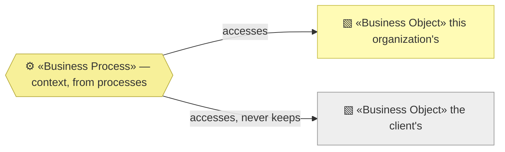
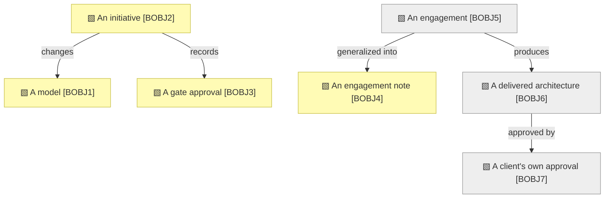

# Business objects

_[← Business layer](./README.md) · [EA home](../README.md)_

**ArchiMate viewpoint:** Business. The things the processes handle — and,
for each, **whose it is**.

**Status:** ● Validated at **Gate 2**, 2026-08-22.

That last column is the one that matters here. This organization holds very
little: three of the seven objects belong to a client and are handled without
ever being kept, which is what makes the information layer as short as it is.

## How to read this document

| Glyph | Shape | Element | ID prefix | Reads as |
| ----- | ----- | ------- | --------- | -------- |
| `▧` | Rectangle | «Business Object» | `BOBJ` | `BOBJ1` = Business Object 1 |
| `⚙` | Hexagon | «Business Process» — context, from [3_business-processes.md](./3_business-processes.md) | `BPROC` | `BPROC1` = Process 1 |

**An object the client owns is drawn grey**, the same convention the system
context uses for anything outside this organization's boundary.

## The objects

| ID | Business object | Owned by | Handled in | Where it lives | Shaped by |
| -- | --------------- | -------- | ---------- | -------------- | --------- |
| `BOBJ1` | **A model** — an organization or application described in numbered layers | This organization, per project | `BPROC4` | This repository for its own; the adopter's repository otherwise | The scaffold |
| `BOBJ2` | **An initiative** — one change to a model, from framing to delivery | This organization, per project | `BPROC2`–`BPROC5` | A scope document in `architecture/scope/` | The `write-scope-document` skill |
| `BOBJ3` | **A gate approval** — a named human accepting a named document on a date | This organization, per project | `BPROC3` | The Approvals table inside `BOBJ2` | The gates |
| `BOBJ4` | **An engagement note** — what the method failed to cover, generalized past the case | This organization | `BPROC6` | [`engagements/`](../engagements/README.md) | The `run-retrospective` skill |
| `BOBJ5` | **An engagement** — a client's problem, their people, their constraints | **The client** | `BPROC2`, `BPROC3`, `BPROC5` | Held by one person, outside any system | `ROLE2`, in person |
| `BOBJ6` | **A delivered architecture** — the model a client receives and owns afterwards | **The client** | `BPROC4`, `BPROC5` | The client's repository, which this organization does not keep | `ROLE2`, with `ACT2` |
| `BOBJ7` | **A client's own approval** — their Requester granting their gate | **The client** | `BPROC3` | The Approvals table in their repository | Their own project |

## What this organization does not keep

**`BOBJ5` is the object with no storage, and that is deliberate.** A client's
problem, their people and their constraints are held by one person and written
down nowhere — no notes system, no database, no repository. The organization
therefore holds no client data at all, which is why
[the information layer](../3_information/README.md) has nothing to classify
and no retention policy to state.

**That property is temporary, and decision 1 says so.** Stage 4 of
[`COA1`](../decisions/1_take-coa1-staged.md) has an agent running discovery
with a client directly, which means holding `BOBJ5` in a system for the first
time. The obligation — retention, classification, jurisdiction — is named now
rather than discovered then.

**`BOBJ4` is the bridge between the two halves of the table.** It is the only
object this organization keeps that comes out of a client engagement, and it
is deliberately stripped of anything identifying: the pattern survives, the
case does not. That boundary is carried by the `run-retrospective` skill
rather than by a rule of this organization — see
[5_domain-context-and-rules.md](./5_domain-context-and-rules.md).

## Relationships

<!-- Transcribed from this document's diagrams. The identifier is
     authoritative; the description beside it is checked against the
     catalogue that defines the element. -->

| From | From element | To | To element | Relationship |
| ---- | ------------ | -- | ---------- | ------------ |
| `BOBJ2` | «Business Object» An initiative | `BOBJ1` | «Business Object» A model | changes |
| `BOBJ2` | «Business Object» An initiative | `BOBJ3` | «Business Object» A gate approval | records |
| `BOBJ5` | «Business Object» An engagement | `BOBJ6` | «Business Object» A delivered architecture | produces |
| `BOBJ5` | «Business Object» An engagement | `BOBJ4` | «Business Object» An engagement note | generalized into |
| `BOBJ6` | «Business Object» A delivered architecture | `BOBJ7` | «Business Object» A client's own approval | approved by |
