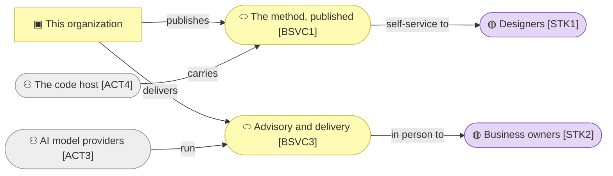

# Domain context and rules

_[← Business layer](./README.md) · [EA home](../README.md)_

**ArchiMate viewpoint:** Business. What this organization is trying to do, the
vocabulary it uses, and the rules that bind it.

## Problem statement

AI can now build almost anything somebody can describe, and cannot know what
they meant. Most software fails because the problem was misunderstood rather
than because the code was hard — and an AI amplifies that, confidently, at
speed.

This organization's answer is to make the understanding the deliverable, and
to give it away: a method, published free, that walks a requirement down six
architecture layers with a person approving at named gates, so that what an
agent builds is what somebody actually meant.

**It is not primarily selling for money.** Two of its four revenue streams are
non-monetary, and the product with real reach is free. The test it answers is
whether the method reaches the people it is for without exhausting the one
person running it.

## System context

Grey is outside the boundary. The organization operates nothing: what it
publishes is carried by somebody else's platform, and what it delivers runs on
somebody else's inference.

### Relationships

<!-- Transcribed from this document's diagrams. The identifier is
     authoritative; the description beside it is checked against the
     catalogue that defines the element. -->

| From | From element | To | To element | Relationship |
| ---- | ------------ | -- | ---------- | ------------ |
| `BSVC1` | «Business Service» The method, published and installable | `STK1` | «Stakeholder» Business and solution designers | self-service to |
| `BSVC3` | «Business Service» Advisory and delivery with the method | `STK2` | «Stakeholder» Established business owners | in person to |
| `ACT4` | «Actor» The code host | `BSVC1` | «Business Service» The method, published and installable | carries |
| `ACT3` | «Actor» AI model providers | `BSVC3` | «Business Service» Advisory and delivery with the method | run |

## Glossary

Terms with a specific meaning here. The method's own vocabulary — subject,
depth, gate, layer, element, grounding, initiative — is defined once, in the
method's business layer, and is not restated.

| Term | Means |
| ---- | ----- |
| **The Requester** | In this tree, the one person who is the organization. In an adopting project, whoever owns that subject and grants its gates. The word is the same because the responsibility is |
| **Adopter** | Someone using the method on their own project, without paying and usually without contact |
| **Client** | Someone the Requester delivers to personally, under `PROD2` |
| **Engagement** | One client's work, start to finish. Distinct from an initiative, which is one change inside a model |
| **Tree** | One federated project's complete model. This repository holds three |
| **Tier** | The relationship between trees: an organization above, the things it builds below. A tier refines what the tier above exposed and never restates it |

## Business rules

**None at this tier — and that is a verdict, not an omission.**

Every rule that governs how this organization works is a rule of **the
method**, held one tier down in `product-archreator`'s business layer. This
organization adds none of its own: it follows the method it publishes, which
is the strongest available claim that the method is usable, and the claim
would be worth nothing if the organization kept a private set.

The tier rule is what makes this the correct answer rather than a gap —
copying the method's rules up here to make the file look complete is precisely
what it forbids.

**Naming them by identifier is not possible from this tree.** Identifiers are
scoped per tree and the method owns those, so a citation would be a dangling
reference rather than a link. The method has no notation for referencing an
element another model owns; this is the third place in this repository where
that limitation shows up.

**What would change this:** a rule binding **the organization** and not anyone
using the method — how an engagement is priced, what may be said about a
client, when `ROLE2` declines work. The confidentiality boundary around
`BOBJ5` is the likeliest first candidate, and it is currently carried by the
`run-retrospective` skill rather than by a rule here.

## Access control

**None.** There is one person, no accounts and no system holding anything
worth restricting. `ROLE1`, `ROLE2` and `ROLE3` are responsibilities rather
than permissions, and the repository's own settings carry whatever
authorization exists.

Stage 4 of [decision 1](../decisions/1_take-coa1-staged.md) is what would end
this: an agent running discovery with a client directly means holding client
data, and holding client data means a real access model for the first time.
