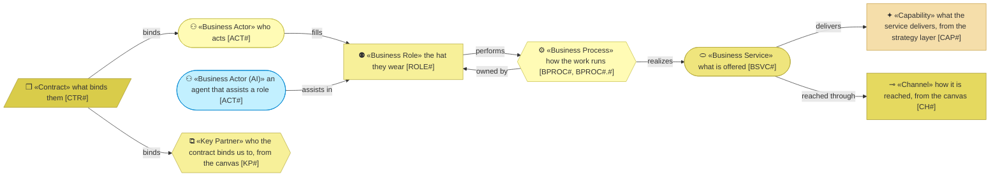
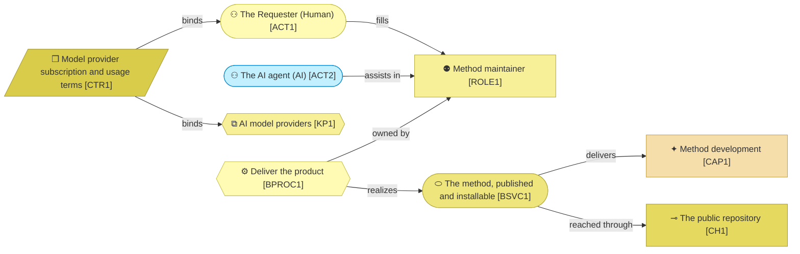

# Business

_[← Front door](../README.md)_

Who does what, which services the organization offers, and how the work
flows.

**ArchiMate viewpoint:** Business: Business Actor, Business Role, Contract,
Business Service, Business Process.

## Documents

| # | Document | Elements | Question it answers |
| - | -------- | -------- | ------------------- |
| 1 | [Business architecture](./1_business-architecture.md) | Two actors, one of them an AI, three roles, two contracts, three services and the process map in its four bands | Who does what, which services are offered, and how does the work flow? |

## Metamodel

An AI actor takes the application cyan, so a reader never mistakes it for a
person. The capability, the channel and the key partner are visitors from the
strategy layer and the canvases and keep their colours.

## Layer view

One person fills every role and an agent assists in two of them. One process
realizes the two services that scale; one role performs the service that does
not.
