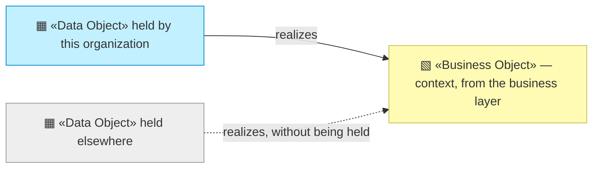
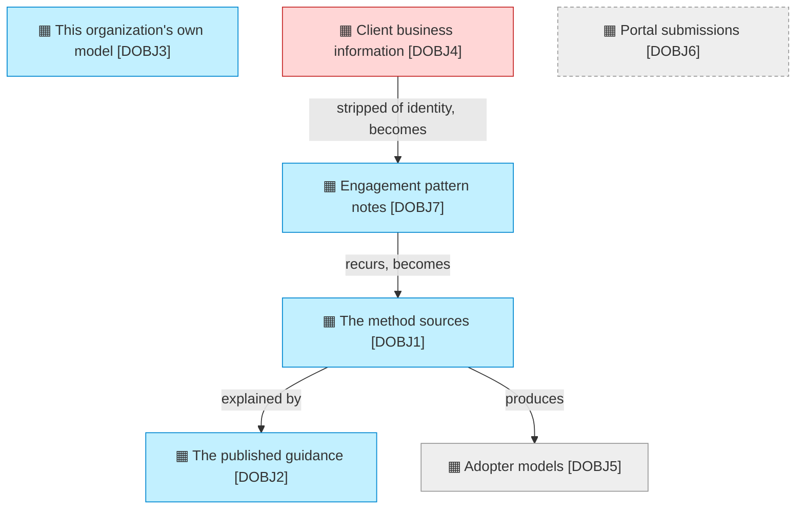

# Data objects

_[← Information layer](./README.md) · [EA home](../README.md)_

**ArchiMate viewpoint:** Passive structure. What information exists, where it
lives, and who can see it.

**Status:** ● Validated — **Gate 3** declined at Gate 2 ([scope document 1](../scope/1_rebuild-the-models-on-the-current-method.md), 2026-08-22), which routed layers 3 to 5 to pull-request review.

**The column that matters is where it lives.** Three of these seven objects
are not held by this organization at all — one is in an adopter's repository,
one in a client's, and one in a single person's head. That distribution is the
organization's information architecture, and it is why there is nothing here
to secure.

## How to read this document

| Glyph | Shape | Element | ID prefix | Reads as |
| ----- | ----- | ------- | --------- | -------- |
| `▦` | Rectangle | «Data Object» | `DOBJ` | `DOBJ1` = Data Object 1 |
| `▧` | Rectangle (yellow) | «Business Object» — context, from [2_business/4_business-objects.md](../2_business/4_business-objects.md) | `BOBJ` | `BOBJ1` = Business Object 1 |

## The objects

**The chain from `DOBJ4` to `DOBJ1` is the organization's learning loop**, and
every step of it removes information: a client's situation becomes a pattern,
a pattern that recurs becomes method. What is published is what survives that
stripping.

| ID | Data object | Where it lives | Classification | Readable by |
| -- | ----------- | -------------- | -------------- | ----------- |
| `DOBJ1` | **The method sources** — skills, conventions, the scaffold, the validators | `plugins/archreator/` in the public `archreator` repository | Public | `ROLE1`, and every adopter |
| `DOBJ2` | **The published guidance** — the page a reader lands on | `site/index.html` in the same repository | Public | `ROLE1`, and any visitor |
| `DOBJ3` | **This organization's own model** — the canvases, the layers, the scope documents | `org-archreator/` in this repository | **Public, deliberately.** An organization asking others to model themselves honestly should be readable | `ROLE3`, and any visitor |
| `DOBJ4` | **Client business information** — what a consulting engagement learns about a client | Held by `ROLE2` personally, outside this repository and outside any system this model describes | **Confidential** | `ROLE2` only |
| `DOBJ5` | **Adopter models** — the architecture an adopter builds with the method | **In the adopter's own repository.** This organization never receives a copy | Not held | Nobody here |
| `DOBJ6` | **Portal submissions and generated repositories** — what an owner would upload and get back | **Pending — future initiative** (`COA2`) | Would be the first non-public data this organization systematically holds | Nobody yet |
| `DOBJ7` | **Engagement pattern notes** — what the method did not cover, and what was done instead | [`engagements/`](../engagements/README.md) | **Public** — patterns lifted out of `DOBJ4` with every identifying fact left behind | `ROLE1`, `ROLE2`, and any visitor |

## Why the organization cannot measure itself

**`DOBJ5` is the answer to `OUT7`.** Real adoption — organizations actually
modeled and built with the method — lives entirely in adopters' own
repositories, and this organization never receives a copy. That is not an
oversight to be fixed; it is what `PROD1` being free and self-service *means*.

So the second band of `OUT7` has no collection method, and cannot get one
without either asking adopters to report (`COA3`) or taking something from
them that the current design deliberately does not take.

**`DOBJ4` is the confidential object, and it is held in a person rather than a
system.** Nothing in this model stores it, which is why there is no retention
policy, no classification scheme and no access control anywhere in this tree.
That is a real property today and a temporary one: stage 4 of
[decision 1](../decisions/1_take-coa1-staged.md) puts a client's information
in front of an agent, and `DOBJ6` is what that would create.

**Two objects would arrive together.** `DOBJ6` is Pending under `COA2` and
stage 4 of `COA1` would produce something very like it. Whichever comes first
is the initiative that gives this organization a real information layer for
the first time.
