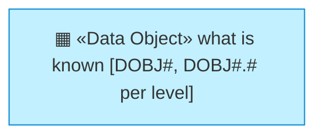
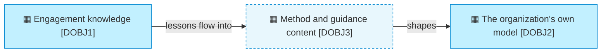

# Information domains and objects

_[← Information layer](./README.md) · [Front door](../README.md)_

**ArchiMate viewpoint:** Information — Data Object. A domain is the level-1
row of the catalogue; its objects extend the identifier, so the hierarchy is
readable from the ID and no new element kind is needed.

**Status:** ◐ Draft catalogue — not yet approved at a gate. **Understanding**
covers this document.

## How to read this document

## Level 1 — the domains

| ID | Domain | Owner | Mastered in |
| -- | ------ | ----- | ----------- |
| `DOBJ1` | **Engagement knowledge** — what working with a client produces and teaches | `ROLE2` | The client's own repository for their model; this repository for what the method learns |
| `DOBJ2` | **The organization's own model** — what this tree says about the organization | `ACT1` | This repository |
| `DOBJ3` | **Method and guidance content** — what the method is made of | The product — [its information layer](../../../product-archreator/architecture/3_information/1_data-domains-and-objects.md) models it as Method content [`product-archreator::DOBJ1`] | The archreator repository |

## Level 2 — the objects

Only the domains this organization masters decompose here; the product's
objects are the product's to define.

| ID | Object | Is | Classification |
| -- | ------ | -- | -------------- |
| `DOBJ1.1` | **The client's model** | The architecture the engagement builds, in the client's repository — theirs, referenced from here and never copied | The client's call |
| `DOBJ1.2` | **Engagement notes** | What the method did not cover, captured by `Capture what real use exposed [BPROC2.1]`; none exist yet — the first lands with the next retrospective | Internal |
| `DOBJ2.1` | **The canvases and layer documents** | The model proper — this tree | Public |
| `DOBJ2.2` | **The initiative records** | Scope documents and their Approvals tables — the durable trail of who approved what | Public |
