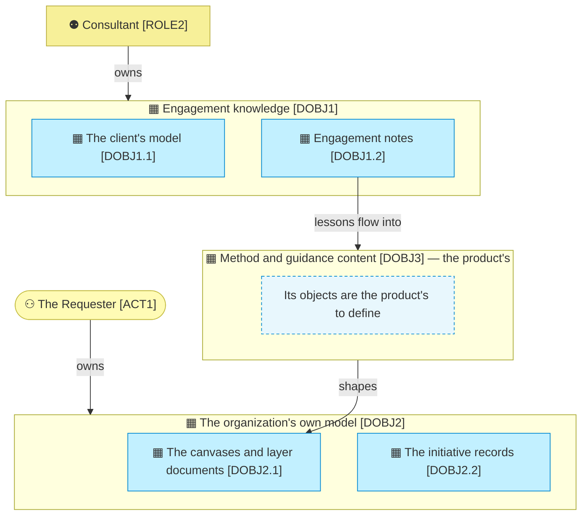

# Information domains and objects

_[← Information layer](./README.md) · [Front door](../README.md)_

What the organization knows, who owns each part, and where it lives.

**ArchiMate viewpoint:** Information: Data Object, with the domain as its
level 1 and the object as its level 2.

**Status:** ◐ Draft catalogue, not yet approved at Understanding.

## Level 1 — the domains

Two owners, and the third domain has neither. What the organization masters
it owns outright; what it uses most, the method itself, belongs to the
product. The loop closes anyway: engagement notes become method and come
back as the shape of the organization's own model.

| ID | Domain | Owner | Mastered in |
| -- | ------ | ----- | ----------- |
| `DOBJ1` | **Engagement knowledge**: what working with a client produces and teaches | [`ROLE2`] [Consultant](../2_business/1_business-architecture.md#roles) | The client's own repository for their model; this repository for what the method learns |
| `DOBJ2` | **The organization's own model**: the canvases, the layers and the initiative records | [`ACT1`] [The Requester](../2_business/1_business-architecture.md#actors) | This repository |
| `DOBJ3` | **Method and guidance content**: what the method is made of | The product; [its information layer](../../../product-archreator/architecture/3_information/1_data-domains-and-objects.md) models it in full | The archreator repository |

## Level 2 — the objects

Only the domains the organization masters have objects; the product defines
its own.

| ID | Object | Is | Classification |
| -- | ------ | -- | -------------- |
| `DOBJ1.1` | **The client's model** | The architecture the engagement builds, in the client's repository; theirs, referenced and never copied | The client's call |
| `DOBJ1.2` | **Engagement notes** | What the method did not cover, captured by the process [`BPROC2.1`] [Capture what real use exposed](../2_business/1_business-architecture.md#the-process-map); none exist yet, and the first lands with the next retrospective | Internal |
| `DOBJ2.1` | **The canvases and layer documents** | The model proper: the canvases and the layer documents | Public |
| `DOBJ2.2` | **The initiative records** | Scope documents and their Approvals tables: the durable trail of who approved what | Public |
