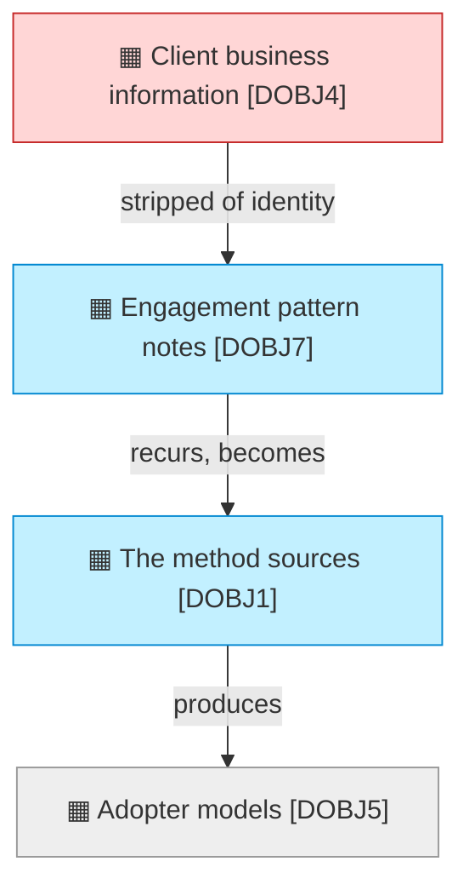

# Information Layer

_[← EA home](../README.md)_

The passive structure of the architecture: the data objects that represent
the `business objects`, and how
information flows, is represented, and persists.

## Analysis order

Files are numbered in the order they are analyzed: first _what information
exists_, then _how it moves and is represented_, and finally _where it is
physically stored, classified, and retained_.

| #   | Document                                           | Elements                                              | Question it answers                                 |
| --- | ---------------------------------------------------| -------------------------------------------------------| ------------------------------------------------------ |
| 1   | [1_data-objects.md](./1_data-objects.md)           | Data Objects (domain types) and their code locations  | What information exists?                             |
| 2   | `2_data-flows.md`               | Representations, persistence and flow relationships   | How does it move between representations?            |
| 3   | `3_data-architecture.md` | Schema, classification, retention                     | Where does it live, how sensitive is it, how long?   |

`3_data-architecture.md` is where **data classification** (public,
internal, sensitive, regulated, …) and **retention** live — reference it
whenever a business rule or technology decision depends on how sensitive a
piece of data is.

## Layer view

The learning loop, and every step removes information. It ends outside the
boundary: what an adopter builds is never seen here, which is why the
organization cannot measure its own main outcome.

### Relationships

<!-- Transcribed from this document's diagrams. The identifier is
     authoritative; the description beside it is checked against the
     catalogue that defines the element. -->

| From | From element | To | To element | Relationship |
| ---- | ------------ | -- | ---------- | ------------ |
| `DOBJ4` | «Data Object» Client business information | `DOBJ7` | «Data Object» Engagement pattern notes | stripped of identity |
| `DOBJ7` | «Data Object» Engagement pattern notes | `DOBJ1` | «Data Object» The method sources | recurs, becomes |
| `DOBJ1` | «Data Object» The method sources | `DOBJ5` | «Data Object» Adopter models | produces |
