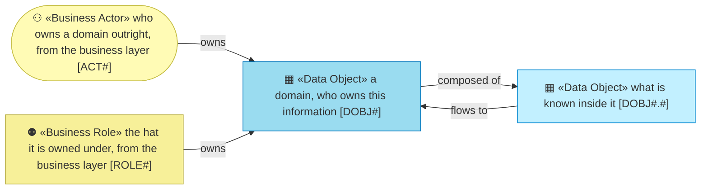
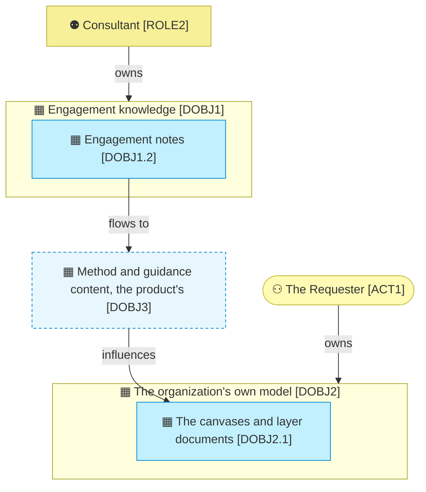

# Information

_[← Front door](../README.md)_

What the organization knows, who owns each part, and where it lives.

**ArchiMate viewpoint:** Information: Data Object, with the domain as its
level 1 and the object as its level 2.

## Documents

| # | Document | Elements | Question it answers |
| - | -------- | -------- | ------------------- |
| 1 | [Information domains and objects](./1_information-domains-and-objects.md) | The two domains the organization masters, the one it defers to the product, and the objects inside each | What does the organization know, who owns it, and where does it live? |

## Metamodel

The actor and the role are visitors from the business layer and keep their
yellow; the darker cyan marks a domain, and a dashed box is a domain the
product owns.

## Layer view

What the organization masters it owns outright. What it uses most, the method
itself, belongs to the product, and the loop closes anyway: engagement notes
become method and come back as the shape of the organization's own model.
