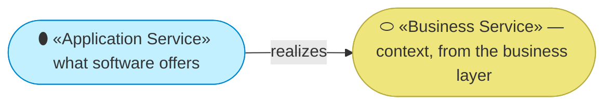
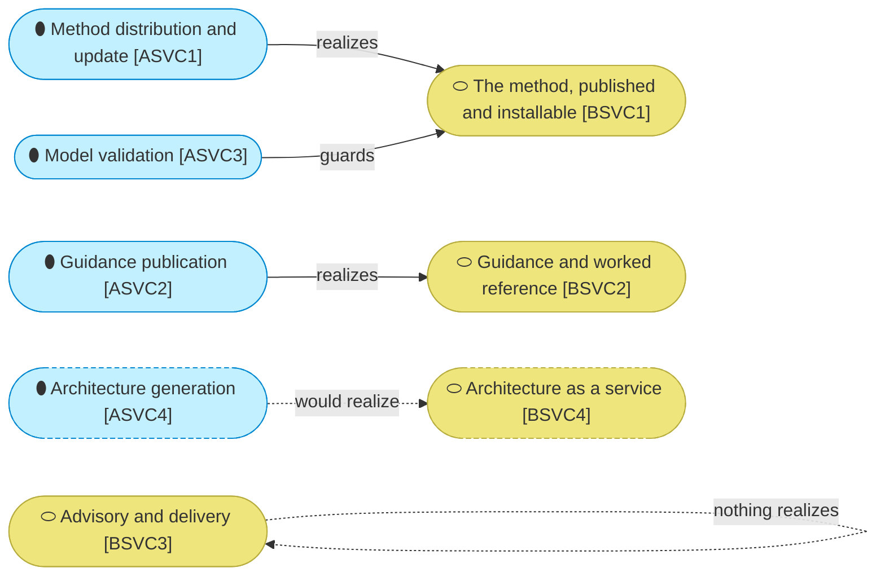

# Application services

_[← Application layer](./README.md) · [EA home](../README.md)_

**ArchiMate viewpoint:** Application. What software does for this
organization's business layer — and, just as importantly, what it does not.

**Status:** ● Validated — **Gate 3** declined at Gate 2 ([scope document 1](../scope/1_rebuild-the-models-on-the-current-method.md), 2026-08-22), which routed layers 3 to 5 to pull-request review.

## How to read this document

| Glyph | Shape | Element | ID prefix | Reads as |
| ----- | ----- | ------- | --------- | -------- |
| `⬮` | Stadium | «Application Service» | `ASVC` | `ASVC1` = Application Service 1 |
| `⬭` | Stadium (yellow) | «Business Service» — context, from [2_business/2_business-services.md](../2_business/2_business-services.md) | `BSVC` | `BSVC1` = Business Service 1 |

## The services

| ID | Application service | What it does | Realizes | Provided by | State |
| -- | ------------------- | ------------ | -------- | ----------- | ----- |
| `ASVC1` | **Method distribution and update** — obtaining the method, and receiving improvements to it without hand-porting | `BSVC1` | `ACMP1` | Live |
| `ASVC2` | **Guidance publication** — the readable explanation of what the method is and how to start | `BSVC2` | `ACMP2` | Live |
| `ASVC3` | **Model validation** — every element reference resolves, no identifier is defined twice or reused after retirement | `CAP2` | `ACMP3` | Live |
| `ASVC4` | **Architecture generation** — an owner supplies what they have and receives a working architecture repository | `BSVC4` | `ACMP5` | **Pending — future initiative** (`COA2`) |

### Relationships

<!-- Transcribed from this document's diagrams. The identifier is
     authoritative; the description beside it is checked against the
     catalogue that defines the element. -->

| From | From element | To | To element | Relationship |
| ---- | ------------ | -- | ---------- | ------------ |
| `ASVC3` | «Application Service» Model validation | `BSVC1` | «Business Service» The method, published and installable | guards |
| `BSVC3` | «Business Service» Advisory and delivery with the method | `BSVC3` | «Business Service» Advisory and delivery with the method | nothing realizes |

## What the business does not get from software

**`BSVC3` has no application service, and that is the finding this layer
exists to make.** Advisory and delivery is realized by a person, in person.
There is no software behind it, nothing to scale, and no marginal cost that
falls with the second client — the second client costs exactly what the first
one did.

That single empty cell is the same fact as `RES1` being the binding
constraint, `COST1` being dominant, and `PROD2` being the only product that
cannot grow. Four layers state it in four vocabularies, and this is where it
is least deniable: a business service with no realizing software is a business
service that scales at the speed of one person's calendar.

**`COA1` is the response**, and it targets this row specifically. Its stages
move what the consultant knows into `ACMP1`, where `ASVC1` already delivers it
to everyone at zero marginal cost. The course of action is not "add software
under `BSVC3`" — it is "make `BSVC1` carry what `BSVC3` currently carries".

**`ASVC3` realizes a capability rather than a business service**, which is
unusual and correct: model validation is not something an adopter buys, it is
something that keeps `CAP2` true. Nobody meets it except when it fails.
