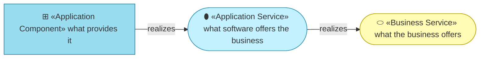
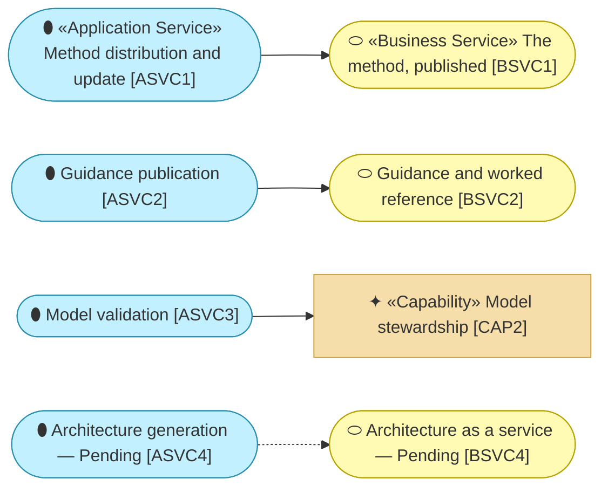

# Application Services — the organization behind archreator

_[← Application layer](./README.md) · [EA home](../README.md)_

**ArchiMate elements:** Application Service.

What the software offers the business layer. Four services, three of them
running today.

## How to read this document

| Glyph | Shape | Element | ID prefix | Reads as |
| ----- | ----- | ------- | --------- | -------- |
| `⬮` | Stadium | «Application Service» | `ASVC` | `ASVC1` = Application Service 1 |
| `⊞` | Rectangle | «Application Component» — detailed in [2_application-components.md](./2_application-components.md) | `ACMP` | `ACMP1` = Application Component 1 |
| `⬭` | Stadium (yellow) | «Business Service» — context, from [layer 2](../2_business/2_business-services.md) | `BSVC` | `BSVC1` = Business Service 1 |

Application elements take the cyan; the ramp runs light for what is offered
to dark for what provides it. **The glyph rides on every node; the
«stereotype» word appears once.**

## The services

Every edge reads **realizes**.

| ID | Application service | Realizes | Provided by | State |
| -- | ------------------- | -------- | ----------- | ----- |
| `ASVC1` | **Method distribution and update** — obtaining the method, and receiving improvements to it without hand-porting | `BSVC1` | `ACMP1` | Live |
| `ASVC2` | **Guidance publication** — the readable explanation of what the method is and how to start | `BSVC2` | `ACMP2` | Live |
| `ASVC3` | **Model validation** — every element reference resolves, no identifier is defined twice or reused after retirement | `CAP2` model stewardship | `ACMP3` | Live |
| `ASVC4` | **Architecture generation** — an owner supplies what they have and receives a working architecture repository | `BSVC4` | `ACMP5` | **Pending — future initiative** (`COA2`) |

**`ASVC3` realizes a capability rather than a business service**, which is
unusual and correct: nobody buys model validation. It exists so that
`CAP2` (model stewardship) is something the organization can actually do
rather than something it intends, and it is the only place in this model
where software enforces a rule instead of a person remembering one.

## What the business does *not* get from software

`BSVC3` — advisory and delivery — has no application service behind it. It is
`ROLE2` in a room with a client, assisted by an agent the organization does
not own or run. That is why `PROD2` does not scale, restated one layer down:
**there is no software to scale.**
