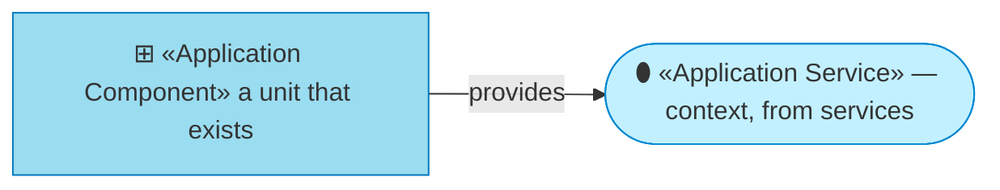
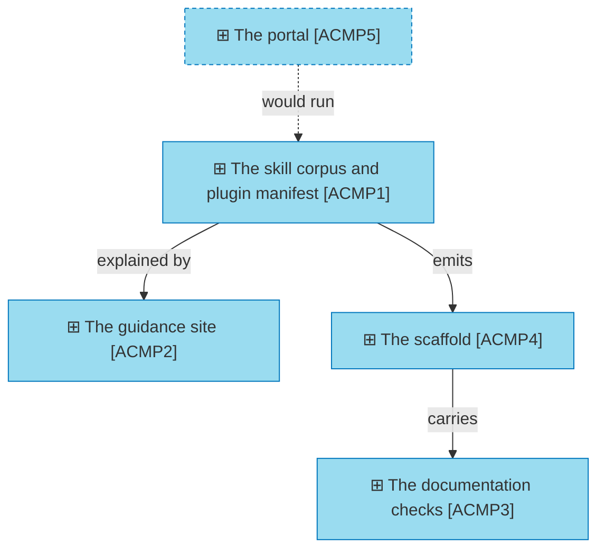

# Application components

_[← Application layer](./README.md) · [EA home](../README.md)_

**ArchiMate viewpoint:** Application. What provides each service, and which
tree models it in detail.

**Status:** ● Validated — **Gate 3** declined at Gate 2 ([scope document 1](../scope/1_rebuild-the-models-on-the-current-method.md), 2026-08-22), which routed layers 3 to 5 to pull-request review.

**This layer names components; it does not describe them.** Each one is a
deliverable with a model of its own, one tier down. Restating what those
models say would be two copies of the same fact — so the last column links to
the tree that owns it, and this document stops there.

## How to read this document

| Glyph | Shape | Element | ID prefix | Reads as |
| ----- | ----- | ------- | --------- | -------- |
| `⊞` | Rectangle | «Application Component» | `ACMP` | `ACMP1` = Application Component 1 |
| `⬮` | Stadium | «Application Service» — context, from [1_application-services.md](./1_application-services.md) | `ASVC` | `ASVC1` = Application Service 1 |

## The components

| ID | Component | Provides | Realized by | Modeled in |
| -- | --------- | -------- | ----------- | ---------- |
| `ACMP1` | **The skill corpus and plugin manifest** — seventeen skills, plus the plugin and marketplace manifests | `ASVC1` | `plugins/archreator/skills/`, `plugins/archreator/.claude-plugin/plugin.json`, `.claude-plugin/marketplace.json` | [`product-archreator/`](../../../product-archreator/README.md) |
| `ACMP2` | **The guidance site** — the published page | `ASVC2` | `site/index.html` | [`product-archreator/site/`](../../../product-archreator/site/README.md) |
| `ACMP3` | **The documentation checks** — link resolution and element-identifier validation, run in CI | `ASVC3` | `plugins/archreator/scaffold/scripts/`, and the workflows beside them | [`product-archreator/`](../../../product-archreator/README.md) |
| `ACMP4` | **The scaffold** — the empty layered tree, and the validators, that `ACMP1` emits into a new project | `ASVC1` | `plugins/archreator/scaffold/` | [`product-archreator/`](../../../product-archreator/README.md) |
| `ACMP5` | **The portal** | `ASVC4` | **Pending — future initiative** (`COA2`) | Nothing yet — it would need a tree of its own |

All paths are in the [`archreator`](https://github.com/roanboc/archreator)
repository, which is where the method's source lives. This repository holds
the models of it.

## Where the tiers divide

**Four of five components are modeled one tier down, and one has nowhere to
be modeled.** That asymmetry is the state of `COA2` expressed structurally:
`ACMP5` is a component with no tree, because a tree is a thing you write once
there is something to describe.

**`ACMP5` arriving would create the third product tree.** It is the one
product that does not share the organization's name, which makes it the case
that tests the naming convention rather than confirming it.

**Nothing here describes how a component works**, and that is the tier rule
rather than brevity: this tree names *that* a component exists and links to
its model. Reaching into that model's internals from here is the same
error as an enterprise describing an application's classes.

## Relationships

<!-- Transcribed from this document's diagrams. The identifier is
     authoritative; the description beside it is checked against the
     catalogue that defines the element. -->

| From | From element | To | To element | Relationship |
| ---- | ------------ | -- | ---------- | ------------ |
| `ACMP1` | «Application Component» The skill corpus and plugin manifest | `ACMP4` | «Application Component» The scaffold | emits |
| `ACMP4` | «Application Component» The scaffold | `ACMP3` | «Application Component» The documentation checks | carries |
| `ACMP1` | «Application Component» The skill corpus and plugin manifest | `ACMP2` | «Application Component» The guidance site | explained by |
| `ACMP5` | «Application Component» The portal | `ACMP1` | «Application Component» The skill corpus and plugin manifest | would run |
