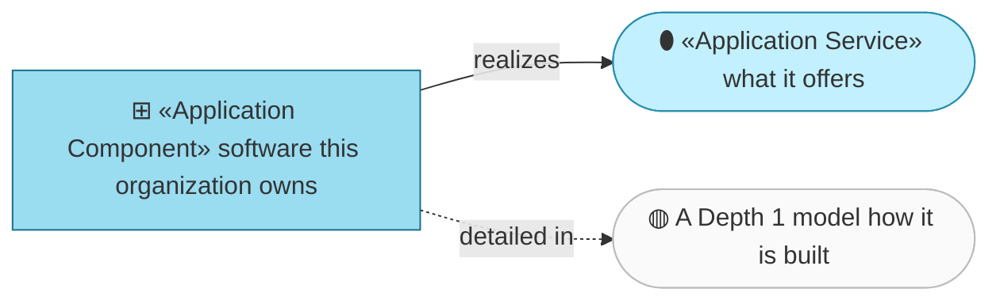
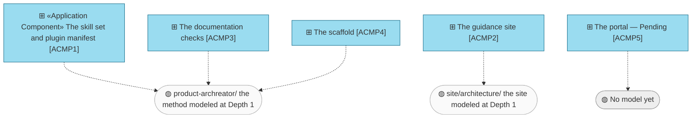

# Application Components — the organization behind archreator

_[← Application layer](./README.md) · [EA home](../README.md)_

**ArchiMate elements:** Application Component.

Where the grounding rule bites hardest: every component names the files that
implement it, or is marked Pending.

## How to read this document

| Glyph | Shape | Element | ID prefix | Reads as |
| ----- | ----- | ------- | --------- | -------- |
| `⊞` | Rectangle | «Application Component» | `ACMP` | `ACMP1` = Application Component 1 |
| `⬮` | Stadium | «Application Service» — from [1_application-services.md](./1_application-services.md) | `ASVC` | `ASVC1` = Application Service 1 |

**The glyph rides on every node; the «stereotype» word appears once.**

## The components, and where each one is modeled in full

Every dashed edge reads **detailed in**, and the pattern they show is the
answer to a question this model left open — see below.

| ID | Component | Realizes | Implemented by | Modeled in full by |
| -- | --------- | -------- | -------------- | ------------------ |
| `ACMP1` | **The skill set and plugin manifest** — fourteen skills, the plugin and marketplace manifests | `ASVC1` | `.claude/skills/`, `.claude/.claude-plugin/plugin.json`, `.claude-plugin/marketplace.json` | [`product-archreator/`](../../../product-archreator/README.md) |
| `ACMP2` | **The guidance site** — the published pages, English and Spanish | `ASVC2` | `product-archreator/site/public/` | [`site/architecture/`](../../../product-archreator/site/architecture/README.md) |
| `ACMP3` | **The documentation checks** — link resolution and element-identifier validation, run in CI | `ASVC3` | `.claude/skills/project-bootstrap/templates/scripts/`, `.github/workflows/` | [`product-archreator/`](../../../product-archreator/README.md) |
| `ACMP4` | **The scaffold** — the empty layered tree, and the validators, that `ACMP1` emits into a new project | `ASVC1` | `.claude/skills/project-bootstrap/templates/` | [`product-archreator/`](../../../product-archreator/README.md) |
| `ACMP5` | **The portal** | `ASVC4` | **Pending — future initiative** (`COA2`) | Nothing yet — it would need its own Depth 1 model |

## How this layer relates to `product-archreator/` and its `site/`

This resolves the question
[the first initiative left open](../scope/1_model-the-operating-model.md):
what happens to `product-archreator/` once the organization's layer 4 exists.

**The organization's layer 4 names *that* an application exists, what it
offers, and who runs it. A Depth 1 model says *how* it is built.** Neither
restates the other, and the link between them is the `Modeled in full by`
column above. This is the enterprise tier of the rule the method now owns —
see `architecture-doc-style` § What belongs at which tier. Stated here once
because it is what this table *is*; the rule itself is not restated.

That is the Depth 2 → Depth 1 relationship archreator recommends to every
adopter, running on itself for the first time. An adopting company models its
organization once, and each application it builds gets its own project that
consumes that model — rather than one document growing until nobody can
change it safely.

The rule that keeps it honest: **nothing about a component's internals is
written here.** `ACMP1` has fourteen skills and a manifest; how they fit
together is `product-archreator/`'s layer 4, and copying any of it into this
table would be the enumeration `P5` exists to prevent.

## The organization runs almost no software

Four components, and three of them are **text that other people execute**.
`ACMP1` is instructions an adopter's agent reads; `ACMP4` is a directory
it copies for them. Only `ACMP3` runs anywhere this organization controls, and it
runs in someone else's continuous-integration service for a few seconds per
push.

The runtime that does the actual work — the coding agent — belongs to the
adopter, is paid for by the adopter, and appears in
[layer 5](../5_technology/1_technology-services.md) as a node this
organization does not operate. That is the clearest statement of what
archreator is: **not a system, a set of instructions with a validator
attached.**

`ACMP5` is where that would change.
