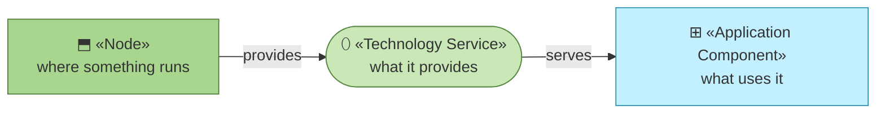
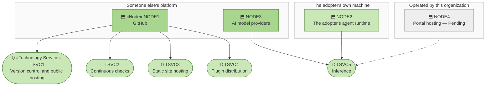

# Technology Services — the organization behind archreator

_[← Technology layer](./README.md) · [EA home](../README.md)_

**ArchiMate elements:** Technology Service, Node.

Infrastructure this organization uses. It operates none of it.

## How to read this document

| Glyph | Shape | Element | ID prefix | Reads as |
| ----- | ----- | ------- | --------- | -------- |
| `⬯` | Stadium | «Technology Service» | `TSVC` | `TSVC1` = Technology Service 1 |
| `⬒` | Rectangle | «Node» | `NODE` | `NODE1` = Node 1 |
| `⎔` | Parallelogram | «Artifact» — see [2_deployment.md](./2_deployment.md) | `ART` | `ART1` = Artifact 1 |
| `⊞` | Rectangle (cyan) | «Application Component» — context, from [layer 4](../4_application/2_application-components.md) | `ACMP` | `ACMP1` = Application Component 1 |

Technology takes the green, ramped light for what is provided to dark for
what provides it. **The glyph rides on every node; the «stereotype» word
appears once.**

## Where this organization runs nothing

**The third box holds one node and it is greyed out.** Every node that
actually exists is either someone else's platform or the adopter's own
machine; the only thing this organization would operate is Pending. `COST3` —
hosting, at effectively zero — is not frugality; there is nothing to run.

| ID | Technology service | Provided by | Serves | Cost |
| -- | ------------------ | ----------- | ------ | ---- |
| `TSVC1` | **Version control and public hosting** — the repository itself, which is also `BIF1` | `NODE1` | `ACMP1`, `ACMP3`, `ACMP4` | Zero — free tier |
| `TSVC2` | **Continuous checks** — the documentation workflow that runs `ACMP3` on every push | `NODE1` | `ACMP3` | Zero — free tier |
| `TSVC3` | **Static site hosting** — Pages, serving `ACMP2` | `NODE1` | `ACMP2` | Zero — free tier |
| `TSVC4` | **Plugin distribution** — the marketplace manifest an adopter installs from | `NODE1` | `ACMP1` | Zero |
| `TSVC5` | **Inference** — the model calls the method's instructions are executed by | `NODE3`, invoked from `NODE2` | The adopter, not a component here | **Paid by the adopter** for `PROD1`; by the Requester for `PROD2`; by this organization only under `COA2` |

| ID | Node | Operated by | Notes |
| -- | ---- | ----------- | ----- |
| `NODE1` | **GitHub** | GitHub | Four of five services run here. Replaceable in principle, and replacing it would rebuild `BIF1`–`BIF3` at once |
| `NODE2` | **The adopter's agent runtime** — their machine, their Claude Code or equivalent | **The adopter** | Where the method actually executes. This organization has no visibility into it, which is the same fact [layer 3](../3_information/1_data-objects.md#why-the-organization-cannot-measure-itself) records as `DOBJ5` |
| `NODE3` | **AI model providers** | The provider | Reached under each party's own account — see `CTR1` |
| `NODE4` | **Portal hosting** | Would be this organization | **Pending — future initiative** (`COA2`) |

### The single dependency, stated plainly

`NODE1` provides four of the five services. That is a real concentration and
it is worth naming next to the one in `RES1`: **this organization has one
person and one platform.** The difference is that the platform is
substitutable on a weekend and the person is not, which is why only one of
the two carries a course of action.

### What `COA2` would change here

`NODE4` is the only row in the "operated by this organization" box, and it
brings the first infrastructure cost that scales with use (`COST2`
inference, `COST4` operations). [Layer 3](../3_information/1_data-objects.md#the-portal-crosses-two-lines-at-once)
reaches the same conclusion from the data side. Both layers were filled
independently and both say the portal is where this organization stops being
a method and becomes a service.
