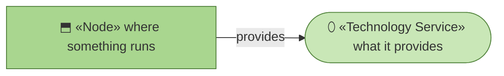
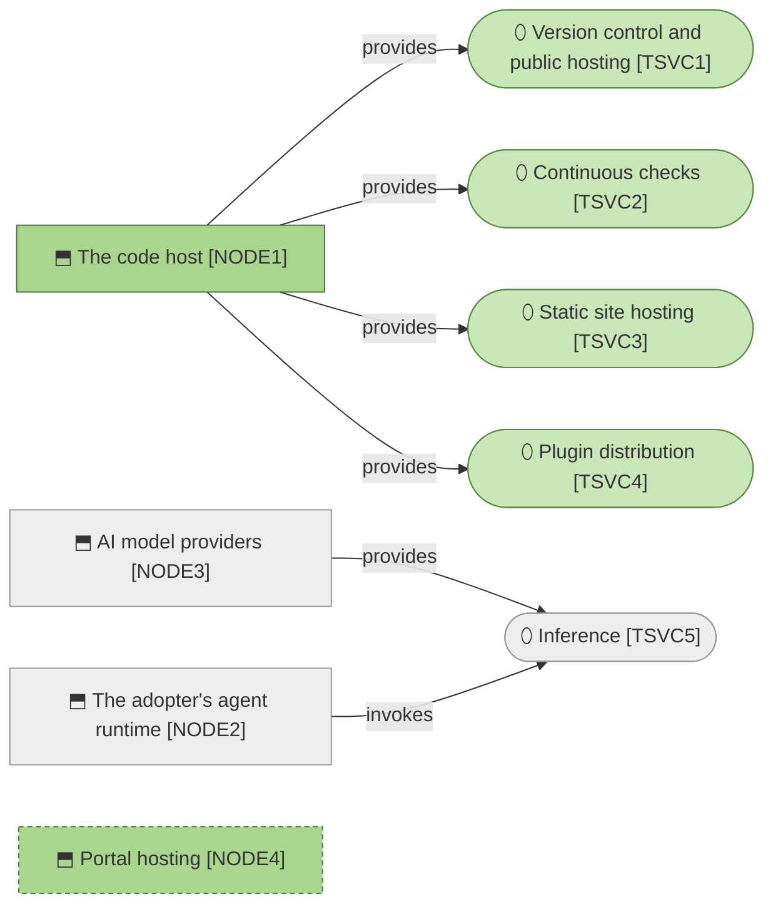

# Technology services

_[← Technology layer](./README.md) · [EA home](../README.md)_

**ArchiMate viewpoint:** Technology. What everything runs on, and who pays
for it.

**This organization operates nothing.** Four of its five technology services
run on somebody else's free tier, and the fifth runs on hardware and accounts
belonging to whoever is using the method. That is not frugality; it is what
makes a one-person organization able to publish a method at all.

## How to read this document

| Glyph | Shape | Element | ID prefix | Reads as |
| ----- | ----- | ------- | --------- | -------- |
| `⬒` | Rectangle | «Node» | `NODE` | `NODE1` = Node 1 |
| `⬯` | Stadium | «Technology Service» | `TSVC` | `TSVC1` = Technology Service 1 |

## The stack

| ID | Technology service | Provided by | Serves | Cost |
| -- | ------------------ | ----------- | ------ | ---- |
| `TSVC1` | **Version control and public hosting** — the repository itself, which is also `BIF1` | `NODE1` | `ACMP1`, `ACMP3`, `ACMP4` | Zero — free tier |
| `TSVC2` | **Continuous checks** — the workflow that runs `ACMP3` on every push | `NODE1` | `ACMP3` | Zero — free tier |
| `TSVC3` | **Static site hosting** — serving `ACMP2` | `NODE1` | `ACMP2` | Zero — free tier |
| `TSVC4` | **Plugin distribution** — the marketplace manifest an adopter installs from | `NODE1` | `ACMP1` | Zero |
| `TSVC5` | **Inference** — the model calls the method's instructions are executed by | `NODE3`, invoked from `NODE2` | The adopter, not a component here | **Paid by the adopter** for `PROD1`; by the Requester for `PROD2`; by this organization only under `COA2` |

| ID | Node | Operated by | Note |
| -- | ---- | ----------- | ---- |
| `NODE1` | **The code host** | The host | Four of five services run here. Replaceable in principle; replacing it would rebuild `BIF1`–`BIF3` at once |
| `NODE2` | **The adopter's agent runtime** — their machine, their agent | **The adopter** | Where the method actually executes. This organization has no visibility into it, which is the same fact `DOBJ5` records |
| `NODE3` | **AI model providers** | The provider | Reached under each party's own account — see `CTR1` |
| `NODE4` | **Portal hosting** | Would be this organization | **Pending — future initiative** (`COA2`) |

## Who pays for what, and why it matters

`TSVC5` is the only service with a real cost, and **this organization does not
pay it for its main product.** An adopter running `PROD1` uses their own
account and their own inference; nothing meters through here.

That is what makes `PROD1` free without being subsidised — the marginal cost
of the thousandth adopter is genuinely zero, because the thousandth adopter
brings their own compute. It is also why `COST2` only becomes dominant under
`PROD3`: the portal is the one design where this organization would pay for
somebody else's inference.

**`NODE4` is the whole of what `COA2` would add**, and it is the first node
this organization would operate. Everything currently true of this layer — no
uptime, no secrets, no bill, no on-call — stops being true on the day it
exists. `P7` is the constraint that would then bind: priced at the cost of
running it, which requires knowing what running it costs.

## What this layer deliberately does not have

| Absent | Because |
| ------ | ------- |
| Anything operated by this organization | Every node belongs to a host, an adopter, or a provider |
| A staging environment | There is nothing running to stage. A pull request is the environment |
| Monitoring or alerting | Nothing runs between pushes. A failure is a red check |
| A backup policy | The repository is the artifact, and the host holds it |
