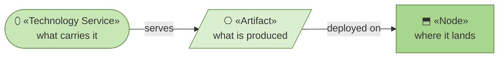
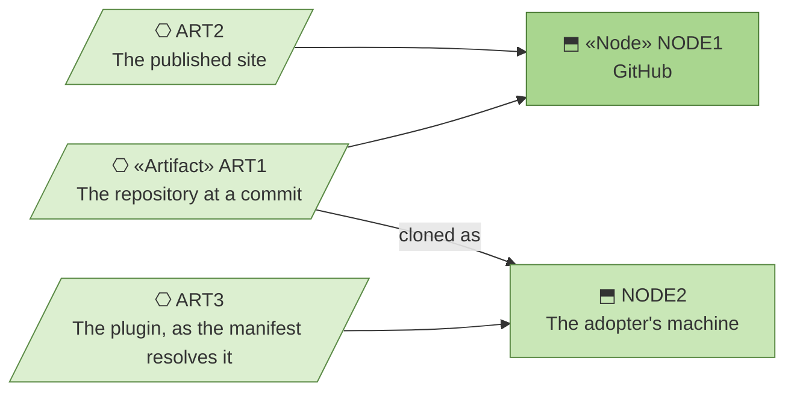

# Deployment — the organization behind archreator

_[← Technology layer](./README.md) · [EA home](../README.md)_

**ArchiMate elements:** Artifact, Node.

How the built things reach where they run. There is very little pipeline,
and the reason is structural rather than immature.

## How to read this document

| Glyph | Shape | Element | ID prefix | Reads as |
| ----- | ----- | ------- | --------- | -------- |
| `⎔` | Parallelogram | «Artifact» | `ART` | `ART1` = Artifact 1 |
| `⬒` | Rectangle | «Node» — from [1_technology-services.md](./1_technology-services.md) | `NODE` | `NODE1` = Node 1 |
| `⬯` | Stadium | «Technology Service» — same document | `TSVC` | `TSVC1` = Technology Service 1 |

**The glyph rides on every node; the «stereotype» word appears once.**

## What gets deployed, and to where

| ID | Artifact | Produced by | Deployed on | How it gets there |
| -- | -------- | ----------- | ----------- | ----------------- |
| `ART1` | **The repository at a commit** — the method, the scaffold and the validators as text | A merge to the default branch | `NODE1`, and `NODE2` on clone | `git push`; the adopter pulls |
| `ART2` | **The published site** — `ACMP2`'s pages | The Pages workflow | `NODE1` | Automatic on merge |
| `ART3` | **The plugin, as the manifest resolves it** | Nothing — the manifest points at the repository | `NODE2` | `/plugin install`, then `/plugin update` |

## There is no build

`ART1` and `ART3` are **not compiled, bundled or versioned artifacts** —
they are the source, read where it lies. `ART2` is the only thing produced
by a process, and that process copies static files.

The whole deployment story is therefore: merge to the default branch, and
the three artifacts are current. What passes for release engineering here is
`TSVC2`, the continuous checks, which run `ACMP3` and stop a merge that would
leave the model inconsistent.

**That is a consequence of `P2`** — everything in the repository, as text. A
method distributed as source has no packaging step to get wrong, and the
cost is that there is no version boundary either: an adopter who pulls gets
whatever the default branch says today. Nobody has needed more than that, and
the moment someone does, this document is where it would be recorded.

`COA2` would introduce the first real deployment: `NODE4` needs something
built, shipped and rolled back.
