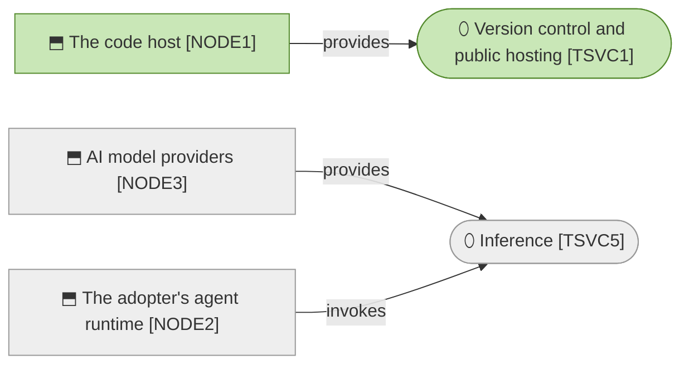

# Technology Layer

_[← EA home](../README.md)_

The runtimes, tooling, and infrastructure that the
[application layer](../4_application/README.md) executes on.

## Analysis order

Files are numbered in the order they are analyzed: first _which technology
services exist and what provides them_, then _how the built artifacts reach
their runtime nodes_.

| #   | Document                                               | Elements                                                          | Question it answers                       |
| --- | --------------------------------------------------------| --------------------------------------------------------------------| --------------------------------------------- |
| 1   | [1_technology-services.md](./1_technology-services.md) | Technology Services and the nodes/system software providing them | What infrastructure services are used?    |
| 2   | `2_deployment.md`                   | Nodes, Artifacts, and the CI/CD deployment pipeline               | How does the build get to where it runs?  |

If no stack has been chosen yet — typical the first time this layer is
assessed for a new small project — use the `stack-selection` skill for a
decision framework and concrete defaults (static hosting vs. Supabase +
Vercel, etc.) before writing [1_technology-services.md](./1_technology-services.md).

## Layer view

Grey is outside the boundary, and most of this layer is grey: the only service
running on anything this organization arranged is free, and the only service
with a real cost is paid by whoever is using the method.

## Relationships

<!-- Transcribed from this document's diagrams. The identifier is
     authoritative; the description beside it is checked against the
     catalogue that defines the element. -->

| From | From element | To | To element | Relationship |
| ---- | ------------ | -- | ---------- | ------------ |
| `NODE3` | «Node» AI model providers | `TSVC5` | «Technology Service» Inference | provides |
| `NODE2` | «Node» The adopter's agent runtime | `TSVC5` | «Technology Service» Inference | invokes |
