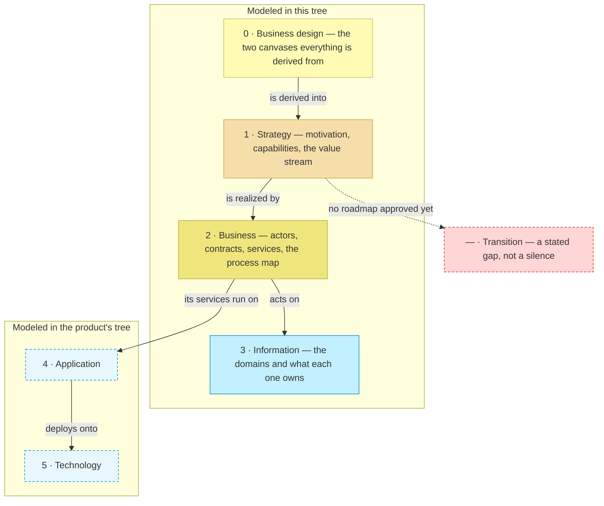

# Architecture — the organization that publishes archreator

_The front door of this model. Repository-wide rules: [`AGENTS.md`](../AGENTS.md)._

**This folder is what the organization knows about itself** — who it serves,
what it must be able to do, and how the work flows from first contact to a
delivered outcome. Plain Markdown, so a person, a colleague and a coding
agent all read the same thing.

**Federation ID:** `ORG` — a reference to this model from another model in
the federation reads `ORG.STK#`.

## What is modeled, and what is not

**One row per layer, and every row says something.** A layer with no folder
is a stated fact, not a silence. The two dashed boxes are where this model
stops: what the organization builds keeps a model of its own, and where it
is going has not been approved as direction yet.

| # | Layer | The question it answers | Status |
| - | ----- | ----------------------- | ------ |
| 0 | [Business design](./0_business-design/README.md) | Who are the customers, and how does each offering pay? | `Local` — the two canvases |
| 1 | [Strategy](./1_strategy/README.md) | Why does this exist, and what must it be able to do? | `Local` — motivation, capabilities, the value stream |
| 2 | [Business](./2_business/README.md) | Who does what, and which services are offered? | `Local` — actors, services and the process map, one document |
| 3 | [Information](./3_information/README.md) | What information exists, and where does it live? | `Local` — two domains the organization masters, and the one it defers to [the product tree](../../product-archreator/architecture/README.md) |
| 4 | Application | Which software realizes each business service? | `External` — owned by [product-archreator](../../product-archreator/architecture/README.md): what the organization builds keeps a model of its own |
| 5 | Technology | What runs it all? | `External` — owned by [product-archreator](../../product-archreator/architecture/README.md), same reason |
| — | Transition | Where is this going, and in what order? | `Gap` — this model describes the current state only; a roadmap is a later initiative through Direction |

Domains stay unused at Depth 2 — see [`AGENTS.md`](../AGENTS.md) § Modeling
depth.

## How far each document has been validated

Every document that defines elements opens with one of three marks:

| Mark | Meaning |
| ---- | ------- |
| `○` | Not started — the document exists so the gap is visible |
| `◐` | Draft catalogue — identified and written down; nobody has approved it |
| `●` | Validated — confirmed by the Requester at a named gate, on a date |

**Everything in this model is `◐` today.** Direction and Understanding are
pending in
[the current initiative](../../product-archreator/architecture/scope/1_rebuild-the-models-on-method-02.md).

## Initiatives

Recorded in
[`product-archreator/architecture/scope/`](../../product-archreator/architecture/scope/README.md)
— an initiative spanning both trees is one initiative with one document.
