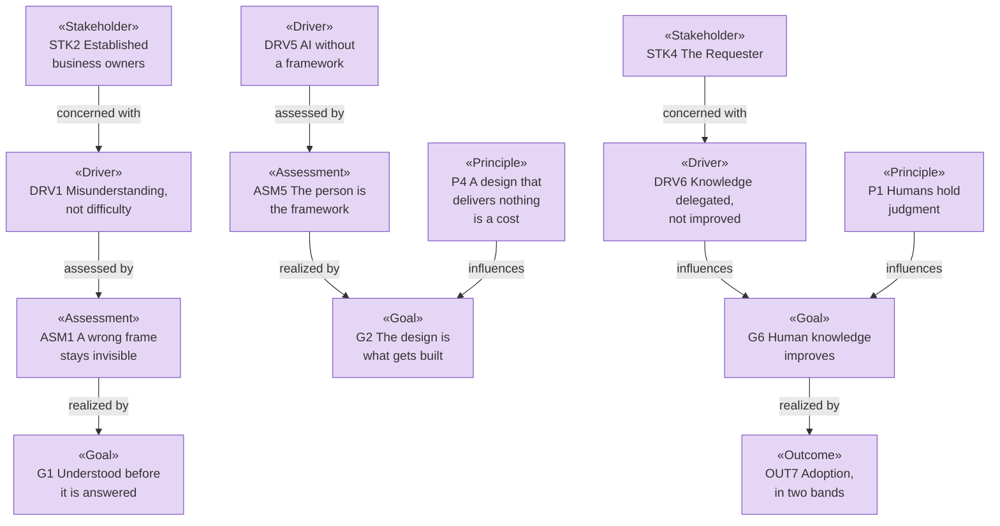

# Motivation — the organization behind archreator

_[← Strategy layer](./README.md) · [EA home](../README.md)_

**ArchiMate elements:** Stakeholder, Driver, Assessment, Goal, Outcome,
Principle.

Derived from the [value proposition canvas](../0_business-design/1_value-proposition-canvas.md)
and the [business model canvas](../0_business-design/2_business-model-canvas.md),
approved at Gate 0 on 2026-08-08. Each table's `Source` column names the
canvas element it came from, so the trace back survives.

## Stakeholders

The three customer segments become stakeholders, and so do the two internal
parties. Partners are stakeholders in the loose sense but are modeled where
they act — as external Business Actors in
[the business layer](../2_business/1_business-actors-and-roles.md) — rather
than duplicated here.

| ID | Stakeholder | Concern | Driver | Source |
| -- | ----------- | ------- | ------ | ------ |
| `STK1` | **Business and solution designers** — enterprise architects at any level, business analysts, entrepreneurs designing for themselves | Getting from a design to something delivered, without handing the work to someone who will not understand it | `DRV1`, `DRV2` | `CS1` Customer Segment 1 |
| `STK2` | **Established business owners** — a running company with real operational knowledge and no structure a builder can act on | Having their business understood well enough that what gets built is what they meant | `DRV1`, `DRV3`, `DRV4` | `CS2` Customer Segment 2 |
| `STK3` | **Founders at the idea stage** — pre-operational, the business model still forming | Testing an idea without paying for expertise they cannot yet justify | `DRV1`, `DRV4` | `CS3` Customer Segment 3 |
| `STK4` | **The Requester** — the single person who maintains the method and delivers the consulting | That the method is used, improves through that use, and does not depend on their availability forever | `DRV5`, `DRV6` | `KR1` Key Resource 1, `COST1` Cost 1 |
| `STK5` | **Contributor community** — **Pending**, no contributor base exists yet | Being able to feed real experience back into a method they did not write | `DRV5` | `KP3` Key Partner 3 |

`STK5` is recorded because `RS1` (Revenue Stream 1 — continuous improvement)
depends on it. A stakeholder who does not exist yet is still the honest way
to model a return that is claimed.

## Drivers

| ID | Driver | What pressures it |
| -- | ------ | ----------------- |
| `DRV1` | **Solutions fail from misunderstanding, not difficulty** — a good answer to the wrong question, discovered late |
| `DRV2` | **Design and delivery are separate worlds** — the design is handed over, the meaning is lost at the handover, and time to market pays for it |
| `DRV3` | **Knowledge decays and leaves with people** — the owner explains the business again to every new builder |
| `DRV4` | **Architectural expertise is priced out of reach** — an enterprise architect costs more than the businesses that most need one can justify |
| `DRV5` | **AI can now do the work and has no framework behind it** — the capability arrived; the discipline did not |
| `DRV6` | **Human knowledge is being delegated rather than improved** — the fastest path with AI is to let it think, and the person ends up understanding their own business less than before |

`DRV6` is the reason this organization exists rather than a competitor to it.
Everything else on this list is a market condition; `DRV6` is a choice about
which way the market should go.

## Assessments

The canvas pains, as judgments about the drivers above. One assessment per
pain, with the severity per segment kept where it belongs — on the
[canvas](../0_business-design/1_value-proposition-canvas.md#pains) — rather
than restated.

| ID | Assessment | Assesses | Source |
| -- | ---------- | -------- | ------ |
| `ASM1` | Without a method that forces a complete frame, a wrongly framed problem stays invisible until delivery | `DRV1` | `PAIN1` Pain 1 |
| `ASM2` | Design and delivery being separate is one failure with three faces: slow delivery, documentation that drives nothing, and no path from a canvas to an implementation | `DRV2` | `PAIN2` |
| `ASM3` | Knowledge scattered across documents, meetings, diagrams and wikis is knowledge trapped in whoever last held it | `DRV3` | `PAIN3` |
| `ASM4` | Architectural quality is currently bought either with years of seniority or with consulting fees, and both are out of reach for the segments that need it most | `DRV4` | `PAIN4` |
| `ASM5` | AI already performs most of this work in isolation, with a person acting as the framework by hand | `DRV5` | `PAIN5` |

`ASM5` is the load-bearing one. The other four are decades old; what is new
is that the tooling to relieve them exists and has nothing connecting it.

## Goals

What must become true. Six goals from six customer jobs plus the mission —
`G1` through `G5` are the organization's goals stated as its customers'
jobs getting done, and `G6` is the one held for its own sake.

- **G1 — The problem is understood before it is answered.** Designing is how
  the understanding happens, not a record of understanding already had.
  Derived from `JOB1` (Job 1) against `ASM1`.
- **G2 — The design is what gets built.** An approved design flows into a
  working solution with no handover for the meaning to change shape in —
  whether the designer builds it or directs a builder. Derived from `JOB2`
  and `JOB3` against `ASM2` and `ASM5`.
- **G3 — One shared source that outlives the people.** The same explanation
  is not given twice. Derived from `JOB4` against `ASM3`.
- **G4 — Architectural quality without scarce expertise.** Competence comes
  from the method rather than from seniority or budget. Derived from `JOB5`
  against `ASM4`.
- **G5 — A change of direction does not discard the work.** Derived from
  `JOB6`.
- **G6 — Human knowledge improves while AI builds.** The person understands
  their business better after using the method than before, which is the
  opposite of delegating the thinking. Derived from `DRV6` and `RS2`
  (Revenue Stream 2 — mission progress).

`G2` absorbs two jobs because they are one goal reached by two routes: a
designer who builds it and an owner who directs a builder want the same thing
to become true.

## Outcomes

Observable, and measured where a measure exists. Derived from the canvas
gains, plus the adoption measure the Requester attached to `G6` at Gate 0.

| ID | Outcome | Realizes | Measured by | Source |
| -- | ------- | -------- | ----------- | ------ |
| `OUT1` | Strategic and business gaps surface **during** the design work rather than after delivery | `G1` | A gate presentation names a gap the Requester had not stated. **Pending** — no collection method | `GAIN1` Gain 1 |
| `OUT2` | Documentation goes in front of the business without a rewrite | `G1`, `G3` | The document shown at a gate is the document in the repository — no separate deck exists | `GAIN2` |
| `OUT3` | Delivery starts from the approved design, with AI doing the technical work | `G2` | An implementation initiative names the scope document and the elements it builds | `GAIN3` |
| `OUT4` | A new person or agent works from the model instead of being briefed | `G3` | The model is read and acted on without the Requester re-explaining it | `GAIN4` |
| `OUT5` | Someone without years of seniority produces an architecture that holds | `G4` | **Pending** — evidenced only by the real adoption band below | `GAIN5` |
| `OUT6` | A pivot changes some layers and leaves the rest standing | `G5` | A scope document records "no change" verdicts for layers the pivot did not reach | `GAIN6` |
| `OUT7` | **Adoption in two bands** — pre-engagement (stars, forks, contributions, discussions) and real (enterprises and initiatives actually designed and built) | `G6` | Pre-engagement is readable from GitHub today; the real band has **no collection method** — see the [measure](../0_business-design/2_business-model-canvas.md#measuring-rs1-and-rs2--adoption-in-two-bands) | `RS1`, `RS2` |

**Five of seven outcomes have no working measure.** That is stated rather
than smoothed over: this organization can currently observe that people star
the repository and cannot observe whether anyone finished an architecture
with it. Closing that is `COA3`
([courses of action](./2_capabilities-and-resources.md#courses-of-action)).

## Principles

Few, load-bearing, and testable. **No canvas block feeds this section** —
these came directly from the Requester, and every one of them has already
overruled something during the method's development.

They gate every change: `ea-first-change` Step 1c stops on a conflict with
any of them.

| ID | Principle | What it rules out |
| -- | --------- | ----------------- |
| `P1` | **Humans hold strategy and business judgment; AI assists and executes.** The gates exist to make that structural rather than aspirational | An agent deciding what the business is. Also rules out the convenience path — letting AI think so the person does not have to — which is `DRV6` arriving from the inside |
| `P2` | **Everything is in the repository, as text.** Model, method, decisions, approvals | A modeling tool, a wiki, or a database as the source of truth. This is why the model graph is validated in memory and not stored |
| `P3` | **Better language, never simpler language.** Standardised concepts with defined relationships, expanded on first use | Hiding the model from the owner to spare them. The standardisation *is* the value — an owner understands their business more completely because the method forced a frame |
| `P4` | **A design that delivers nothing is a cost.** Every element earns its place by leading to an outcome | Documentation as the deliverable. Also rules out modeling an intention nobody committed to — it is marked Pending or it is not modeled |
| `P5` | **Well-done less is more.** Consolidate before enumerating, propose consolidated options rather than menus | A catalogue that nobody can hold in their head, and therefore relationships nobody traces |
| `P6` | **Generic by design, one implementation at a time.** The method is transferable instructions; the packaging is provider-specific | The method itself becoming unportable. Its exact boundary is still open — see [open question 2](../0_business-design/2_business-model-canvas.md#open-questions) |
| `P7` | **Priced at the cost of running it.** Even at scale, the intent is not to charge much beyond operational cost | Value-based pricing, and any future paid tier introduced without revisiting this principle first |

`P5` and `P7` are the two most likely to be violated by accident — `P5` by an
agent being thorough, `P7` by a reasonable-looking business decision three
initiatives from now. Both are written down for that reason.

## Motivation view

