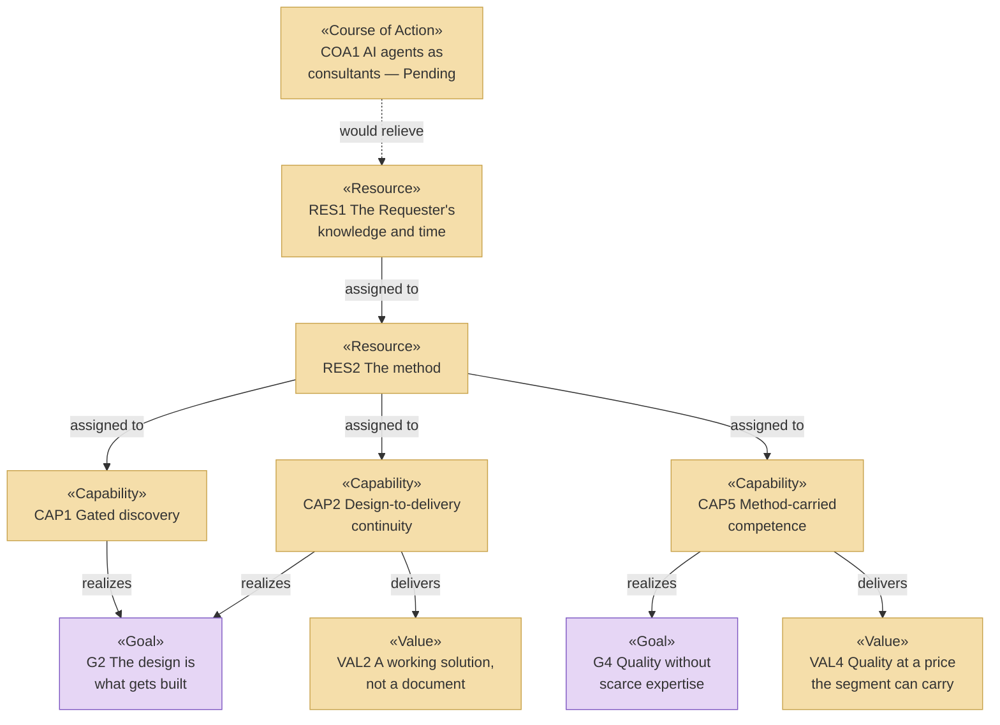

# Capabilities and Resources — the organization behind archreator

_[← Strategy layer](./README.md) · [EA home](../README.md)_

**ArchiMate elements:** Capability, Resource, Course of Action.

Derived from the value map and the business model canvases, approved at
Gate 0 on 2026-08-08.

## Capabilities

Eleven canvas elements — five Pain Relievers (`PREL1`–`PREL5`) and six Gain
Creators (`GCRE1`–`GCRE6`) — became **six capabilities**. Most of the eleven
were one ability described twice: once from the customer's side as a pain
being removed, once from the method's side as a gain being produced.

| ID | Capability | Delivers the value of | Realized by | Source |
| -- | ---------- | --------------------- | ----------- | ------ |
| `CAP1` | **Gated discovery** — question-driven discovery that tests the business rather than recording it, with approval gates forcing a complete frame before anything is built | `VAL1` | The `ea-first-change`, `operating-model-discovery` and `strategy-discovery` skills | `PREL1` Pain Reliever 1, `GCRE1` Gain Creator 1 |
| `CAP2` | **Design-to-delivery continuity** — the approved design is the input an agent builds from, so there is no handover | `VAL2` | The `ea-first-change` skill, Steps 5–7, and the `story-sharding` skill | `PREL2`, `GCRE3` |
| `CAP3` | **One documented model** — markdown in git, catalogues and diagrams, every element naming what realizes it | `VAL3` | The `ea-doc-style` skill, `scripts/check_links.py`, `scripts/check_model.py` | `PREL3`, `GCRE2` |
| `CAP4` | **A shared architectural language** — standardised concepts with defined relationships, which is what makes the model mean the same thing to a person and to an agent | `VAL3` | ArchiMate-on-Mermaid notation, per the `ea-doc-style` skill | `GCRE4` |
| `CAP5` | **Method-carried competence** — the expertise sits in the method, so the price of an architecture drops to the price of an agent | `VAL4` | The skill set as a whole, distributed as a plugin | `PREL4`, `GCRE5` |
| `CAP6` | **Layered change absorption** — strategy can change without redoing technology, and the reverse | `VAL5` | The numbered layers and the per-layer "no change" verdict | `GCRE6` |

**`PREL5` has no capability of its own, deliberately.** "The whole thing
operating together" is the *aggregate* of `CAP1`–`CAP6`, not a seventh
ability — and it is what the Requester identified as what archreator
essentially is. Modeling it as a peer of the others would double-count the
six and hide the fact that the value is in their composition.

### Values delivered

| ID | Value | Delivered to |
| -- | ----- | ------------ |
| `VAL1` | The problem is framed completely before it is answered | `STK1`, `STK2`, `STK3` |
| `VAL2` | The design produces a working solution rather than a document | `STK1`, `STK2` |
| `VAL3` | One source that survives people joining and leaving | `STK1`, `STK2` |
| `VAL4` | Architectural quality at a price the segment can carry | `STK2`, `STK3` |
| `VAL5` | A pivot costs a layer, not the project | `STK3` |

## Resources

| ID | Resource | Kind | State | Source |
| -- | -------- | ---- | ----- | ------ |
| `RES1` | **The Requester's knowledge and time** | People | **Constrained — the binding limit on the whole organization** | `KR1` Key Resource 1 |
| `RES2` | **The method** — skills, conventions, gates | Knowledge | Held, and improving. Every capability depends on it | `KR2` |
| `RES3` | **The published guidance site** | Asset | Held — realized by `site/` | `KR3` |
| `RES4` | **The portal** | Asset | **Pending — future initiative** (`COA2`) | `KR4` |

`RES1` supports `CAP1` through `CAP6` — every one of them, because one person
authors the method that realizes all six. That is the structural risk the
[business model canvas](../0_business-design/2_business-model-canvas.md#what-the-three-share-and-where-they-diverge)
records, restated here in the layer where something could be done about it.

## Courses of action

Choices the organization has named but not taken. Each is Pending, and each
is a candidate initiative rather than a plan.

| ID | Course of action | Addresses | Requires | State |
| -- | ---------------- | --------- | -------- | ----- |
| `COA1` | **AI agents acting as consultants**, carrying the Requester's knowledge | The `RES1` concentration, if `PROD2` ever had to scale | More AI maturity than exists today | **Pending** — named at Gate 0 as a route, explicitly not a plan |
| `COA2` | **Build the portal** (`PROD3`) | `STK2` and `STK3` are reachable today only through a coding agent, and nothing reaches an owner who is not already looking | An application and technology layer this model does not yet have | **Pending — target state** |
| `COA3` | **Instrument the adoption measure** | Five of seven outcomes have no working measure, and `OUT7`'s real band has no collection method | A way for adopters to report use — self-reporting is the obvious candidate | **Pending.** Prerequisite for any Social Return on Investment valuation |

`COA1` and `COA2` pull in opposite directions on `RES1`: one reduces the
dependency on the Requester's time, the other spends a large amount of it
first. Which comes first is a strategy decision, not a sequencing detail, and
it is not settled here.

## Strategy view

