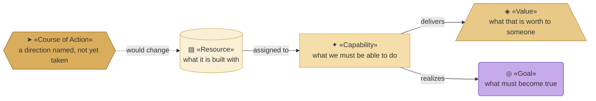
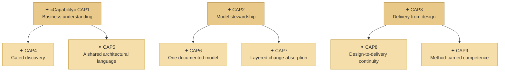
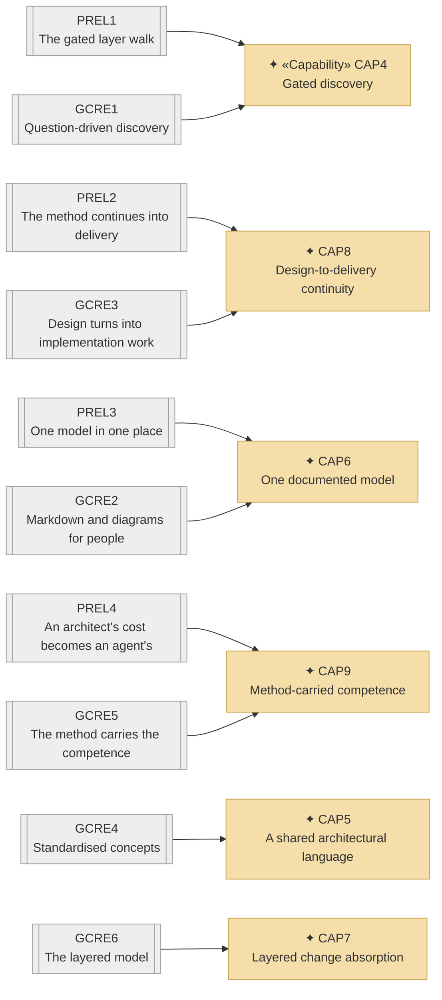
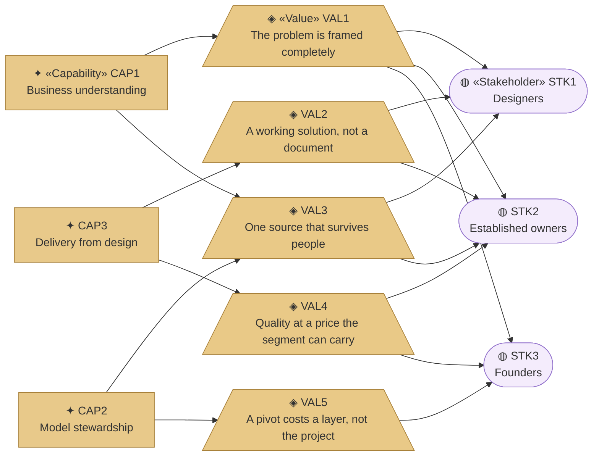
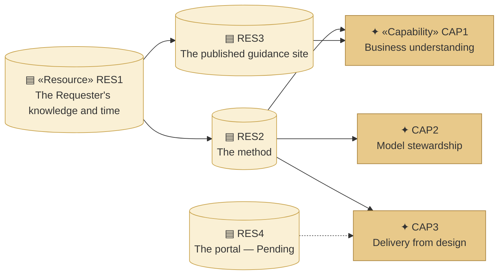
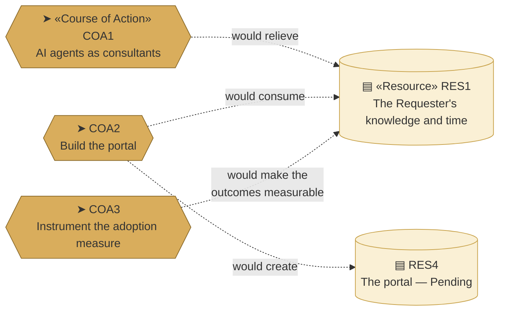

# Capabilities and Resources — the organization behind archreator

_[← Strategy layer](./README.md) · [EA home](../README.md)_

**ArchiMate elements:** Capability, Resource, Value, Course of Action.

Derived from the value map and the business model canvases, approved at
Gate 0 on 2026-08-08.

## How to read this document

**Where the strategy layer sits:** resources are what the organization has,
capabilities are what it can therefore do, values are what that is worth to
a stakeholder, and goals — which live in
[the motivation layer](./1_motivation.md) — are what it is all for. Courses
of action are the odd ones out: they are directions named but not taken, so
they attach with a dashed edge to whatever they would change.

| Glyph | Shape | Element | ID prefix | Reads as |
| ----- | ----- | ------- | --------- | -------- |
| `▤` | Cylinder | «Resource» | `RES` | `RES1` = Resource 1 |
| `✦` | Rectangle | «Capability» | `CAP` | `CAP1` = Capability 1 |
| `◈` | Trapezoid | «Value» | `VAL` | `VAL1` = Value 1 |
| `➤` | Hexagon | «Course of Action» | `COA` | `COA1` = Course of Action 1 |
| `◎` | Rounded rectangle (violet) | «Goal» — context, from layer 1 | `G` | `G1` = Goal 1 |
| `◍` | Stadium (violet) | «Stakeholder» — context, from layer 1 | `STK` | `STK1` = Stakeholder 1 |
| — | Grey, double bars | a **canvas** element from layer 0 — not ArchiMate, so no glyph | `PREL`, `GCRE` | `PREL1` = Pain Reliever 1 |

**The glyph rides on every node; the «stereotype» word appears once.** The
glyph costs one character, so it carries the type everywhere. The word costs
a line, so it is written on the first node of each type in a diagram and
dropped on the rest.

Four sand tones, running light for what is held to dark for what is only
proposed. Goals and stakeholders keep the Motivation violet, shape and glyph
they have in [1_motivation.md](./1_motivation.md), so an element that appears
in two documents looks the same in both.

## Capabilities

**Two levels.** Three capability areas, each composed of two capabilities.
The areas are what a decision gets taken at — "does this initiative
strengthen understanding, stewardship or delivery?" is answerable, while the
same question against six flat capabilities is not.

Every edge reads **composed of**. The areas carry a deeper sand than the
capabilities inside them — the same ramp logic as everywhere else, applied to
depth rather than to type.

| ID | Level | Capability | Composed of / part of | Delivers | Realized by | Source |
| -- | ----- | ---------- | --------------------- | -------- | ----------- | ------ |
| `CAP1` | Area | **Business understanding** — the organization can arrive at what a business actually is, and say it in a form that survives being passed on | `CAP4`, `CAP5` | `VAL1` | — | — |
| `CAP2` | Area | **Model stewardship** — it can keep that understanding true as time and change act on it | `CAP6`, `CAP7` | `VAL3`, `VAL5` | — | — |
| `CAP3` | Area | **Delivery from design** — it can turn an approved design into a working solution without an expert in the room | `CAP8`, `CAP9` | `VAL2`, `VAL4` | — | — |
| `CAP4` | 2 | **Gated discovery** — question-driven discovery that tests the business rather than recording it, with approval gates forcing a complete frame before anything is built | `CAP1` | `VAL1` | The `ea-first-change`, `operating-model-discovery` and `strategy-discovery` skills | `PREL1` Pain Reliever 1, `GCRE1` Gain Creator 1 |
| `CAP5` | 2 | **A shared architectural language** — standardised concepts with defined relationships, which is what makes the model mean the same thing to a person and to an agent | `CAP1` | `VAL1`, `VAL3` | ArchiMate-on-Mermaid notation, per the `ea-doc-style` skill | `GCRE4` |
| `CAP6` | 2 | **One documented model** — markdown in git, catalogues and diagrams, every element naming what realizes it | `CAP2` | `VAL3` | The `ea-doc-style` skill, `scripts/check_links.py`, `scripts/check_model.py` | `PREL3`, `GCRE2` |
| `CAP7` | 2 | **Layered change absorption** — strategy can change without redoing technology, and the reverse | `CAP2` | `VAL5` | The numbered layers and the per-layer "no change" verdict | `GCRE6` |
| `CAP8` | 2 | **Design-to-delivery continuity** — the approved design is the input an agent builds from, so there is no handover | `CAP3` | `VAL2` | The `ea-first-change` skill, Steps 5–7, and the `story-sharding` skill | `PREL2`, `GCRE3` |
| `CAP9` | 2 | **Method-carried competence** — the expertise sits in the method, so the price of an architecture drops to the price of an agent | `CAP3` | `VAL4` | The skill set as a whole, distributed as a plugin | `PREL4`, `GCRE5` |

**The areas have no `Realized by`, and that is correct rather than a gap.** An
area is realized by its parts; only the level-2 capabilities point at an
artifact. Grounding (`P1`) applies where the model touches something real,
which is the leaves.

> **Capability IDs were renumbered once, here, before Gate 1.** Introducing
> the areas made a flat `CAP1`–`CAP6` read as though the areas came last.
> This is allowed only because nothing in this layer has been approved yet —
> the same carve-out the [value proposition canvas](../0_business-design/1_value-proposition-canvas.md)
> used before Gate 0. After Gate 1 these IDs are fixed and never reused.

### Where the six came from

Every edge reads **derived into**. The grey nodes are canvas elements from
[layer 0](../0_business-design/1_value-proposition-canvas.md), not ArchiMate
elements — they are drawn only to show the consolidation, which is the one
thing a table cannot show: **ten canvas elements collapsing into six
capabilities**, because most were one ability described twice, once from the
customer's side as a pain being removed and once from the method's side as a
gain being produced.

**`PREL5` is the eleventh canvas element, and it is absent on purpose.** "The
whole thing operating together" is the *aggregate* of the three areas, not a
seventh ability — and it is what the Requester identified as what archreator
essentially is. The two-level structure makes that easier to say than the
flat list did: `PREL5` is `CAP1` and `CAP2` and `CAP3` at once, which is
exactly why it cannot be a peer of any of them.

## Values delivered

Capability edges read **delivers**; value edges read **serves**. Drawn at the
area level, because value is what a whole area produces — the level-2
attribution is in the table above.

| ID | Value | Produced by | Delivered to |
| -- | ----- | ----------- | ------------ |
| `VAL1` | The problem is framed completely before it is answered | `CAP1` | `STK1`, `STK2`, `STK3` |
| `VAL2` | The design produces a working solution rather than a document | `CAP3` | `STK1`, `STK2` |
| `VAL3` | One source that survives people joining and leaving | `CAP1`, `CAP2` | `STK1`, `STK2` |
| `VAL4` | Architectural quality at a price the segment can carry | `CAP3` | `STK2`, `STK3` |
| `VAL5` | A pivot costs a layer, not the project | `CAP2` | `STK3` |

`VAL1` is the only value every stakeholder receives, and `CAP1` is the only
area that produces it. That makes business understanding the one area this
organization cannot drop without changing who it serves.

## Resources

Every edge reads **assigned to**. **This diagram is the risk, drawn.** One
resource authors the method, the method serves all three capability areas,
and so one person's availability sits behind everything the organization can
do. The [business model canvas](../0_business-design/2_business-model-canvas.md#what-the-three-share-and-where-they-diverge)
records that as a concentration; here it is in the layer where something
could be done about it.

| ID | Resource | Kind | State | Source |
| -- | -------- | ---- | ----- | ------ |
| `RES1` | **The Requester's knowledge and time** | People | **Constrained — the binding limit on the whole organization** | `KR1` Key Resource 1 |
| `RES2` | **The method** — skills, conventions, gates | Knowledge | Held, and improving. All three areas depend on it | `KR2` |
| `RES3` | **The published guidance site** | Asset | Held — realized by `site/` | `KR3` |
| `RES4` | **The portal** | Asset | **Pending — future initiative** (`COA2`) | `KR4` |

## Courses of action

Choices the organization has named but not taken. Each is Pending, and each
is a candidate initiative rather than a plan — which is why every edge is
dashed.

| ID | Course of action | Addresses | Requires | State |
| -- | ---------------- | --------- | -------- | ----- |
| `COA1` | **AI agents acting as consultants**, carrying the Requester's knowledge | The `RES1` concentration, if `PROD2` ever had to scale | More AI maturity than exists today | **Pending** — named at Gate 0 as a route, explicitly not a plan |
| `COA2` | **Build the portal** (`PROD3`) | `STK2` and `STK3` are reachable today only through a coding agent, and nothing reaches an owner who is not already looking | An application and technology layer this model does not yet have | **Pending — target state** |
| `COA3` | **Instrument the adoption measure** | Only three of seven outcomes are checkable today; one is observable but never counted, and three have no collection method at all | A way for adopters to report use — self-reporting is the obvious candidate | **Pending.** Prerequisite for any Social Return on Investment valuation |

**All three edges land on `RES1`, and two of them pull opposite ways.** `COA1`
would relieve the Requester's time; `COA2` would spend a great deal of it
first, and `COA3` spends some too. Which comes first is a strategy decision,
not a sequencing detail, and it is not settled here.
