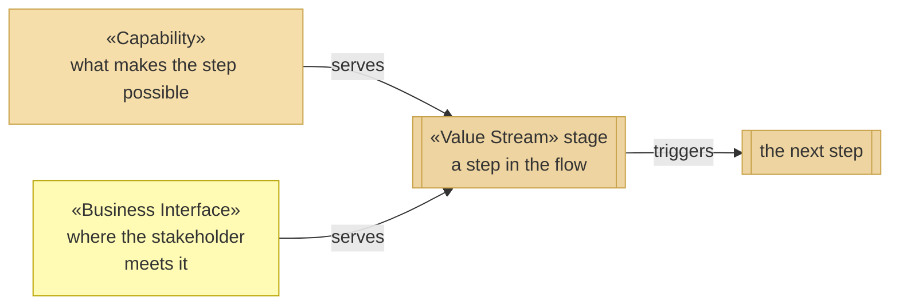
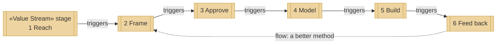
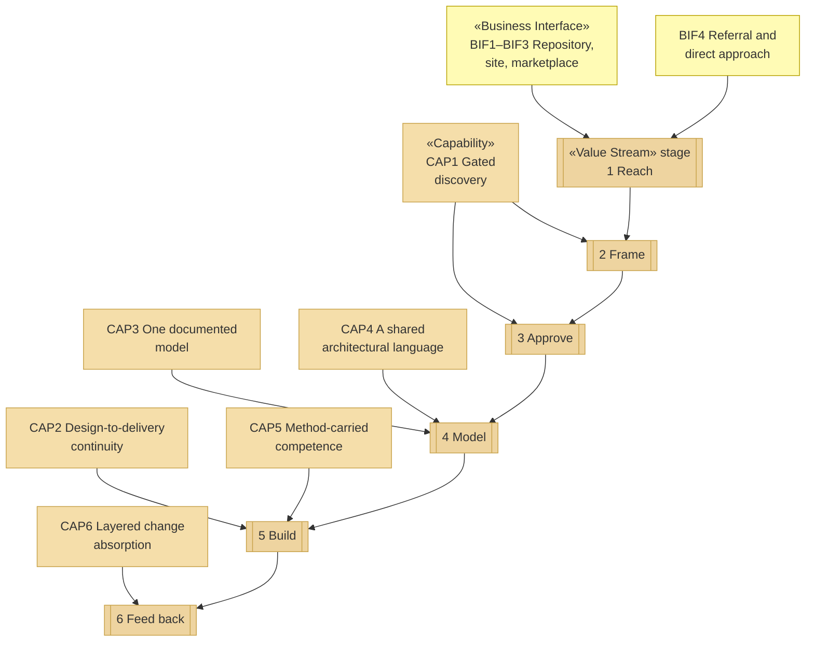
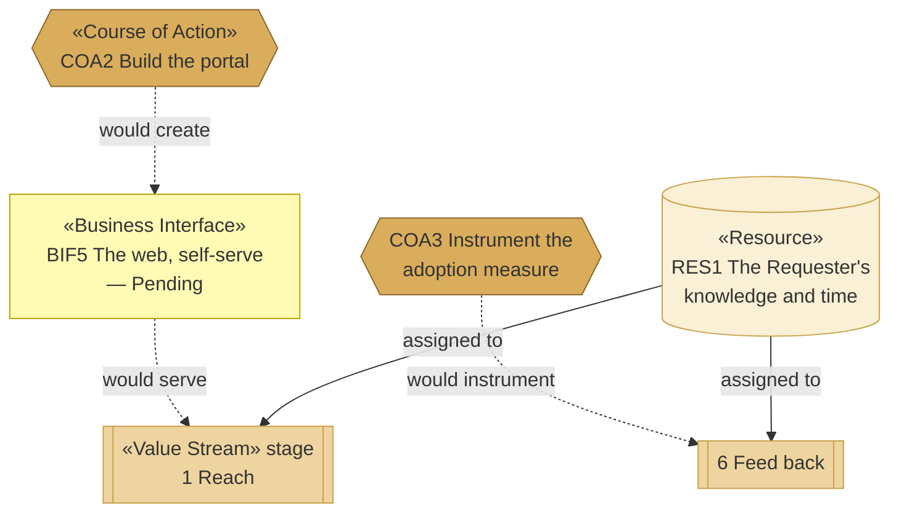

# Value Stream — the organization behind archreator

_[← Strategy layer](./README.md) · [EA home](../README.md)_

**ArchiMate elements:** Value Stream.

One stream, six stages, from a stakeholder who has never heard of the method
to value returning to the organization. Derived from the key activities
(`KA1`–`KA4`) and channels (`CH1`–`CH5`) on the
[business model canvas](../0_business-design/2_business-model-canvas.md).

## How to read this document

A value stream is a sequence of **stages**, each one a step that moves the
stakeholder closer to the value. Stages are served by capabilities — what the
organization must be able to do at that point — and, at the ends, by the
interfaces the stakeholder actually touches.

| Shape | Element | ID prefix | Reads as |
| ----- | ------- | --------- | -------- |
| Rectangle with double bars | «Value Stream» stage | `VS` | `VS1` = Value Stream 1; its stages are numbered inside it |
| Rectangle | «Capability» — context, from [2_capabilities-and-resources.md](./2_capabilities-and-resources.md) | `CAP` | `CAP1` = Capability 1 |
| Rectangle (yellow) | «Business Interface» — context, from [the business layer](../2_business/2_business-services.md) | `BIF` | `BIF1` = Business Interface 1 |

Stages carry a slightly deeper sand than capabilities, so the flow reads as
one band and the things serving it as another. Business interfaces keep the
Business yellow they have in their own layer.

**The «stereotype» label appears on the first node of each type in a
diagram** and is dropped on the rest; the legend carries it for the whole
document.

## The stream

**The stream closes**, which is the one thing worth seeing before the detail:
stage 6 returns to stage 2 as a better method. That loop is `RS1` (Revenue
Stream 1 — continuous improvement) drawn as a flow rather than listed as a
table row. It is also the reason `PROD1` is free — a closed loop needs volume
through it, and a price on the open method would throttle the only
non-monetary return this organization has.

| ID | Value stream | Stages |
| -- | ------------ | ------ |
| `VS1` | **From first contact to a delivered outcome, and back** | Six, below — the sixth returns to the second |

## What serves each stage

Every capability and interface edge reads **serves**.

| # | Stage | What happens | Capability | Reached through |
| - | ----- | ------------ | ---------- | --------------- |
| 1 | **Reach** | Someone finds the method, or the Requester is approached directly | — | `CH1` the repository, `CH2` the site, `CH3` the plugin marketplace, `CH4` referral |
| 2 | **Frame** | Discovery: the business model and strategy are drawn out by questions, and the frame is tested rather than recorded | `CAP1` | `KA1`, `KA3` |
| 3 | **Approve** | The Requester of that project grants the gate, against documents they were given links to | `CAP1` | `KA1`, `KA3` |
| 4 | **Model** | The layers are derived from what was approved, in one place, in one language | `CAP3`, `CAP4` | `KA1` |
| 5 | **Build** | The approved design is what an agent implements from | `CAP2`, `CAP5` | `KA3` |
| 6 | **Feed back** | Real use exposes what the method gets wrong, and the method changes | `CAP6` | `KA1`, `KA2` |

**Stage 1 is the only stage no capability serves.** Being found is not
something this organization is currently able to do — it is something that
happens to it. That is visible in the diagram as two interfaces feeding a
stage with nothing above it, and it is the gap the next section is about.

## Where the stream is weak

Dashed edges are Pending; solid ones are true today. Three weaknesses, and
the diagram shows that two of them have a named response and one does not.

- **Stage 1 reaches only people already looking.** `CH1`–`CH3` cost nothing
  and find only those close to the tooling. `BIF5`, the interface that would
  change it, is Pending on `COA2`.
- **Stage 6 has no instrumentation.** Feedback arrives if someone chooses to
  give it; nothing counts whether stage 5 was ever reached. That is `COA3`.
- **Stages 2–5 all draw on `RES1`.** For `PROD2` the Requester performs them
  personally; for `PROD1` an adopter performs them with an agent, but the
  method they follow is still authored by one person. **No course of action
  addresses this at the stream level** — `COA1` would, and it needs more AI
  maturity than exists today.
