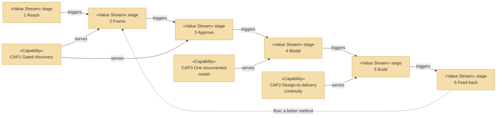

# Value Stream — the organization behind archreator

_[← Strategy layer](./README.md) · [EA home](../README.md)_

**ArchiMate elements:** Value Stream.

One stream, six stages, from a stakeholder who has never heard of the method
to value returning to the organization. Derived from the key activities
(`KA1`–`KA4`) and channels (`CH1`–`CH5`) on the
[business model canvas](../0_business-design/2_business-model-canvas.md).

## The stream

| ID | Value stream | Stages |
| -- | ------------ | ------ |
| `VS1` | **From first contact to a delivered outcome, and back** | Six, below — the sixth returns to the second |

| # | Stage | What happens | Capability | Reached through |
| - | ----- | ------------ | ---------- | --------------- |
| 1 | **Reach** | Someone finds the method, or the Requester is approached directly | — | `CH1` the repository, `CH2` the site, `CH3` the plugin marketplace, `CH4` referral |
| 2 | **Frame** | Discovery: the business model and strategy are drawn out by questions, and the frame is tested rather than recorded | `CAP1` | `KA1`, `KA3` |
| 3 | **Approve** | The Requester of that project grants the gate, against documents they were given links to | `CAP1` | `KA1`, `KA3` |
| 4 | **Model** | The layers are derived from what was approved, in one place, in one language | `CAP3`, `CAP4` | `KA1` |
| 5 | **Build** | The approved design is what an agent implements from | `CAP2`, `CAP5` | `KA3` |
| 6 | **Feed back** | Real use exposes what the method gets wrong, and the method changes | `CAP6` | `KA1`, `KA2` |

**The stream closes.** Stage 6 returns to stage 2 as a better method, which is
`RS1` (Revenue Stream 1 — continuous improvement) stated as a flow rather
than as a table row. It is also the reason `PROD1` is free: a closed loop
needs volume through it, and a price on the open method would throttle the
only non-monetary return this organization has.

## Where the stream is weak

- **Stage 1 reaches only people already looking.** `CH1`–`CH3` cost nothing
  and find only those close to the tooling. `CH5`, the channel that would
  change it, is Pending on `COA2`.
- **Stage 6 has no instrumentation.** Feedback arrives if someone chooses to
  give it; nothing counts whether stage 5 was ever reached. That is `COA3`.
- **Stages 2–5 all draw on `RES1`.** For `PROD2` the Requester performs
  them personally; for `PROD1` an adopter performs them with an agent, but
  the method they follow is still authored by one person.

## Value stream view

