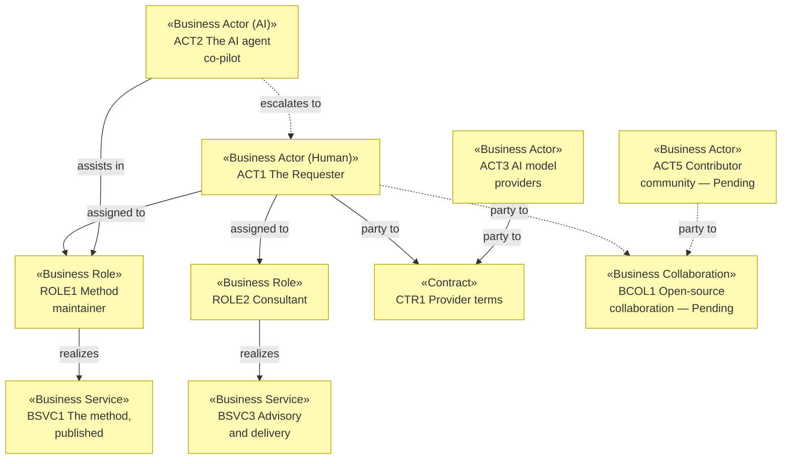

# Business Actors and Roles — the organization behind archreator

_[← Business layer](./README.md) · [EA home](../README.md)_

**ArchiMate elements:** Business Actor, Business Role, Business
Collaboration.

Two internal actors, three external. One of the internal two is an AI, and
per [`ea-doc-style` § Actors](../../../../.claude/skills/ea-doc-style/SKILL.md)
it carries an autonomy level, concrete decision rights, and a named
escalation path.

## Internal actors

| ID | Actor | Kind | Roles | Autonomy level | Decision rights | Escalation path |
| -- | ----- | ---- | ----- | -------------- | --------------- | --------------- |
| `ACT1` | **The Requester** | Human | `ROLE1`, `ROLE2`, `ROLE3` | — (human) | Everything: what the method becomes, what is delivered to a client, and what is priced. The only actor who can grant a gate | — |
| `ACT2` | **The AI agent** | **AI** | Assists in `ROLE1` and `ROLE2` | **Co-pilot** — it acts, and `ACT1` reviews before the result takes effect | May draft and edit documents, write code, and propose a design within an approved frame. May **not** grant a gate, decide what the business is, or change a Principle | `ACT1`, on anything touching strategy, business, or a gate |

**One person holds all three roles.** That is `RES1`
([the binding constraint](../1_strategy/2_capabilities-and-resources.md#resources))
seen from the business layer: not a staffing gap to be filled, but a
deliberate shape the model states plainly instead of implying a resilience it
does not have.

`ACT2` sits at co-pilot because of `P1` — humans hold strategy and business
judgment. Raising its autonomy is exactly the call the `decision-record`
skill exists for, and it would need `P1` revisited first.

## Roles

| ID | Role | Filled by | Covers | Source |
| -- | ---- | --------- | ------ | ------ |
| `ROLE1` | **Method maintainer** | `ACT1`, assisted by `ACT2` | Developing the method, publishing guidance — `KA1` Key Activity 1 and `KA2` | `KA1`, `KA2` |
| `ROLE2` | **Consultant** | `ACT1` | Running discovery and delivery with clients — `KA3` | `KA3` |
| `ROLE3` | **Owner** | `ACT1` | Deciding direction, pricing, and what the organization is for | `KR1` Key Resource 1 |

`ROLE1` is written so a contributor could fill it unchanged — the method does
not branch on who maintains it. That is what would make `STK5`, the
contributor community, a real partner rather than an aspiration.

## External actors and the collaborations that bind them

| ID | Actor | Provides | Bound by | Dependency | Source |
| -- | ----- | -------- | -------- | ---------- | ------ |
| `ACT3` | **AI model providers** | The inference every product ultimately runs on | `CTR1` — a commercial subscription or usage agreement | **Substitutable by design**, per `P6`. The method is transferable instructions; only the packaging is provider-specific | `KP1` Key Partner 1 |
| `ACT4` | **GitHub** | Repository, plugin distribution, site hosting | `CTR2` — platform terms, free at this scale | Replaceable. `CH1`–`CH3` all run through it, so replacing it would mean rebuilding every channel at once | `KP2` |
| `ACT5` | **Contributor community** | Feedback and real-world use, which is `RS1` | `BCOL1` — an open-source collaboration, not a contract | **Pending** — no contributor base exists yet | `KP3` |

| ID | Collaboration / contract | Between | State |
| -- | ------------------------ | ------- | ----- |
| `CTR1` | Model provider subscription and usage terms | `ACT1` (and every adopter, separately) with `ACT3` | Live. Each adopter holds their own — this organization does not resell inference for `PROD1` |
| `CTR2` | Platform terms | `ACT1` with `ACT4` | Live |
| `BCOL1` | Open-source collaboration around the method | `ACT1` with `ACT5` | **Pending — future initiative.** `RS1` and `STK5` both depend on it |

`CTR1` being held separately by each adopter is what makes `P7` — priced at
the cost of running it — hold for `PROD1` without any billing at all: the
adopter pays their own provider, and this organization charges nothing.
`PROD3` is where that changes, because the portal would run the inference
itself.

## Actor view

