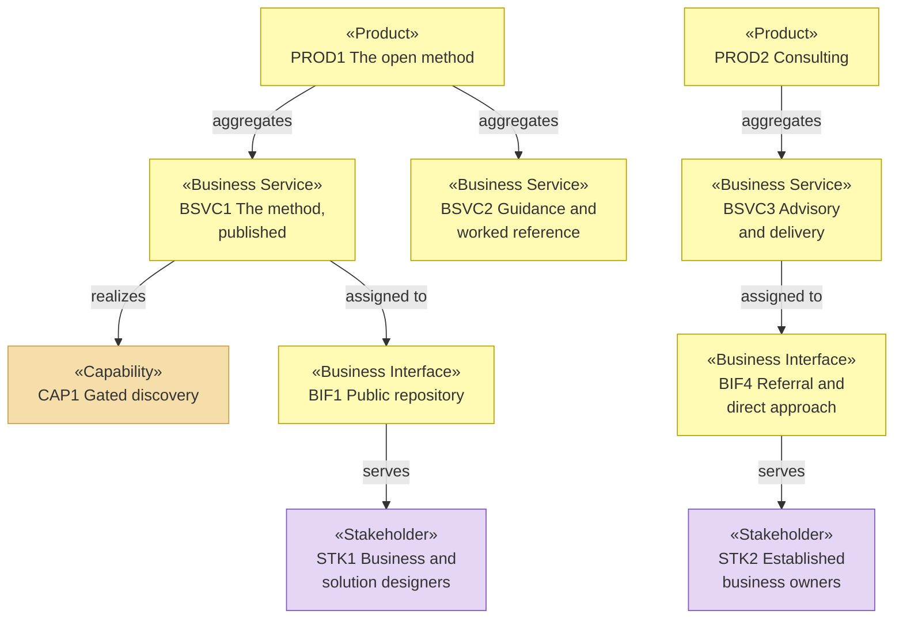

# Products, Services and Channels — the organization behind archreator

_[← Business layer](./README.md) · [EA home](../README.md)_

**ArchiMate elements:** Product, Business Service, Business Interface.

Derived from the three products, five channels and three customer
relationships on the
[business model canvas](../0_business-design/2_business-model-canvas.md),
approved at Gate 0.

## Products

The products are defined on the
[value proposition canvas](../0_business-design/1_value-proposition-canvas.md#products);
this table records what each one aggregates.

| Product | Aggregates | Delivered through | Returns |
| ------- | ---------- | ----------------- | ------- |
| `PROD1` archreator, the open method | `BSVC1`, `BSVC2` | `BIF1`, `BIF2`, `BIF3` | `RS1`, `RS2` — both non-monetary |
| `PROD2` Consulting | `BSVC3` | `BIF4` | `RS3` — monetary, hourly |
| `PROD3` The archreator portal — **Pending** | `BSVC4` | `BIF5` | `RS4` — monetary, per use |

## Business services

| ID | Business service | Realizes | Product | Realized by | Source |
| -- | ---------------- | -------- | ------- | ----------- | ------ |
| `BSVC1` | **The method, published and installable** — the skills, the conventions, the gates, obtainable and usable without asking anyone | `CAP1`–`CAP6` | `PROD1` | `.claude/skills/`, the plugin manifest, `docs/` | Value propositions of `PROD1` |
| `BSVC2` | **Guidance and worked reference** — how to start, what the method is for, and a model built with it that a reader can inspect | `CAP5` | `PROD1` | `site/`, `meta/`, and this tree | Value propositions of `PROD1` |
| `BSVC3` | **Advisory and delivery with the method** — the Requester runs discovery and delivery personally | `CAP1`, `CAP2` | `PROD2` | `ROLE2`, in person | Value propositions of `PROD2` |
| `BSVC4` | **Architecture as a service** — an owner supplies what they have and receives a working architecture repository | `CAP1`, `CAP5` | `PROD3` | **Pending — future initiative** (`COA2`) | Value propositions of `PROD3` |

`BSVC2` is realized partly by **this document's own tree**. The organization
behind archreator modeling itself in public is not a side project — it is
what makes the guidance inspectable, which is the service.

## Business interfaces — the channels

| ID | Interface | Serves | Relationship | Cost to operate | Source |
| -- | --------- | ------ | ------------ | --------------- | ------ |
| `BIF1` | The public repository | `STK1` | Self-service | Zero | `CH1` Channel 1 |
| `BIF2` | The guidance site | `STK1`, and any owner evaluating the method | Self-service | Zero — free hosting | `CH2` |
| `BIF3` | The plugin marketplace | `STK1`, already working in an agent | Self-service | Zero | `CH3` |
| `BIF4` | Referral and direct approach | `STK2` | Personal and direct — the Requester individually | The Requester's whole available time | `CH4` |
| `BIF5` | The web, self-serve | `STK2`, `STK3` | Self-service | **Pending** — inference dominates, and it scales with use | `CH5` |

**Four of five interfaces reach only people already looking.** `BIF1`–`BIF3`
find those close to the tooling and `BIF4` needs someone to make an
introduction. `BIF5` is the only one that would reach an owner who is not
already searching, and it is Pending on `COA2` — which is the same gap the
[value stream](../1_strategy/3_value-stream.md#where-the-stream-is-weak)
records at stage 1, seen from the interface side.

## Service view

