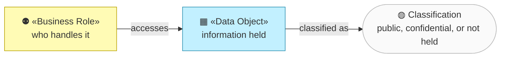
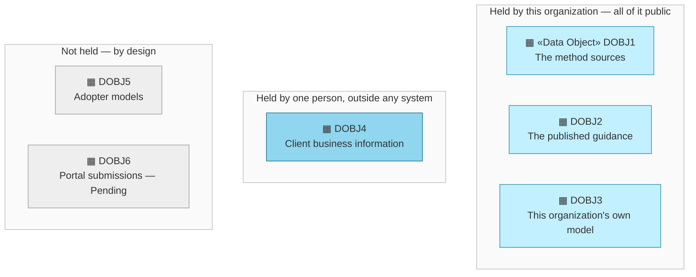

# Data Objects — the organization behind archreator

_[← Information layer](./README.md) · [EA home](../README.md)_

**ArchiMate elements:** Data Object.

What information this organization actually holds. The answer is unusual
enough to be the point of the layer.

## How to read this document

| Glyph | Shape | Element | ID prefix | Reads as |
| ----- | ----- | ------- | --------- | -------- |
| `▦` | Rectangle | «Data Object» | `DOBJ` | `DOBJ1` = Data Object 1 |
| `⚉` | Rectangle | «Business Role» — context, from [layer 2](../2_business/1_business-actors-and-roles.md) | `ROLE` | `ROLE1` = Business Role 1 |

Data objects take the Application cyan, which is where ArchiMate puts passive
structure realized by software. **The glyph rides on every node; the
«stereotype» word appears once** — on the first node of each type in a
diagram, dropped on the rest.

## What is held, and what is not

**Everything this organization holds is public, and most of what it touches
it does not hold at all.** That is the finding of this layer, and three
things follow from it.

| ID | Data object | Where it lives | Classification | Accessed by |
| -- | ----------- | -------------- | -------------- | ----------- |
| `DOBJ1` | **The method sources** — skills, conventions, the scaffold, the validators | `.claude/skills/`, `docs/`, `scripts/` in the public repository | Public | `ROLE1`, and every adopter |
| `DOBJ2` | **The published guidance** — the pages a reader lands on | `site/public/` | Public | `ROLE1`, and any visitor |
| `DOBJ3` | **This organization's own model** — the canvases, the layers, the scope documents | `organization/` | **Public, deliberately.** An organization asking others to model themselves honestly should be readable | `ROLE3`, and any visitor |
| `DOBJ4` | **Client business information** — what a consulting engagement learns about a client | Held by `ROLE2` personally, outside this repository and outside any system this model describes | **Confidential** | `ROLE2` only |
| `DOBJ5` | **Adopter models** — the architecture an adopter builds with the method | **In the adopter's own repository.** This organization never receives a copy | Not held | Nobody here |
| `DOBJ6` | **Portal submissions and generated repositories** — what an owner would upload and get back | **Pending — future initiative** (`COA2`) | Would be the first non-public data this organization systematically holds | Nobody yet |

### Why the organization cannot measure itself

`DOBJ5` is the row that explains [`OUT7`](../1_strategy/1_motivation.md#outcomes).
Adoption of `PROD1` happens entirely through git clone and a plugin install;
nothing reports back, no account is created, no telemetry is emitted. The
organization is not choosing not to look — **there is nothing to look at.**

That reframes `COA3` (instrument the adoption measure) from a reporting task
into a **data decision**: it means starting to hold information about
adopters, which this organization has never done. Self-reporting is the
lightest version and still crosses the line. Whoever opens that initiative
should know they are changing this layer, not just adding a counter.

### `DOBJ4` is the whole confidentiality surface, and it has no system

One person holds every client's business information, outside anything
modeled here. There is no access control to describe because there is no
system — which is defensible at one consultant and one client at a time, and
stops being defensible the moment `ROLE2` is filled by anyone else. The
model says so rather than leaving an empty security section to imply there is
nothing to secure.

### The portal crosses two lines at once

`DOBJ6` would be the first data this organization holds about someone else.
[Layer 5](../5_technology/1_technology-services.md#where-this-organization-runs-nothing)
finds the same threshold from the other side: the portal is also the first
thing this organization would operate. **Two layers, discovered
independently, agree that `COA2` is the moment this stops being a method and
starts being a service** — with the obligations that come with it.

## Data flows, storage and retention

**Not started, and correctly so.** There is one flow (an adopter clones a
public repository), no storage this organization operates, and nothing to
retain. `2_data-flows.md` and `3_data-architecture.md` are the documents
`COA2` would have to write before a portal held anything —
[classification and retention](../../../../docs/ea/3_information/README.md)
have no content until `DOBJ6` exists.
