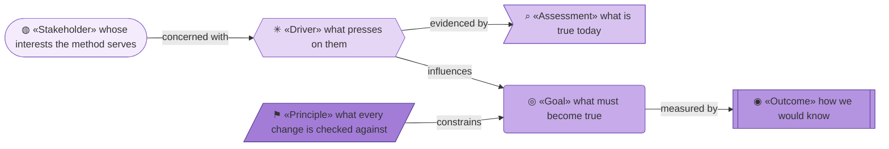
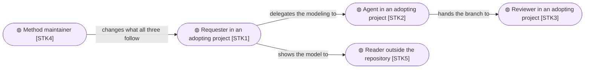
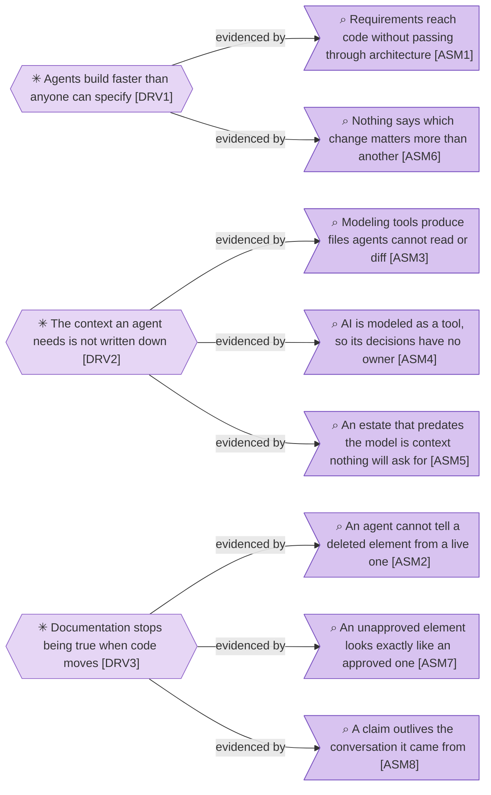
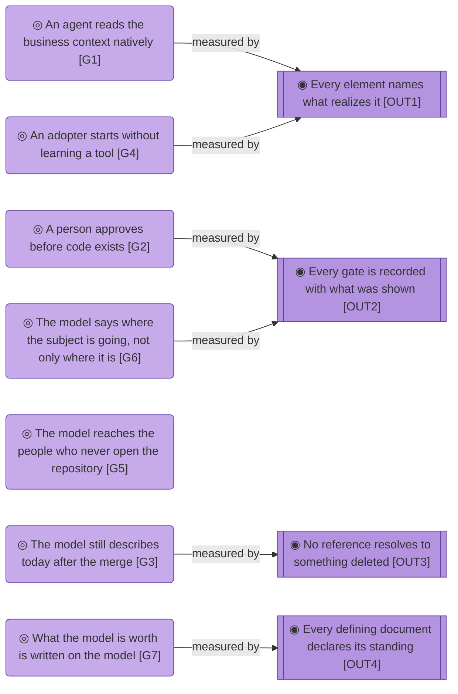

# Motivation

_[← Strategy layer](./README.md) · [EA home](../README.md)_

**ArchiMate viewpoint:** Motivation. Who has a stake in archreator, what
presses on them, what must become true, and the principles every change is
checked against.

**Status:** ● Validated at **Gate 1**, 2026-08-24.

The subject is **the method** — seventeen skills, the scaffold they emit, the
validators, and the plugin that ships them. The organization that publishes it
is modeled one tree up, in
[`org-archreator/`](../../../org-archreator/architecture/README.md).

## How to read this document

| Glyph | Shape | Element | ID prefix | Reads as |
| ----- | ----- | ------- | --------- | -------- |
| `◍` | Stadium | «Stakeholder» | `STK` | `STK1` = Stakeholder 1 |
| `✳` | Hexagon | «Driver» | `DRV` | `DRV1` = Driver 1 |
| `⌕` | Flag | «Assessment» | `ASM` | `ASM1` = Assessment 1 |
| `◎` | Rounded rectangle | «Goal» | `G` | `G1` = Goal 1 |
| `◉` | Rectangle, double bars | «Outcome» | `OUT` | `OUT1` = Outcome 1 |
| `⚑` | Parallelogram | «Principle» | `P` | `P1` = Principle 1 |

The tone darkens along the chain, from the stakeholder who cares to the
principle that constrains.

## Stakeholders

| ID | Stakeholder | What they want from the method | Where they meet it |
| -- | ----------- | ------------------------------ | ------------------ |
| `STK1` | **Requester in an adopting project** | To own a subject — a company, a department, an app — and have it modeled without doing the modeling. To decide at points they choose, and be shown enough to decide honestly | The gates, and whatever surface a gate is presented on |
| `STK2` | **Agent in an adopting project** | To know the business context before writing code, and to be stopped from acting on a fact that is no longer true. Usually an AI agent | The skills, the model, and the validators |
| `STK3` | **Reviewer in an adopting project** | To read a whole branch and see what it claims to change, against documents that were true before it started | The pull request and the scope document |
| `STK4` | **Method maintainer** | To change the method without silently falsifying the models built on it | The skill corpus and its own validator |
| `STK5` | **Reader outside the repository** | To read the architecture they are asked to agree with, fund or audit, without cloning anything or being taught where it lives | The portal, and the PDF |

**`STK1` and `STK3` are usually the same person, and that is not a
redundancy.** They want different things at different moments: one decides
before the work, the other checks after it. Collapsing them would lose the
distinction that makes the second reading worth doing.

**`STK2` is the stakeholder the method is written for.** The documents are
Markdown in git rather than a modeling tool's file format because that is what
an agent reads natively.

**`STK5` decides nothing, and that is what separates them from `STK1`.** A
Requester is shown a change and grants a gate; a reader is shown the model and
has to be able to follow it. The same documents serve both, which is why
reaching `STK5` is a rendering rather than a second model.

## Drivers and assessments

| ID | Driver | Why it presses | Concerns |
| -- | ------ | -------------- | -------- |
| `DRV1` | **Agents build faster than anyone can specify** | The constraint on delivery has moved from writing code to deciding what should be written. A requirement handed straight to an agent produces working software nobody agreed to | `STK1`, `STK2` |
| `DRV2` | **The context an agent needs is not written down** | Who the customers are, what the organization is trying to do, which rules bind a change — an agent with none of this fills the gap with something plausible | `STK2` |
| `DRV3` | **Documentation stops being true when code moves** | A model describing last quarter is worse than no model, because it is trusted | `STK2`, `STK3` |

| ID | Assessment | What it means for the method |
| -- | ---------- | --------------------------- |
| `ASM1` | **Requirements reach code without passing through architecture** | The ladder from strategy to technology exists in every methodology and is skipped in most projects, because nothing stops the skip. Something has to stop it |
| `ASM2` | **An agent cannot tell a deleted element from a live one** | An agent reading a claim that one element relieves another has no cheap way to notice the second was removed three initiatives ago, and will reason confidently from it. This is the failure agents are worst at unaided |
| `ASM3` | **Modeling tools produce files agents cannot read or diff** | An architecture kept in a tool's own format is invisible to the reader who most needs it, and invisible to code review |
| `ASM4` | **AI is modeled as a tool, so its decisions have no owner** | When an agent is drawn as a box rather than an actor, nothing records what it may decide alone, or who it escalates to |
| `ASM5` | **An estate that predates the model is context nothing will ask for** | Every route into the lower layers starts from a requirement, and no requirement ever asks for the applications that were already running. An organization modeled by a method that only follows change requests gets a strategy layer and four empty folders below it |
| `ASM6` | **Nothing says which change matters more than another** | Each request is defensible on its own, and a method that only judges one change at a time can say whether it is coherent but never whether it is the one to make first. The question a Requester asks most often is the one the model was least able to answer |
| `ASM7` | **An unapproved element looks exactly like an approved one** | A catalogue of things three people mentioned in a workshop and a layer a Requester signed are the same tables, the same identifiers, the same shape. Nothing on either says which it is, so a reader supplies the answer from how finished it looks — and a document is at its most finished-looking on the day it is drafted |
| `ASM8` | **A claim outlives the conversation it came from** | The figure came off a slide, the process came from someone describing it once. Eighteen months later the model still says so and nobody can say why. The claim is not wrong, but it is unreviewable, which over enough time is the same thing |

## Goals and outcomes

| ID | Goal | Answers | Realized by |
| -- | ---- | ------- | ----------- |
| `G1` | **An agent reads the business context natively** | `DRV2`, `ASM3`, `ASM5` | The model is Markdown in git — nothing has to be exported before it can be used, and a landscape sweep fills the layers a change request would never have asked for |
| `G2` | **A person approves before code exists** | `DRV1`, `ASM1` | The gates, and the rule that an unrecorded approval did not happen |
| `G3` | **The model still describes today after the merge** | `DRV3`, `ASM2` | The validators, and the rule that a change updates whatever it falsifies |
| `G4` | **An adopter starts without learning a tool** | `ASM3` | A scaffold of Markdown and two scripts, installed as a plugin |
| `G5` | **The model reaches the people who never open the repository** | `ASM3` | The portal and the PDF, both rendered from the Markdown, both thrown away and rebuilt |
| `G6` | **The model says where the subject is going, not only where it is** | `DRV1`, `ASM6` | `architecture/roadmap/` — target plateaus, a gap register derived from the baseline, and a sequence — approved as direction at Gate 1 |
| `G7` | **What the model is worth is written on the model** | `DRV3`, `ASM7`, `ASM8` | A status glyph on every document that defines an element, and `architecture/reference/` holding what each was built from |

| ID | Outcome | How it is checked | Happening today? |
| -- | ------- | ----------------- | ---------------- |
| `OUT1` | **Every element names what realizes it, or says it is Pending** | `query_model.py coverage`, read by a person. No validator can tell a repository path from a team name, and a wrong failure in CI teaches people to ignore CI — so this reports and never fails a build | Partly — the convention holds, and the omissions are now listed rather than hunted |
| `OUT2` | **Every gate is recorded with who approved and what they were shown** | The Approvals table in the scope document | Yes, by convention |
| `OUT3` | **No reference resolves to something that was deleted** | `check_model.py`, on every pull request | Yes, mechanically |
| `OUT4` | **Every document that defines an element declares how far it has been validated** | `check_model.py`, on every pull request. Checked on the glyph, never on the words beside it, so it holds in a model written in any language | Yes, mechanically |

**`G1` and `G5` are the two halves of `ASM3`.** An architecture in a tool's
own format is unreadable by the agent that must build from it *and* by the
person who must agree to it. Markdown in git answers the first directly; the
second is answered by rendering the same files, never by keeping a second copy.

**`OUT4` is the only one of the four that is both mechanical and complete.**
`OUT1` cannot be fully checked because grounding is fuzzy; `OUT2` is a
convention; `OUT3` is mechanical but narrow. Whether a status glyph is present
is neither fuzzy nor narrow — it is there or it is not, and it is there on
every document or the build fails. The reason this one could be gated when
grounding could not is worth keeping in view: the check asks whether a
declaration was made, never whether it was true.

**`G6` shares `OUT2` rather than earning an outcome.** What would prove the
model says where the subject is going is that a direction was approved and
recorded — which is the gate record `OUT2` already measures, pointed at a
roadmap instead of a strategy layer. A second outcome would have restated the
first with a different object.

**`G5` is measured by no outcome, because nothing here can measure it.** The
repository knows whether a page can be traced back to its source; it cannot
know whether anyone read it. An outcome invented to fill the row would be
checked by nobody.

**`OUT1` is the weakest of the three, and deliberately so.** Grounding is the
rule that makes the model verifiable, and it is the one the tooling cannot
enforce — distinguishing a path from a description is fuzzy, and a check that
fails wrongly is worse than no check.

What the tooling can do is narrow the search. `query_model.py coverage` judges
a catalogue table rather than an element: where a table grounds some of its
rows and leaves others blank, the blanks are an omission and it says so; where
a table grounds none of them it is not modeling realization at all, and saying
so once about the document beats saying it about every row. That is a smaller
claim than the outcome, and it is the largest one that can be made without
being wrong sometimes.

## Principles

Constraints every proposed change is tested against, before anything else.
They are few on purpose: a principle nobody could violate is a slogan.

- **P1 — Each fact has exactly one home.** Every other place that needs it
  points there rather than restating it. A second copy is a second thing to
  drift, and the drift is always silent. Where a copy is unavoidable, a check
  holds the two in step.
- **P2 — Every element names what realizes it.** A skill file, a script, a
  written procedure — or an explicit `Pending — future initiative`. An element
  grounded in nothing is a claim, and a model of claims cannot be verified.
- **P3 — An approval that is not recorded did not happen.** The Requester's
  decision lives in the scope document's Approvals table, with what they were
  shown. A gate that did not apply is marked `N/A` with its reason rather than
  deleted, so a skipped gate is distinguishable from a forgotten one.
- **P4 — Consolidate before enumerating.** A new rule, element or document
  must earn its place against the ones that already exist. The method is read
  by people who are busy; length is a cost paid by every future reader.
- **P5 — Method content is portable; packaging is disposable.** The test for
  any file is whether it would need *editing* if the host platform vanished
  tomorrow, or merely *moving*. Anything that would need editing is packaging,
  and packaging is allowed to be thrown away.

**`P1` and `P4` pull the same way from different ends** — one forbids saying a
thing twice, the other forbids saying it at all unless it earns the space.
Together they are why this document is short.

## Notes

`0_business-design/` is empty in this tree and stays that way. The canvases
describe an organization's customers and economics, and this subject has
neither of its own. They are filled one tree up.

## Relationships

<!-- Transcribed from this document's diagrams. The identifier is
     authoritative; the description beside it is checked against the
     catalogue that defines the element. -->

| From | From element | To | To element | Relationship |
| ---- | ------------ | -- | ---------- | ------------ |
| `STK1` | «Stakeholder» Requester in an adopting project | `STK2` | «Stakeholder» Agent in an adopting project | delegates the modeling to |
| `STK2` | «Stakeholder» Agent in an adopting project | `STK3` | «Stakeholder» Reviewer in an adopting project | hands the branch to |
| `STK4` | «Stakeholder» Method maintainer | `STK1` | «Stakeholder» Requester in an adopting project | changes what all three follow |
| `STK1` | «Stakeholder» Requester in an adopting project | `STK5` | «Stakeholder» Reader outside the repository | shows the model to |
| `DRV1` | «Driver» Agents build faster than anyone can specify | `ASM1` | «Assessment» Requirements reach code without passing through architecture | evidenced by |
| `DRV1` | «Driver» Agents build faster than anyone can specify | `ASM6` | «Assessment» Nothing says which change matters more than another | evidenced by |
| `DRV2` | «Driver» The context an agent needs is not written down | `ASM3` | «Assessment» Modeling tools produce files agents cannot read or diff | evidenced by |
| `DRV2` | «Driver» The context an agent needs is not written down | `ASM4` | «Assessment» AI is modeled as a tool, so its decisions have no owner | evidenced by |
| `DRV2` | «Driver» The context an agent needs is not written down | `ASM5` | «Assessment» An estate that predates the model is context nothing will ask for | evidenced by |
| `DRV3` | «Driver» Documentation stops being true when code moves | `ASM2` | «Assessment» An agent cannot tell a deleted element from a live one | evidenced by |
| `DRV3` | «Driver» Documentation stops being true when code moves | `ASM7` | «Assessment» An unapproved element looks exactly like an approved one | evidenced by |
| `DRV3` | «Driver» Documentation stops being true when code moves | `ASM8` | «Assessment» A claim outlives the conversation it came from | evidenced by |
| `G1` | «Goal» An agent reads the business context natively | `OUT1` | «Outcome» Every element names what realizes it, or says it is Pending | measured by |
| `G2` | «Goal» A person approves before code exists | `OUT2` | «Outcome» Every gate is recorded with who approved and what they were shown | measured by |
| `G3` | «Goal» The model still describes today after the merge | `OUT3` | «Outcome» No reference resolves to something that was deleted | measured by |
| `G4` | «Goal» An adopter starts without learning a tool | `OUT1` | «Outcome» Every element names what realizes it, or says it is Pending | measured by |
| `G6` | «Goal» The model says where the subject is going, not only where it is | `OUT2` | «Outcome» Every gate is recorded with who approved and what they were shown | measured by |
| `G7` | «Goal» What the model is worth is written on the model | `OUT4` | «Outcome» Every document that defines an element declares how far it has been validated | measured by |
