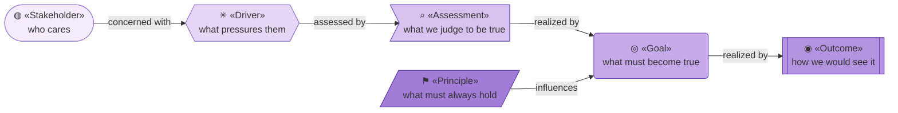
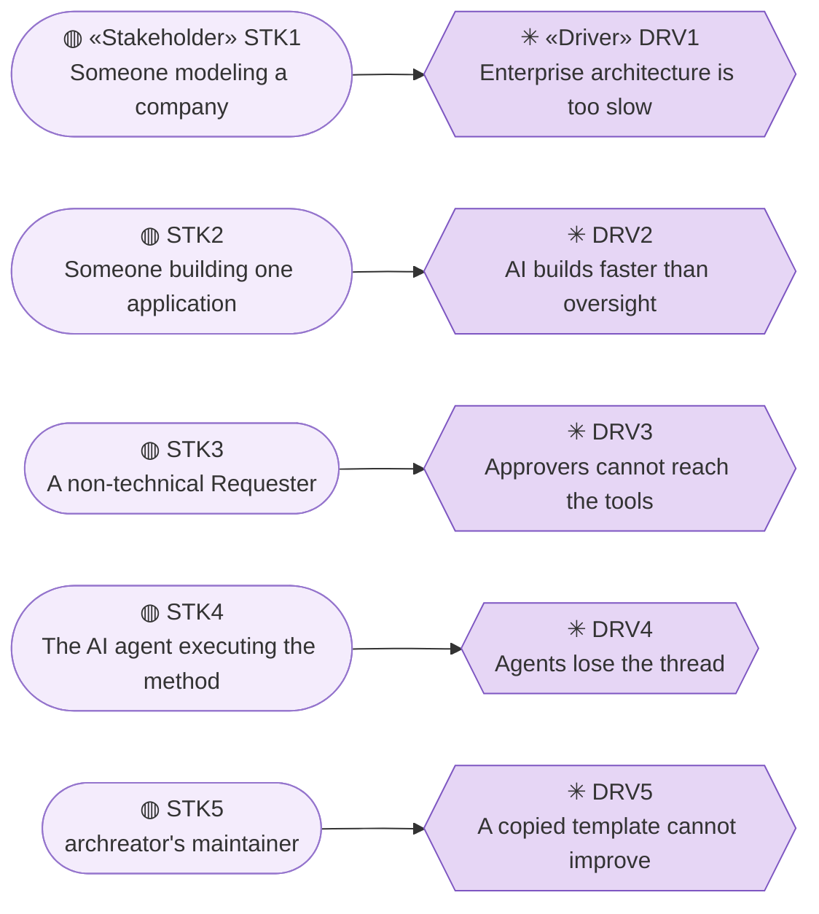
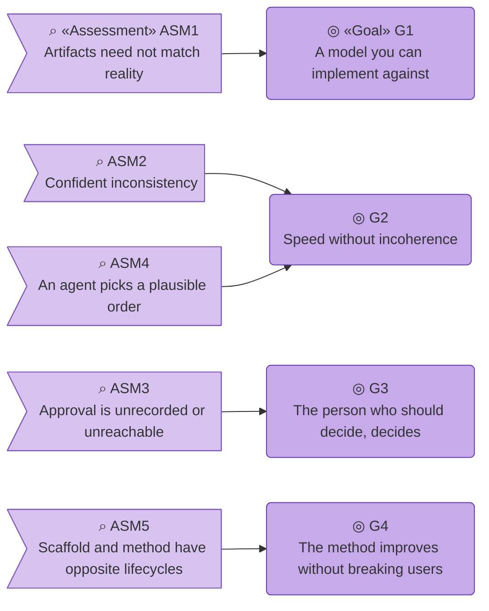
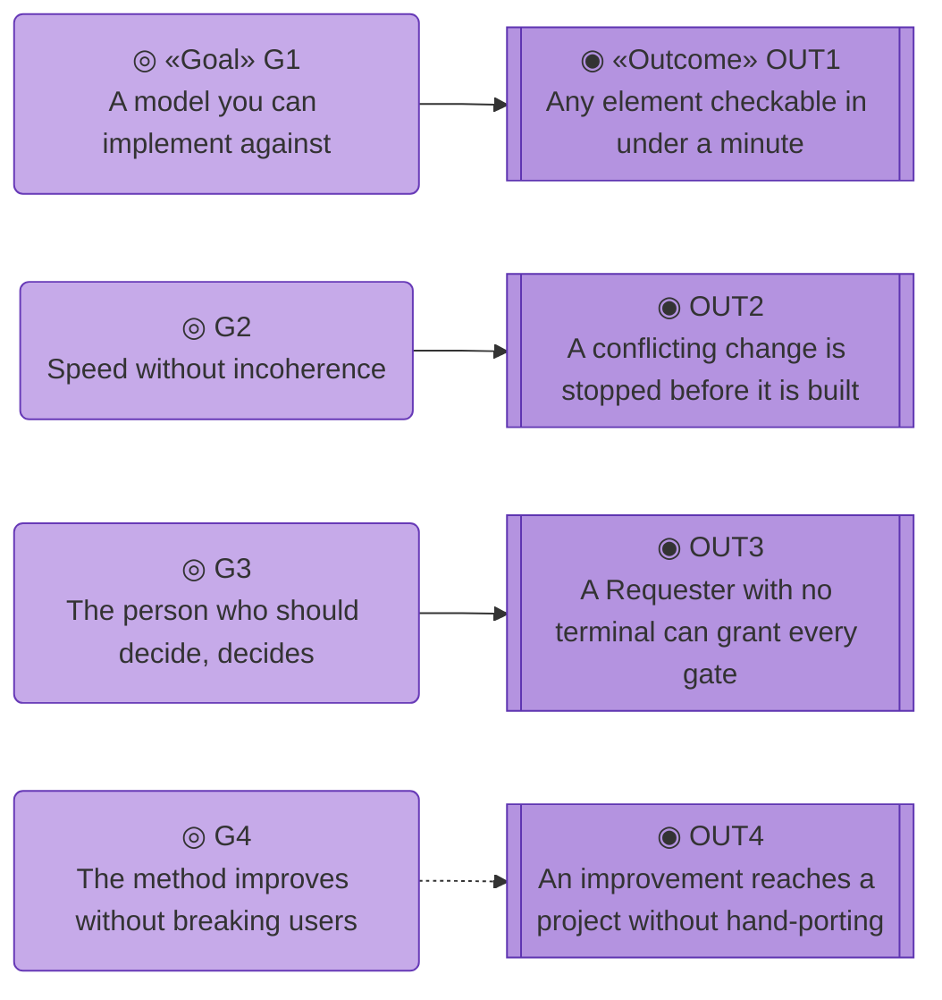
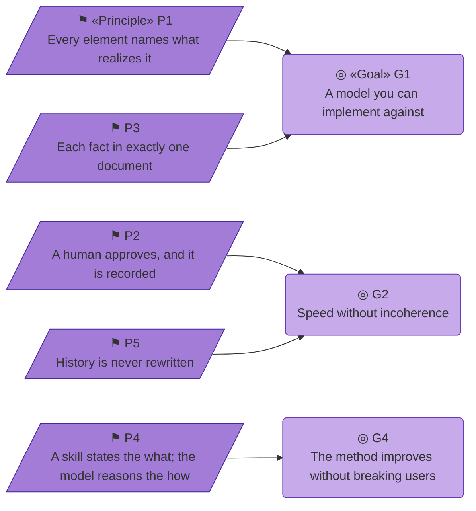

# Motivation — archreator

_[← Strategy layer](./README.md) · [EA home](../README.md)_

**ArchiMate elements:** Stakeholder, Driver, Assessment, Goal, Outcome,
Principle.

At Depth 1 there is no `0_business-design/` to derive from, so every element
here was discovered directly rather than mapped from a canvas block.

## How to read this document

| Glyph | Shape | Element | ID prefix | Reads as |
| ----- | ----- | ------- | --------- | -------- |
| `◍` | Stadium | «Stakeholder» | `STK` | `STK1` = Stakeholder 1 |
| `✳` | Hexagon | «Driver» | `DRV` | `DRV1` = Driver 1 |
| `⌕` | Flag | «Assessment» | `ASM` | `ASM1` = Assessment 1 |
| `◎` | Rounded rectangle | «Goal» | `G` | `G1` = Goal 1 |
| `◉` | Rectangle, double bars | «Outcome» | `OUT` | `OUT1` = Outcome 1 |
| `⚑` | Parallelogram | «Principle» | `P` | `P1` = Principle 1 |

Six tones of the Motivation violet, light at the start of the chain and dark
at the end. **The glyph rides on every node; the «stereotype» word appears
once** — on the first node of each type in a diagram, dropped on the rest.
The values come from
[`architecture/README.md` § Notation conventions](../../../.claude/skills/project-bootstrap/templates/architecture/README.md#notation-conventions).

## Stakeholders and drivers

Every edge reads **concerned with**. One driver per stakeholder, which is
what a Depth 1 model looks like when it is honest: five constituencies, five
distinct pressures, and no pretence that they overlap.

| ID | Stakeholder | Concern | Driver |
| -- | ----------- | ------- | ------ |
| `STK1` | Someone modeling a company (external, adopts and uses) | Getting their organization into a form AI agents can work from, without a six-month architecture programme | `DRV1` |
| `STK2` | Someone building one application (external, adopts and uses) | The same discipline at a weight a single app can carry | `DRV2` |
| `STK3` | A non-technical Requester (external, approves) | Being able to approve what gets built without learning git | `DRV3` |
| `STK4` | The AI agent executing the method (internal, non-human) | Instructions unambiguous enough to act on without re-deriving intent each session | `DRV4` |
| `STK5` | archreator's maintainer (internal, owner) | A method that improves without every downstream project having to be rebuilt | `DRV5` |

| ID | Driver | What pressures it |
| -- | ------ | ----------------- |
| `DRV1` | **Enterprise architecture is too slow to be useful** — by the time a traditional practice produces a model, the organization has moved |
| `DRV2` | **AI builds faster than humans can keep track** — drift, contradiction, and code nobody can explain a week later |
| `DRV3` | **The people who should approve can't reach the tools** — the person who knows whether the business model is right does not work in a terminal |
| `DRV4` | **Agents lose the thread across sessions** — context that isn't written down is context that doesn't survive |
| `DRV5` | **A copied template cannot be improved** — a method distributed by copy diverges the moment it is used |

## Assessments

Every edge reads **realized by**. `G2` is the only goal two assessments
point at, and that is the shape of the problem archreator exists for:
inconsistency comes both from the agent's speed and from its lack of a fixed
order to work in.

| ID | Assessment | Assesses |
| -- | ---------- | -------- |
| `ASM1` | Documentation frameworks produce artifacts that describe an architecture without anything having to correspond to reality; nothing detects the gap | `DRV1` |
| `ASM2` | The failure mode of AI-assisted building isn't bad code, it's confident inconsistency — each change is locally reasonable and the set is incoherent | `DRV2` |
| `ASM3` | Approval that lives in a chat message is not a record; approval that requires a git client is not accessible | `DRV3` |
| `ASM4` | An agent given a process but not the order to apply it in will pick a plausible order, and a different one next time | `DRV4` |
| `ASM5` | A template's scaffold and its method have opposite lifecycles — one is overwritten on day one, the other should keep improving — and bundling them means neither can be handled correctly | `DRV5` |

## Goals

- **G1 — A model you can implement against.** Every element points at
  something real, so the model is checkable rather than merely written.
  Derived from `ASM1`.
- **G2 — Speed without incoherence.** A change moves as fast as an agent
  can work, and still lands consistent with everything already decided.
  Derived from `ASM2`.
- **G3 — The person who should decide, decides.** Business judgment is
  exercised by whoever holds it, at a surface they can actually use.
  Derived from `ASM3`.
- **G4 — The method improves without breaking its users.** Adopting an
  improvement is an install, not a migration. Derived from `ASM5`.

## Outcomes

Every edge reads **realized by**. `OUT4`'s edge is dashed because it is
**Pending**: the plugin mechanism exists and no second version has shipped
through it, so nothing has proved the claim.

| ID | Outcome | Realizes | Measured by |
| -- | ------- | -------- | ----------- |
| `OUT1` | Any element in the model can be checked against the repository or the people doing the work in under a minute | `G1` | A reader picks a row at random and finds the artifact, or an explicit "Pending" |
| `OUT2` | A change that contradicts an existing principle is stopped before it is built, not after | `G2` | `ea-first-change` Step 1c reaches a Conflict verdict rather than proceeding |
| `OUT3` | A Requester with no terminal can grant every gate | `G3` | Gates are granted in conversation or on a PR comment, and transcribed into the Approvals table |
| `OUT4` | A method improvement reaches an existing project without hand-porting | `G4` | `/plugin update`. **Pending** until the plugin has shipped a second version |

## Principles

Every edge reads **influences**. `G3` has no principle pointing at it — the
person who should decide deciding is a goal the gates deliver structurally,
not something a rule can be checked against.

Few, load-bearing, and testable. These gate every change to the method
itself, and `ea-first-change` Step 1c stops on a conflict with any of them.

| ID | Principle | What it rules out |
| -- | --------- | ----------------- |
| `P1` | **Every element names what realizes it, or is explicitly Pending.** | A model that describes an intention as though it were a fact. This is the grounding rule, and it is the one that makes archreator a modeling-for-implementation method rather than a documentation method |
| `P2` | **A human approves before anything is built, and the approval is recorded where it can be found later.** | Silent agent autonomy; approvals that exist only in a chat scrollback |
| `P3` | **Each fact lives in exactly one document; everything else links to it.** | Drift between two copies of the same table — the failure that makes large models untrustworthy |
| `P4` | **A skill states the *what*; the model reasons the *how*.** | A command catalogue that grows faster than anyone can learn it, and instructions that break when the situation differs slightly from the one anticipated |
| `P5` | **History is never rewritten.** A merged scope document, an assigned element ID, and a granted approval are permanent. | Retroactively making the past agree with the present — which destroys the only evidence that a decision was made against different information |

`P5` is the newest, added when `restate-current-state` made it necessary to
say explicitly what compaction may and may not touch.

## Why there is no single view of this layer

The four diagrams above are the complete view, drawn one link of the chain at
a time. An earlier version of this document ended with one picture of
everything, which showed twelve of thirty-six elements and implied it showed
all of them —
[the notation standard](../../scope/5_diagram-notation-standard.md) exists
because of exactly that.
