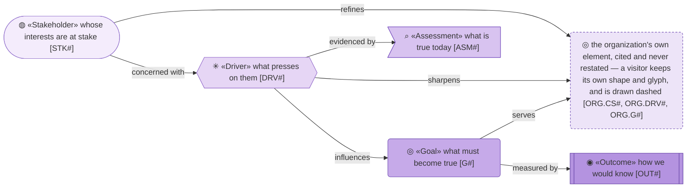
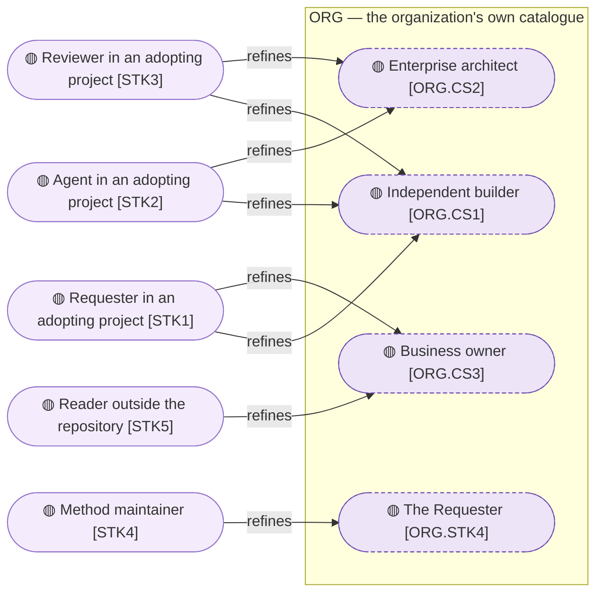
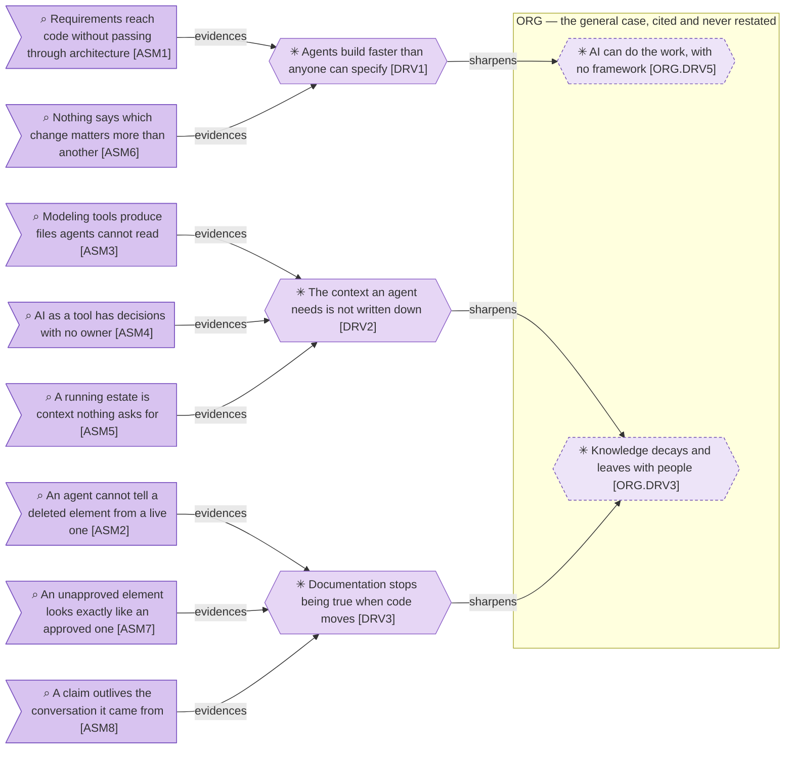
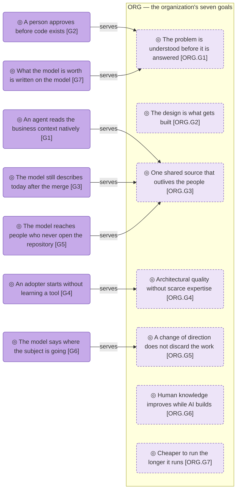

# Motivation

_[← Strategy layer](./README.md) · [Front door](../README.md)_

**ArchiMate viewpoint:** Motivation.

**Status:** ◐ Draft catalogue — not yet approved at a gate. **Direction**
covers this document.

**The why of the organization lives in
[its strategy](../../../org-archreator/architecture/1_strategy/1_motivation.md);
this document holds only what the product adds** — the adopting project's
roles, and what must be true of the method itself. Where an element would
restate the organization's, a cross-model reference stands in its place.

## How to read this document

## Stakeholders

**Three of the five roles refine the same segment**, which is what the solo
project actually looks like: one independent builder [`ORG.CS1`] owning the
subject, running the agent and reviewing the branch. The product's
stakeholders are the three roles of every adopting project, plus the two
people outside the loop — and no row invents a stakeholder the organization
has never heard of.

| ID | Stakeholder | What they want | Refines |
| -- | ----------- | -------------- | ------- |
| `STK1` | **Requester in an adopting project** | To own a subject and have it modeled without doing the modeling; to decide at points they choose, shown enough to decide honestly | `ORG.CS1`, `ORG.CS3` |
| `STK2` | **Agent in an adopting project** — the coding agent each of those segments already works with | To know the business context before writing code, and to be stopped from acting on a fact that is no longer true | `ORG.CS1`, `ORG.CS2` |
| `STK3` | **Reviewer in an adopting project** | To read a whole branch and see what it claims to change, against documents that were true before it started | `ORG.CS1`, `ORG.CS2` |
| `STK4` | **Method maintainer** — the organization's Requester [`ORG.STK4`], wearing the maintainer hat | To change the method without silently falsifying the models built on it | `ORG.STK4` |
| `STK5` | **Reader outside the repository** — the owner evaluating the method before adopting it | To read the architecture they are asked to agree with, fund or audit, without cloning anything | `ORG.CS3` |

The segments themselves stay modeled
[where they are defined](../../../org-archreator/architecture/1_strategy/1_motivation.md#stakeholders);
a stakeholder that refined none of them would be the organization's finding
to raise, not this model's to invent.

## Drivers and assessments

**Eight assessments narrow to three drivers, and two of the three sharpen
the same organizational one.** What the organization calls knowledge decaying
splits here into two different failures — context that was never written and
context that stopped being true — and they need different machinery, which
is why they are two rows rather than one.

Each driver sharpens one of the organization's into what it means for this
product specifically; the organization's row is the general case, cited
rather than restated.

| ID | Driver | Pressing on | Sharpens |
| -- | ------ | ----------- | -------- |
| `DRV1` | **Agents build faster than anyone can specify** — the constraint moved from writing code to deciding what should be written | `STK1`, `STK3` | `ORG.DRV5` |
| `DRV2` | **The context an agent needs is not written down** — an agent with none of it fills the gap with something plausible | `STK2` | `ORG.DRV3` |
| `DRV3` | **Documentation stops being true when code moves** — a model describing last quarter is worse than none, because it is trusted | `STK2`, `STK3` | `ORG.DRV3` |

| ID | Assessment | Evidences |
| -- | ---------- | --------- |
| `ASM1` | Requirements reach code without passing through architecture, because nothing stops the skip | `DRV1` |
| `ASM2` | An agent cannot tell a deleted element from a live one, and will reason from the ghost | `DRV3` |
| `ASM3` | Modeling tools produce files agents cannot read or diff | `DRV2` |
| `ASM4` | AI modeled as a tool has decisions with no owner — nothing records what it may decide alone, or who it escalates to | `DRV2` |
| `ASM5` | An estate that predates the model is context nothing will ask for — no requirement ever asks for the applications already running | `DRV2` |
| `ASM6` | Nothing says which change matters more than another, so the method can judge coherence but never priority | `DRV1` |
| `ASM7` | An unapproved element looks exactly like an approved one on the page | `DRV3` |
| `ASM8` | A claim outlives the conversation it came from, and eighteen months later nobody can say why the model says so | `DRV3` |

## Goals and outcomes

**Three of the organization's goals have nothing pointing at them** —
`ORG.G2`, `ORG.G6` and `ORG.G7`. Two of those the method plainly works
towards; the third is the one nothing measures on either side. Whether that
is a missing goal here or a missing `Serves` cell is a question for the
**Direction** gate, and the diagram is what makes it askable.

| ID | Goal | Against | Realized by | Serves |
| -- | ---- | ------- | ----------- | ------ |
| `G1` | **An agent reads the business context natively** — Markdown in git, nothing exported before it can be used | `ASM3`, `ASM5` | The document conventions; the landscape sweep | `ORG.G3` |
| `G2` | **A person approves before code exists** | `ASM1` | The three named gates, and the rule that an unrecorded approval did not happen | `ORG.G1` |
| `G3` | **The model still describes today after the merge** | `ASM2`, `ASM7`, `ASM8` | The validators; the status glyphs; the rule that a change updates whatever it falsifies | `ORG.G3` |
| `G4` | **An adopter starts without learning a tool** — eleven files on the first commit, every one of them used | `ASM3` | The scaffold, installed as a plugin | `ORG.G4` |
| `G5` | **The model reaches the people who never open the repository** — a portal generated on request, a brief for one question, a PDF of one brief converted by the agent | `ASM3` | The stock portal configuration and the brief generator; nothing published lives in the repository | `ORG.G3` |
| `G6` | **The model says where the subject is going, not only where it is** — target plateaus, a derived gap register, a sequence, approved as direction | `ASM6` | The transition-planning skill | `ORG.G5` |
| `G7` | **What the model is worth is written on the model** — a status glyph on every defining document, provenance beside every draft claim | `ASM7`, `ASM8` | The draft-catalogue discipline and its validator | `ORG.G1` |

| ID | Outcome | Checked by | Mechanical? |
| -- | ------- | ---------- | ----------- |
| `OUT1` | Every element names what realizes it, or says it is Pending | The plugin's coverage report, read by a person — no validator can tell a repository path from a team name | No — a report, not a gate |
| `OUT2` | Every gate is recorded with who approved and what they were shown | The Approvals table in the scope document | By convention |
| `OUT3` | No reference resolves to something that was deleted | The element-ID validator, on every pull request | Yes |
| `OUT4` | Every document that defines an element declares how far it has been validated | The same validator — checked on the glyph, never the words, so it holds in any language | Yes |
