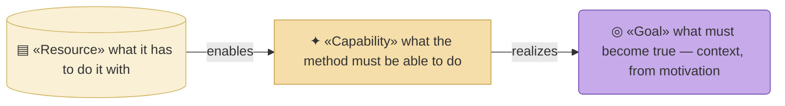
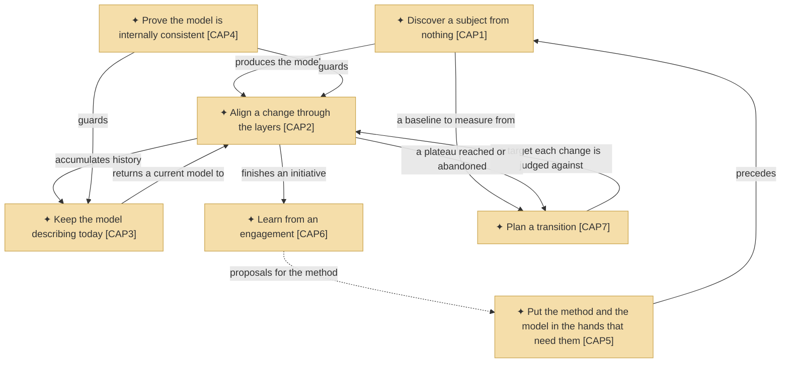
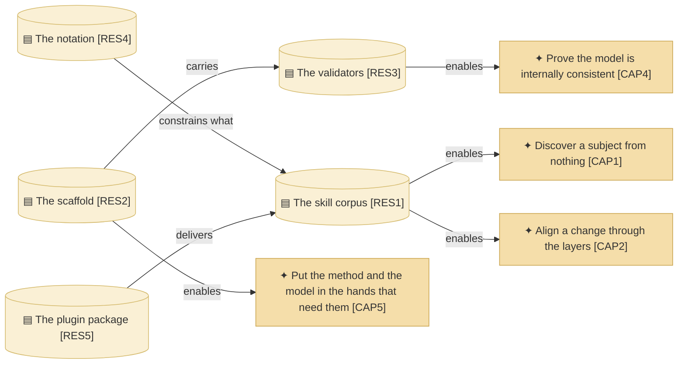

# Capabilities and resources

_[← Strategy layer](./README.md) · [EA home](../README.md)_

**ArchiMate viewpoint:** Strategy. What the method must be able to do, and
what it has to do it with.

Capabilities here are **flat, not leveled**. Levelling is what an
organization's capability map needs; this subject is one deliverable, and six
capabilities under one aim do not need areas above them. The leveled map is
one tree up, in
[`org-archreator/`](../../../org-archreator/architecture/README.md).

## How to read this document

| Glyph | Shape | Element | ID prefix | Reads as |
| ----- | ----- | ------- | --------- | -------- |
| `✦` | Rectangle | «Capability» | `CAP` | `CAP1` = Capability 1 |
| `▤` | Cylinder | «Resource» | `RES` | `RES1` = Resource 1 |
| `◎` | Rounded rectangle (violet) | «Goal» — context, from [motivation](./1_motivation.md) | `G` | `G1` = Goal 1 |

A goal borrowed for context keeps its home layer's colour, so it reads as a
visitor rather than a strategy element.

## Capabilities

The dashed edge is the only one that is not a delivery path: what an
engagement teaches changes the method itself, which is a different repository
and a different cadence.

| ID | Capability | What it includes | Realized by | Maturity |
| -- | ---------- | ---------------- | ----------- | -------- |
| `CAP1` | **Discover a subject from nothing** | Turning a company or an application nobody has modeled into canvases, a strategy layer and a domain split, each stopped at its gate — and, where the subject was already running, sweeping its estate into the four layers below the strategy | `establish-project`, `discover-business-model`, `discover-strategy`, `model-domains`, `discover-current-landscape` | Established |
| `CAP2` | **Align a change through the layers** | Taking a requirement top-down through the six layers, stopping at the gates, recording it in a scope document, and handing over a reviewable branch | `align-change-through-layers`, `write-scope-document`, `shard-stories`, `write-pr-description` | Established — the spine of the method |
| `CAP3` | **Keep the model describing today** | Removing accumulated history from a model that has stopped reading as a description of now, and recording calls too small to be initiatives | `restate-current-state`, `record-decision` | Established |
| `CAP4` | **Prove the model is internally consistent** | Checking mechanically that references resolve, that no identifier is reused, that levelled identifiers have parents, and that links and anchors point at something — and reporting, without failing anything, where a catalogue grounds some rows and leaves others blank | `check_model.py`, `check_links.py`, `check_skills.py`, `query_model.py` | Established. Still narrower than the rule it serves, and now narrower on purpose rather than for want of a tool — see `OUT1` |
| `CAP5` | **Put the method and the model in the hands that need them** | Publishing the skills as an installable plugin, emitting a scaffold that is a working project on the first commit, explaining the method in public — and rendering any model built with it as a website and as one document, for the readers who will never open a repository | `plugin.json` and `marketplace.json`, the scaffold, `docs/`, the [guidance site](../../site/README.md), `scaffold/scripts/build_docs.py` and `scaffold/scripts/export_pdf.py` | Established for the method; new for the model |
| `CAP6` | **Learn from an engagement** | Capturing what the method failed to cover while the memory of it is fresh, generalized past recognition of the client | `run-retrospective` | Established, and rarely exercised |
| `CAP7` | **Plan a transition** | Turning an approved description of today into named target plateaus, a gap register derived by subtracting the baseline from them, and a sequence of initiatives ordered by dependency — approved as direction, and never as permission to build | `plan-the-transition` | New. The only capability whose output describes a future |

**`CAP4` is deliberately narrower than `P2`, and the gap is now measured
rather than merely admitted.** Grounding says every element names what realizes
it; the validators check that *references* and *links* resolve, not that a
"Realized by" cell points at a file that exists. Distinguishing a repository
path from a team name is fuzzy, and a check that fails wrongly teaches people
to ignore the checks that do not.

`query_model.py coverage` closes the half of that which can be closed without
guessing: an empty cell in a table whose other rows are filled is an omission
by the model's own standard, and needs no judgement about paths. It reports and
exits zero, which is the whole reason it is allowed to exist — a gate here
would recreate the failure the paragraph above rules out.

**`CAP5` covers two audiences on purpose, rather than splitting.** Handing an
adopter the method and handing their stakeholders the model are the same
ability pointed at different people: publish what exists, to whoever cannot
otherwise reach it. A second capability would have restated the first with a
different object, which `P4` forbids.

**`CAP7` is a seventh capability rather than a widening of `CAP1` or `CAP2`,
and that is a real cost accepted for a real distinction.** Discovery describes
what is there; alignment judges one change against it. Neither can say what
should be there instead, and the difference is not the object but the tense —
every other capability produces a statement about the present. Folding planning
into discovery would have made "discover" mean two things, and the second one
cannot be validated against anything that exists.

**`CAP6` is the one capability with no pull on it.** Nothing triggers a
retrospective except an initiative ending and somebody remembering. It is
recorded as established because the skill exists and works, not because it
runs often.

## Resources

| ID | Resource | Kind | What it is | State |
| -- | -------- | ---- | ---------- | ----- |
| `RES1` | **The skill corpus** | Knowledge | Seventeen skills in a fixed format — a description that declares its kind, a set of required sections, and frontmatter binding it to the process it realizes. `plugins/archreator/skills/` | Held, and the thing most often changed |
| `RES2` | **The scaffold** | Asset | The empty project an adopter starts from: six layer folders, the notation, the validators, the portal configuration, and placeholder entry points. `plugins/archreator/scaffold/` | Held |
| `RES3` | **The validators** | Asset | `check_links.py` and `check_model.py`, which ship inside the scaffold, plus `check_skills.py`, which does not — a downstream project has no skills to check. `query_model.py` ships beside them and is not one of them: it reports and never fails | Held |
| `RES4` | **The notation** | Knowledge | ArchiMate semantics encoded onto Mermaid with four devices — label form, glyph, shape, colour — stated once in `scaffold/architecture/README.md` | Held |
| `RES5` | **The plugin package** | Asset | The manifests that publish the corpus to a marketplace an adopter can install from. `plugin.json` and `marketplace.json` | Held, and the only part `P5` calls disposable |

**`RES4` is what makes `RES1` affordable.** Because glyph, shape and colour
carry an element's type, a skill never has to teach the notation, and a
diagram never has to spell out a stereotype. It is knowledge rather than an
asset because moving the file would not lose it — every document in every
model already applies it.

**`RES1` and `RES2` are the pair that must not drift.** The scaffold's
`CLAUDE.md` carries a copy of the skill catalogue, because a generated project
needs it without having the skills; `check_skills.py` holds the two in step.
That is `P1`'s escape clause working as intended — one unavoidable copy, with
a check on it.

## Courses of action

**None in this tree.** A course of action is how an organization decides to
close a gap between where it is and where it wants to be, and that instrument
belongs to whoever sets direction. This subject is a deliverable, not an
organization: it has no gap of its own to close and nobody to make the call.

The organization's courses of action — including the one that would build a
published view of these models — are one tree up, in
[`org-archreator/`](../../../org-archreator/architecture/README.md).
