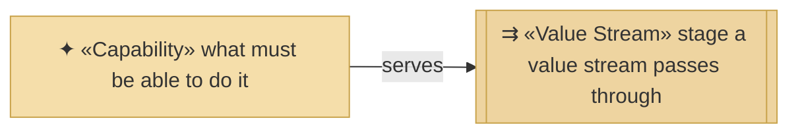
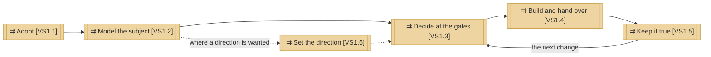

# Value stream

_[← Strategy layer](./README.md) · [EA home](../README.md)_

**ArchiMate viewpoint:** Strategy. How value reaches an adopter, end to end,
and which capability carries each stage.

**Status:** ● Validated at **Gate 1**, 2026-08-24.

One stream, five stages. It starts before the method is installed and ends
with something merged that the documents still describe truthfully — which is
the only definition of done the method accepts.

## How to read this document

| Glyph | Shape | Element | ID prefix | Reads as |
| ----- | ----- | ------- | --------- | -------- |
| `⇉` | Rectangle, double bars | «Value Stream» | `VS` | `VS1` = Value Stream 1 |
| `✦` | Rectangle | «Capability» — context, from [capabilities](./2_capabilities-and-resources.md) | `CAP` | `CAP1` = Capability 1 |

## The stream

`VS1` is the stream; the stages carry its levels. The loop from `VS1.5` back
to `VS1.3` is the method's normal state — a project spends almost all of its
life going round it, and only passes through `VS1.1` and `VS1.2` once.

`VS1.6` is dashed because it is the one optional stage. An adopter with a
single change in front of them goes straight from the model to the gates; one
with a portfolio and no way to rank it does not.

| ID | Stage | What happens | Served by | Ends when |
| -- | ----- | ------------ | --------- | --------- |
| `VS1` | **From a subject nobody has modeled to a change nobody has to re-explain** | The whole stream | — | — |
| `VS1.1` | **Adopt** | The plugin is installed or the scaffold cloned; the project is named, its language chosen, its depth declared | `CAP5` | `CLAUDE.md` declares a depth |
| `VS1.2` | **Model the subject** | Canvases where the subject is an organization, then the strategy layer derived from them, then domains if the subject is an enterprise — and, where the subject was already running, the estate swept into the layers below | `CAP1` | The strategy layer is approved, and any estate is described |
| `VS1.6` | **Set the direction** | Target plateaus named from the goals, a gap register derived by subtracting the baseline, and a sequence of initiatives ordered by dependency. Optional — an adopter with one change in front of them skips it | `CAP7` | The roadmap is approved as direction |
| `VS1.3` | **Decide at the gates** | A requirement is walked down the layers, each layer changed or explicitly declared unchanged, and the Requester approves what they were shown | `CAP2` | The scope document's Approvals table is filled |
| `VS1.4` | **Build and hand over** | Implementation against an approved design, with the documents updated as the code changes, and a pull request covering the whole branch | `CAP2` | The Reviewer merges |
| `VS1.5` | **Keep it true** | Accumulated history is removed, decisions too small for an initiative are recorded, and what the method failed to cover is captured | `CAP3`, `CAP6` | The model reads as a description of today |

**Value is delivered at `VS1.4` and protected at `VS1.5`.** Everything before
`VS1.4` is cost — real, necessary cost, and the reason the method exists — but
an adopter who stops at `VS1.3` has paid for a model and received nothing that
runs. An adopter who skips `VS1.5` receives something that runs and loses the
model within two initiatives.

**The gate loop is inside `VS1.3`, not between stages.** A gate the Requester
declines sends the work back within the stage rather than to an earlier one:
the layers are re-walked, not the subject re-modeled. Drawing it as a
stage-to-stage loop would suggest a declined gate re-opens discovery, which it
does not.

## Where the stream is thin

| Stage | The weakness |
| ----- | ------------ |
| `VS1.1` | Depends on the adopter answering two questions honestly — what the subject is, and how deeply to model it. An adopter who overstates the depth gets four gates for an application, and abandons the method rather than the depth |
| `VS1.5` | Has no trigger. Nothing observes that a model has drifted; somebody has to notice. This is the same gap `CAP6` has, one stage further on |
| `VS1.6` | Runs between `VS1.2` and `VS1.3`, and is numbered last because an identifier is assigned once and never reallocated. It is also the one stage an adopter can skip without the stream breaking — which is why it was missing long enough to be noticed |
