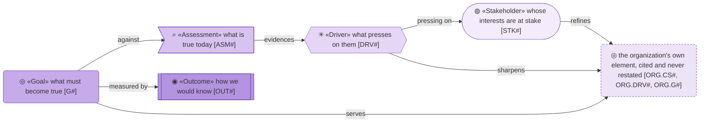
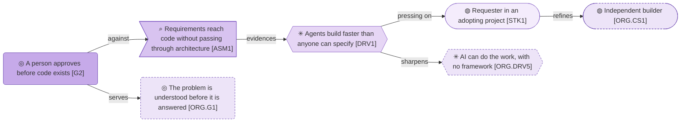

# Strategy

_[← Front door](../README.md)_

Why the method exists and what must be true of it, light enough to judge a
change against and nothing more.

**ArchiMate viewpoint:** Motivation: Stakeholder, Driver, Assessment, Goal,
Outcome. An element of the organization's is cited as `ORG.<ID>`, never
restated.

## Documents

| # | Document | Elements | Question it answers |
| - | -------- | -------- | ------------------- |
| 1 | [Motivation](./1_motivation.md) | The three roles of an adopting project and two readers, what presses on them, seven goals and how each is checked | Who has a stake in the method, and what must be true of it? |

## Metamodel

An element of the organization's keeps its own shape and glyph and is drawn
dashed.

## Layer view

A requester in an adopting project refines the organization's independent
builder; the pressure on them sharpens a driver of the organization's, and the
goal that answers it serves a goal of the organization's.
