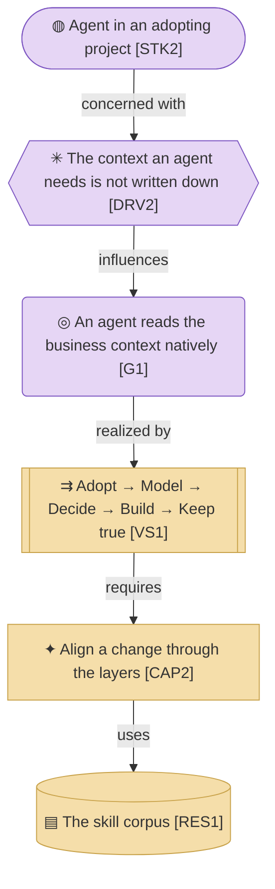

# Strategy & Motivation Layer

_[← EA home](../README.md)_

The top-down business context: who has a stake in the project, why it
exists, which capabilities it needs, and the value stream it delivers. This
layer motivates everything below it — each capability is realized by
business services in the [business layer](../2_business/README.md).

**If [0_business-design/](../0_business-design/README.md) is filled in, this
layer is derived from it, not invented alongside it.** On the company track
the canvases come first and every element here traces back to a canvas
block — the `Source` column below says which. On the application track
layer 0 stays empty, the `Source` column is left blank, and this layer is
where discovery starts.

## Analysis order

Files are numbered in the order they are analyzed: first _who wants what
and why_, then _what we must be able to do_, and only then _how value
flows_.

| #   | Document | Elements | Question it answers |
| --- | -------- | -------- | ------------------- |
| 1   | [1_motivation.md](./1_motivation.md) | Stakeholders, Drivers, Assessments, Goals, Outcomes, Principles | Who cares, what pressures them, what must be true? |
| 2   | [2_capabilities-and-resources.md](./2_capabilities-and-resources.md) | Capabilities, Resources | What must the method be able to do, and with what? |
| 3   | [3_value-stream.md](./3_value-stream.md) | Value Stream and its stage mapping | How does value reach an adopter, end to end? |

**There is no `Source` column, because there are no canvases to source from.**
On the company track every element here traces back to a block of a value
proposition or business model canvas. This tree is on the application track:
`0_business-design/` is empty, discovery starts at motivation, and the
elements are derived from what the method itself says it does.

Courses of action are absent for the same reason — they are an organization's
instrument, and this subject is a deliverable. The reasoning is in
[2_capabilities-and-resources.md](./2_capabilities-and-resources.md) §
Courses of action.

**Capabilities are not leveled in this tree.** Leveling — areas, then
capabilities, then sub-capabilities only where a named pain justifies going
further — is what an organization's capability map needs, and this subject is
one deliverable rather than an organization. Its capabilities sit flat, and
the leveled map is one tree up. The `process-and-capability-levels` skill
holds the rule, the safeguard that keeps a reference model a proposal rather
than an answer, and the distinction that keeps this document honest:
capabilities are nouns, processes are verbs.

[1_motivation.md](./1_motivation.md) is where **Principles** live — the constraints that a
proposed change is checked against in step 1 of `align-change-through-layers` before
anything else. Keep them few, load-bearing, and testable (e.g. "role
determines access", not "be secure").

## Layer view

One chain through the layer: the stakeholder the method is written for, the
driver that presses on them, the goal that answers it, and the stream,
capability and resource that deliver it. The full sets are in the three
documents above.

This is a **cross-layer** view, so it uses the flat layer palette — violet for
motivation, sand for strategy — rather than the tone ramps the single-layer
documents use. Colour here separates the layers, not the element types within
them.

## Relationships

<!-- Transcribed from this document's diagrams. The identifier is
     authoritative; the description beside it is checked against the
     catalogue that defines the element. -->

| From | From element | To | To element | Relationship |
| ---- | ------------ | -- | ---------- | ------------ |
| `G1` | «Goal» An agent reads the business context natively | `VS1` | «Value Stream» From a subject nobody has modeled to a change nobody has to re-explain | realized by |
| `VS1` | «Value Stream» From a subject nobody has modeled to a change nobody has to re-explain | `CAP2` | «Capability» Align a change through the layers | requires |
| `CAP2` | «Capability» Align a change through the layers | `RES1` | «Resource» The skill corpus | uses |
