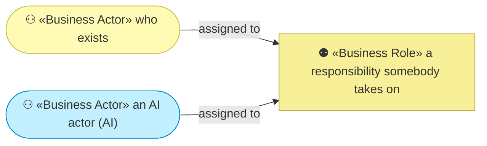
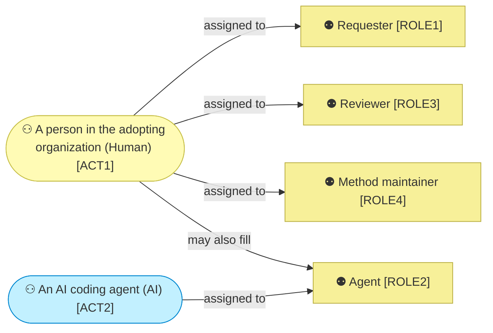

# Business actors and roles

_[← Business layer](./README.md) · [EA home](../README.md)_

**ArchiMate viewpoint:** Business. Who fills each responsibility the method
defines, and — for the one filled by an AI — what it may decide alone.

**Status:** ● Validated at **Gate 2**, 2026-08-22.

The method defines **roles**, not people. Its central claim is that the same
three roles work whether a human or an AI fills the middle one, so the roles
are modeled as responsibilities and the actors as whoever takes them on.

## How to read this document

| Glyph | Shape | Element | ID prefix | Reads as |
| ----- | ----- | ------- | --------- | -------- |
| `⚇` | Stadium | «Business Actor» | `ACT` | `ACT1` = Actor 1 |
| `⚉` | Rectangle | «Business Role» | `ROLE` | `ROLE1` = Role 1 |

**An `(AI)` actor is drawn in the application cyan**, even here in a business
diagram, so that no reader mistakes it for a person. That override is the
notation's, not this document's.

## The actors

**`ACT1` filling `ROLE2` is the whole bet.** A human walking the layers is
the ordinary case in every other method; here it is the exception, and
everything still works when it happens. Nothing in the method assumes it. The
edge is solid because a person doing this today succeeds — the exception is in
how often, which the label says and the notation does not.

| ID | Actor | Kind | Who it is | Fills |
| -- | ----- | ---- | --------- | ----- |
| `ACT1` | **A person in the adopting organization** | Human | Whoever owns the subject, reviews the work, or maintains the method. One person routinely holds several of these responsibilities on a small project | `ROLE1`, `ROLE3`, `ROLE4`, and `ROLE2` when no agent is used |
| `ACT2` | **An AI coding agent** | AI | The agent running the skills — reading the model, walking the layers, writing the documents, implementing, opening the pull request | `ROLE2` |

### `ACT2` — autonomy, decision rights, escalation

| Column | Value |
| ------ | ----- |
| **Autonomy level** | **Co-pilot** — it acts, and a human reviews before the work takes effect |
| **Decision rights** | Which layers a change touches, and the verdict that a layer is unchanged; how a work package is sharded; the wording of every document it writes; the implementation, within an approved design; what a pull request says. It may also **stop** — declaring a conflict with an approved principle and refusing to proceed |
| **Escalation path** | `ROLE1` for anything at a gate, any conflict with an approved principle, and any open question it cannot close from the documents. `ROLE3` for anything that would merge |

**Co-pilot rather than autonomous-with-checkpoint, and the difference is the
gates.** An autonomous-with-checkpoint actor acts and a human may intervene
afterwards. Here the human intervenes *first*, twice — once at each gate that
applies, and again at review — and neither is a notification the Requester can
ignore. An unapproved gate stops the work rather than logging a warning.

**What `ACT2` may never decide:** whether a gate is passed, whether a principle
may be set aside, and whether anything merges. Those three are the method.

### Relationships

<!-- Transcribed from this document's diagrams. The identifier is
     authoritative; the description beside it is checked against the
     catalogue that defines the element. -->

| From | From element | To | To element | Relationship |
| ---- | ------------ | -- | ---------- | ------------ |
| `ACT1` | «Actor» A person in the adopting organization | `ROLE1` | «Role» Requester | assigned to |
| `ACT1` | «Actor» A person in the adopting organization | `ROLE3` | «Role» Reviewer | assigned to |
| `ACT1` | «Actor» A person in the adopting organization | `ROLE4` | «Role» Method maintainer | assigned to |
| `ACT1` | «Actor» A person in the adopting organization | `ROLE2` | «Role» Agent | may also fill |

## The roles

| ID | Role | Responsibility | Ends when |
| -- | ---- | -------------- | --------- |
| `ROLE1` | **Requester** | Says what should change — a requirement or a problem, never a diff. Grants the gate approvals, and is shown enough at each to decide honestly | The Approvals table is filled |
| `ROLE2` | **Agent** | Walks the change through the layers, stops at each gate, writes the scope document, implements, and opens the pull request | The branch is handed over |
| `ROLE3` | **Reviewer** | Reads the whole branch against documents that were true before it started, and merges | Merged |
| `ROLE4` | **Method maintainer** | Changes the method itself, and repairs what each change falsifies in the models built on it | The corpus checks green |

**`ROLE1` and `ROLE3` are usually one person and are still two roles.** One
decides before the work exists, the other checks what came back. A person
wearing both reads the branch twice for different reasons, and the model says
so rather than pretending the second reading is free.

**`ROLE4` sits outside the loop the other three run.** It is the only role
whose subject is the method rather than a model built with it, which is why
its work lands in a different repository from everything the other three
produce.

## External partners

**None modeled.** The method depends on a host platform to run its skills and
on a marketplace to distribute them, and neither is a business relationship —
there is no contract, no counterparty and no negotiated service. Both are
technology, and both are `P5`'s disposable packaging rather than anything the
method is built around. They appear in
[5_technology/](../5_technology/README.md) instead.
