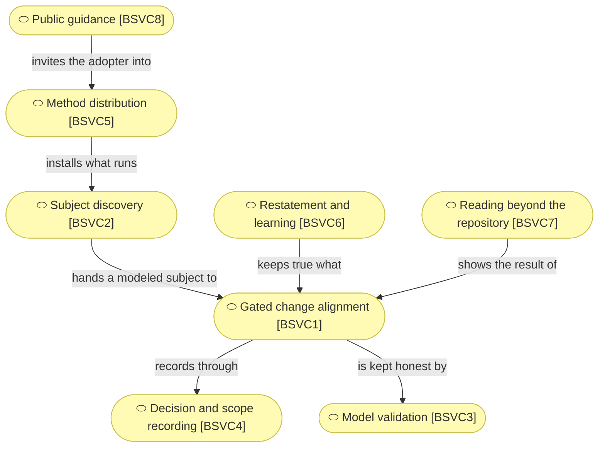

# Business services

_[← Business layer](./README.md) · [Front door](../README.md)_

**ArchiMate viewpoint:** Business — Business Service.

**Status:** ◐ Draft catalogue — rebuilt on method 0.2 from the validated
pre-0.2 layer, not yet re-approved. **Understanding** covers this layer.

## How to read this document

| Glyph | Shape | Element | ID prefix | Reads as |
| ----- | ----- | ------- | --------- | -------- |
| `⬭` | Stadium | «Business Service» | `BSVC` | `BSVC#` |

## The services

| ID | Service | Delivers | Realized by |
| -- | ------- | -------- | ----------- |
| `BSVC1` | **Gated change alignment** | A requirement walked top-down through the layers, stopped at every gate that applies, each layer changed or explicitly declared unchanged | `ACMP1` |
| `BSVC2` | **Subject discovery** | A company or an application turned into canvases, a strategy and — where one already runs — a described estate, each approved before the next begins | `ACMP1` |
| `BSVC3` | **Model validation** | Mechanical proof that references resolve, identifiers are never reused, links point at something, and every defining document declares how far it has been validated — offline, with no plugin | `ACMP2`, `ACMP3`, `ACMP4` |
| `BSVC4` | **Decision and scope recording** | A durable record of what was approved, by whom, and what they were shown — and of the calls too small to be initiatives | `ACMP1` |
| `BSVC5` | **Method distribution** | An installable plugin, and a scaffold that is a working project on its first commit — eleven files, every one of them used | `ACMP8`, `ACMP9`, `ACMP10`, `ACMP11` |
| `BSVC6` | **Restatement and learning** | A model that stopped reading as a description of today turned back into one, and what the method failed to cover captured before it evaporates | `ACMP1` |
| `BSVC7` | **Reading beyond the repository** | Answers a table cannot give — what a change would touch, what names no realizing artifact — plus a portal generated on request and a brief for one question, converted to PDF by the agent when a reader asks | `ACMP5`, `ACMP6` |
| `BSVC8` | **Public guidance** | Why the method exists, what an adopter receives, and the two install commands — for the reader who has not adopted anything yet | `ACMP12` |

**Two ways in, one model.** `BSVC1`, `BSVC2` and `BSVC6` are the guided
route — the independent builder explains the business and the agent runs the
method. `BSVC3` and `BSVC7` serve the expert route just as well without an
agent in the loop: an enterprise architect navigates the standard structure
directly, and the validators and readers answer to them too.
