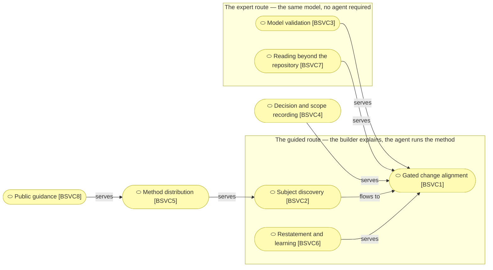

# Business services

_[← Business layer](./README.md) · [Front door](../README.md)_

What the product does for an adopting project, as eight services.

**ArchiMate viewpoint:** Business: Business Service.

**Status:** ◐ Draft catalogue, not yet approved at Understanding.

## The services

Five of the eight services point at one. `BSVC1` is where the method
happens; everything else exists to reach it, feed it, record it or read what
it produced, so a change to it is the most expensive change in the product.

| ID | Service | Delivers | Realized by |
| -- | ------- | -------- | ----------- |
| `BSVC1` | **Gated change alignment** | A requirement walked top-down through the layers, stopped at Direction and at Understanding where each applies, each layer changed or explicitly declared unchanged | [`ACMP1`] The skill corpus |
| `BSVC2` | **Subject discovery** | A company or an application turned into canvases, a strategy and, where one already runs, a described estate, each approved before the next begins | [`ACMP1`] The skill corpus |
| `BSVC3` | **Model validation** | Mechanical proof that references resolve, identifiers are never reused, links point at something, and every defining document declares how far it has been validated, offline and with no plugin | [`ACMP2`] The link checker, [`ACMP3`] The element-ID validator, [`ACMP4`] The model parser, [`ACMP13`] The prose validator |
| `BSVC4` | **Decision and scope recording** | A durable record of what was approved, by whom, and what they were shown, and of the calls too small to be initiatives | [`ACMP1`] The skill corpus |
| `BSVC5` | **Method distribution** | An installable plugin, and a scaffold that is a working project on its first commit: thirteen files, every one of them used | [`ACMP8`] The scaffold, [`ACMP9`] The asset library, [`ACMP10`] The plugin package, [`ACMP11`] The skills installer |
| `BSVC6` | **Restatement and learning** | A model that stopped reading as a description of today turned back into one, and what the method failed to cover captured before it evaporates | [`ACMP1`] The skill corpus |
| `BSVC7` | **Reading beyond the repository** | Answers a table cannot give, such as what a change would touch and what names no realizing artifact, plus a portal generated on request and a brief for one question, converted to PDF by the agent when a reader asks | [`ACMP5`] The model reader, [`ACMP6`] The brief generator |
| `BSVC8` | **Public guidance** | Why the method exists, what an adopter receives, and the two install commands, for the reader who has not adopted anything yet | [`ACMP12`] The guidance site |

Two ways in, one model. `BSVC1`, `BSVC2` and `BSVC6` are the guided route:
the independent builder explains the business and the agent runs the method.
`BSVC3` and `BSVC7` serve the expert route without an agent in the loop: an
enterprise architect navigates the standard structure directly, and the
validators and readers answer to them too.
