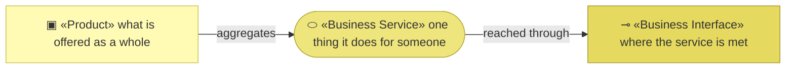
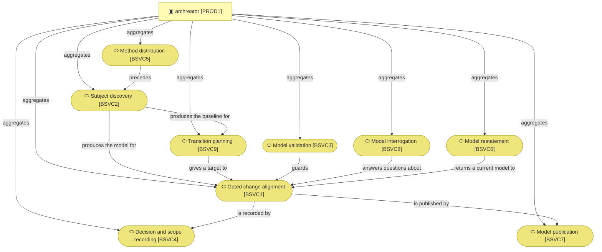
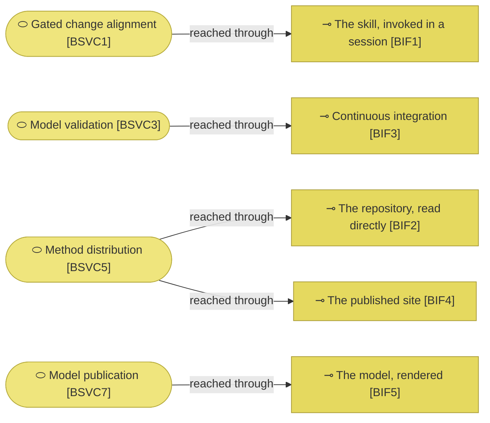

# Products and business services

_[← Business layer](./README.md) · [EA home](../README.md)_

**ArchiMate viewpoint:** Business. What the method offers an adopter, and
through which channel each service reaches them.

**Status:** ● Validated at **Gate 2** — every service on 2026-08-26; `BSVC3`
restated on 2026-08-27 with
[initiative 6](../scope/6_declare-the-relationships-and-let-the-graph-be-walked.md),
`BSVC8` on 2026-08-27 with [initiative 7](../scope/7_walk-the-model.md);
`BSVC3` again on 2026-08-27 with [initiative 9](../scope/9_cross-the-boundary.md).

## How to read this document

| Glyph | Shape | Element | ID prefix | Reads as |
| ----- | ----- | ------- | --------- | -------- |
| `▣` | Rectangle | «Product» | `PROD` | `PROD1` = Product 1 |
| `⬭` | Stadium | «Business Service» | `BSVC` | `BSVC1` = Business Service 1 |
| `⊸` | Rectangle | «Business Interface» | `BIF` | `BIF1` = Business Interface 1 |

## The product and its services

| ID | Business service | What the adopter gets | Realizes | Realized by |
| -- | ---------------- | --------------------- | -------- | ----------- |
| `BSVC1` | **Gated change alignment** | A requirement walked top-down through six layers, stopped at every gate that applies, with each layer either changed or explicitly declared unchanged | `CAP2` | `align-change-through-layers`, `shard-stories`, `write-pr-description` |
| `BSVC2` | **Subject discovery** | A company or an application turned into canvases, a strategy layer and — at enterprise depth — a domain split, each approved before the next begins; and where the subject was already running, its estate described in the four layers below the strategy, with a declared boundary, and the transcripts and documents it was built from kept beside it | `CAP1` | `establish-project`, `discover-business-model`, `discover-strategy`, `model-domains`, `discover-current-landscape` |
| `BSVC3` | **Model validation** | Mechanical proof that references resolve, identifiers are not reused, levelled identifiers have parents, links and anchors point at something, no document defines an element without declaring how far it has been validated, and no document restates an element's name differently from the catalogue that owns it, and every reference that names another model either resolves in this repository or is declared as an import | `CAP4` | `check_model.py`, `check_links.py`, `check_skills.py` |
| `BSVC4` | **Decision and scope recording** | A durable record of what was approved, by whom, and what they were shown — and of the calls too small to be initiatives | `CAP2`, `CAP3` | `write-scope-document`, `record-decision` |
| `BSVC5` | **Method distribution** | An installable plugin and a scaffold that is a working project on its first commit | `CAP5` | `plugin.json`, `marketplace.json`, the scaffold, `docs/` |
| `BSVC6` | **Model restatement** | A model that has stopped reading as a description of today turned back into one, and what the method failed to cover captured before it evaporates | `CAP3`, `CAP6` | `restate-current-state`, `run-retrospective` |
| `BSVC7` | **Model publication** | The model they already have, rendered as a searchable website and printed as one document, with every page carrying the path of the file that produced it and a route back for a question — and, where the repository it lives in can serve it, published there rather than handed over as a folder | `CAP5` | `build_docs.py`, `export_pdf.py`, `mkdocs.yml` and `overrides/` in the scaffold, the question form beside them, and the publishing workflow the scaffold ships inert |
| `BSVC8` | **Model interrogation** | Answers to the two questions a table cannot give — what a change to one element would touch, and which catalogue rows name no realizing artifact while their neighbours do — asked at a terminal or on a page, by anyone who can open a browser | `CAP2`, `CAP4` | `query_model.py` and the navigator, both reading what `build_model.py` writes |
| `BSVC9` | **Transition planning** | A destination the adopter's own goals justify, the gaps between it and today derived rather than asserted, and a sequence ordered by dependency — approved as direction and never as permission to build | `CAP7` | `plan-the-transition` |

| ID | Product | What it aggregates | Realized by |
| -- | ------- | ------------------ | ----------- |
| `PROD1` | **archreator** | All seven services. There is one product, and the services are the useful decomposition of it | The `archreator` repository as a whole |

**One product, and no portfolio.** A single-application project usually has an
implicit product and can leave it out; this one is named because the tree above
needs something to point at when it says what the organization builds.

**`BSVC8` stopped requiring a terminal, and the two questions did not change.**
What changed is who can ask them. A Requester approving a change at a gate is
entitled to see what it touches, and until now that meant running a script and
knowing the identifier to run it on. The service owes the same two answers; it
owes them to more people. [initiative 7](../scope/7_walk-the-model.md) delivers it.

**`BSVC3` stopped stopping at the repository boundary.** Decision 1 recorded,
as the accepted price of a deliberate split, that "no validator crosses the
repository boundary — the mismatch would be caught by review or not at all".
That is no longer true for models in one repository, where a foreign
reference resolves exactly, and it is narrowed for models in another: the
dependency has to be declared, so a reference nobody thought about fails.

**`BSVC3` gained a check because a reader gained a copy.** A relationship
table writes each end's archetype and name beside its identifier, so that the
person approving it can read it without holding the catalogues open. Both are
facts owned elsewhere. The archetype cannot drift — the prefix is in the next
cell — but the name can, so it is compared against the catalogue that defines
the element and a mismatch fails. This is `P1`'s escape clause used the same
way `DOBJ2` uses it: one unavoidable copy, with a check on it.

**`BSVC3` is the service with no human in it.** Every other service is
something an actor performs; validation is something a script does on every
push, and its value is precisely that it does not depend on anyone
remembering.

### Relationships

<!-- Transcribed from this document's diagrams. The identifier is
     authoritative; the description beside it is checked against the
     catalogue that defines the element. -->

| From | From element | To | To element | Relationship |
| ---- | ------------ | -- | ---------- | ------------ |
| `PROD1` | «Product» archreator | `BSVC1` | «Business Service» Gated change alignment | aggregates |
| `PROD1` | «Product» archreator | `BSVC2` | «Business Service» Subject discovery | aggregates |
| `PROD1` | «Product» archreator | `BSVC3` | «Business Service» Model validation | aggregates |
| `PROD1` | «Product» archreator | `BSVC4` | «Business Service» Decision and scope recording | aggregates |
| `PROD1` | «Product» archreator | `BSVC5` | «Business Service» Method distribution | aggregates |
| `PROD1` | «Product» archreator | `BSVC6` | «Business Service» Model restatement | aggregates |
| `PROD1` | «Product» archreator | `BSVC7` | «Business Service» Model publication | aggregates |
| `PROD1` | «Product» archreator | `BSVC8` | «Business Service» Model interrogation | aggregates |
| `PROD1` | «Product» archreator | `BSVC9` | «Business Service» Transition planning | aggregates |
| `BSVC5` | «Business Service» Method distribution | `BSVC2` | «Business Service» Subject discovery | precedes |
| `BSVC2` | «Business Service» Subject discovery | `BSVC1` | «Business Service» Gated change alignment | produces the model for |
| `BSVC2` | «Business Service» Subject discovery | `BSVC9` | «Business Service» Transition planning | produces the baseline for |
| `BSVC9` | «Business Service» Transition planning | `BSVC1` | «Business Service» Gated change alignment | gives a target to |
| `BSVC1` | «Business Service» Gated change alignment | `BSVC4` | «Business Service» Decision and scope recording | is recorded by |
| `BSVC3` | «Business Service» Model validation | `BSVC1` | «Business Service» Gated change alignment | guards |
| `BSVC8` | «Business Service» Model interrogation | `BSVC1` | «Business Service» Gated change alignment | answers questions about |
| `BSVC6` | «Business Service» Model restatement | `BSVC1` | «Business Service» Gated change alignment | returns a current model to |
| `BSVC1` | «Business Service» Gated change alignment | `BSVC7` | «Business Service» Model publication | is published by |

## Channels

| ID | Interface | Who meets the service there | Serves |
| -- | --------- | --------------------------- | ------ |
| `BIF1` | **The skill, invoked in a session** | `ROLE2`, and `ROLE1` through the conversation the agent is having | `BSVC1`, `BSVC2`, `BSVC4`, `BSVC6` |
| `BIF2` | **The repository, read directly** | Anyone who clones or browses it, including an agent with no plugin installed | `BSVC5` |
| `BIF3` | **Continuous integration** | Nobody, until something fails — then `ROLE2` and `ROLE3` | `BSVC3` |
| `BIF4` | **The published site** | A prospective adopter who has not installed anything | `BSVC5` |
| `BIF5` | **The model, rendered** | `STK5` — the reader outside the repository, as a portal in a browser or a PDF in a mail attachment | `BSVC7` |

**`BIF5` is the only channel the method does not operate.** The portal is a
folder of files an adopter hosts wherever they choose, or does not host at
all — the method builds it and stops. What holds the channel honest is
`RULE7` rather than infrastructure: what a reader meets there is a rendering,
and every page says which file produced it.

**`BIF1` is a channel the adopter never chooses.** A skill is selected by its
description matching what the user said, not invoked by name, so the interface
between an adopter and most of this product is a sentence they typed about
their own problem. That is why a skill's description is method content rather
than packaging — it is the routing.

**`BIF4` reaches the one audience the others cannot**: someone deciding whether
to adopt at all. It is modeled in its own tree,
[`site/`](../../site/architecture/README.md).
