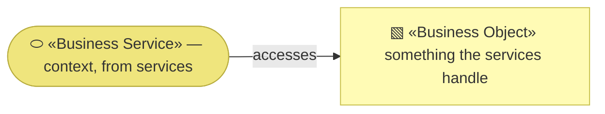
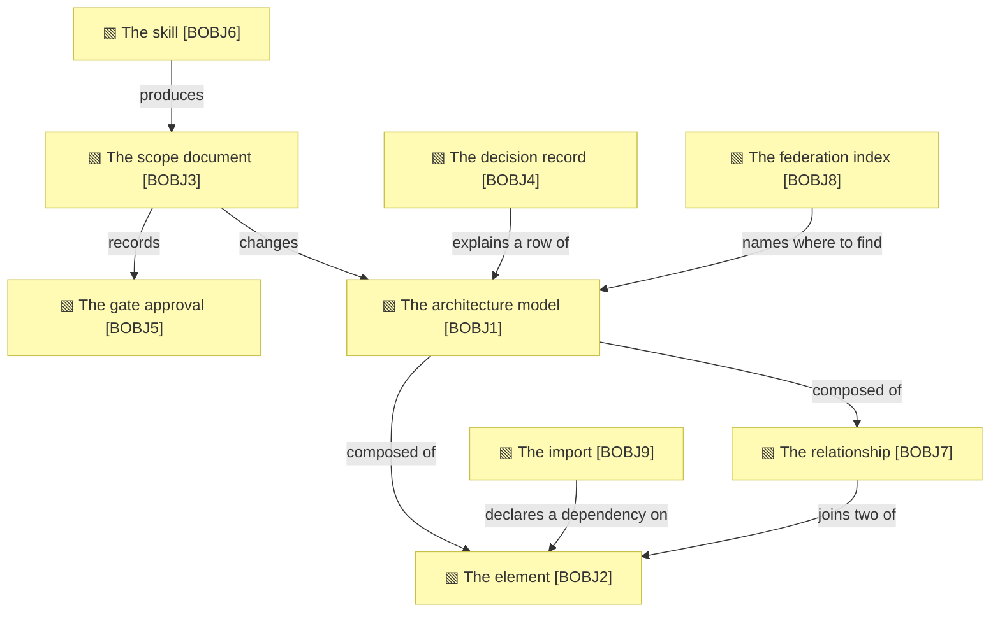

# Business objects

_[← Business layer](./README.md) · [EA home](../README.md)_

**ArchiMate viewpoint:** Business. The things the method's services create,
read and hand to each other.

**Status:** ● Validated at **Gate 2** — `BOBJ1`–`BOBJ6` on 2026-08-22, `BOBJ7` on
2026-08-27 with
[initiative 6](../scope/6_declare-the-relationships-and-let-the-graph-be-walked.md),
`BOBJ8` on 2026-08-27 with [initiative 8](../scope/8_federate-the-graph.md),
`BOBJ9` on 2026-08-27 with [initiative 9](../scope/9_cross-the-boundary.md).

Every object here is a **Markdown file in git**, and that is the point rather
than an implementation detail: it is what makes the model readable by the
agent the method is written for, diffable in review, and versioned by
something nobody has to operate.

## How to read this document

| Glyph | Shape | Element | ID prefix | Reads as |
| ----- | ----- | ------- | --------- | -------- |
| `▧` | Rectangle | «Business Object» | `BOBJ` | `BOBJ1` = Business Object 1 |
| `⬭` | Stadium | «Business Service» — context, from [2_business-services.md](./2_business-services.md) | `BSVC` | `BSVC1` = Business Service 1 |

## The objects

| ID | Business object | What it is | On disk | Accessed by |
| -- | --------------- | ---------- | ------- | ----------- |
| `BOBJ1` | **The architecture model** | Six numbered layers describing one subject as it is today, in assessment order | `architecture/0_*` … `architecture/5_*` | `BSVC1`, `BSVC2`, `BSVC3`, `BSVC6` |
| `BOBJ2` | **The element** | One identified thing in the model — a stakeholder, a capability, a service — carrying a type prefix, a number, a name, and what realizes it | A row in an inventory table, or a bolded lead-in | `BSVC1`, `BSVC3` |
| `BOBJ3` | **The scope document** | One initiative: what changes at each layer, what was approved, what was deliberately left out | `architecture/scope/<n>_<slug>.md` | `BSVC1`, `BSVC4` |
| `BOBJ4` | **The decision record** | One call too small to be an initiative, with the option that was rejected | `architecture/decisions/<n>_<slug>.md` | `BSVC4` |
| `BOBJ5` | **The gate approval** | Which gate, who approved, when, and what they were shown | A row in `BOBJ3`'s Approvals table | `BSVC1`, `BSVC4` |
| `BOBJ6` | **The skill** | One procedure, template or rulebook, in a fixed section format, bound by its frontmatter to the process it realizes | `plugins/archreator/skills/<name>/SKILL.md` | `BSVC5` |
| `BOBJ7` | **The relationship** | One stated connection between two elements — a source, a target, and the words the model uses for what holds between them. Declared in a catalogue column where a row can carry it, and in a relationship table where it cannot | A cell in a catalogue row, or a row in a relationship table | `BSVC1`, `BSVC3`, `BSVC8` |
| `BOBJ8` | **The federation index** | The models that belong with this one, and where each publishes its projection. Authored rather than derived — somebody decides what is in a federation — so it is a document a gate approves and a validator reads, not a configuration file | `architecture/federation.md`, in the topmost model of a federation only | `BSVC7`, `BSVC8` |
| `BOBJ9` | **The import** | One element this model consumes from a model in another repository: its qualified identifier, the name that model gives it, and the revision it was read at. Nothing fetches it — the row is the dependency, stated | `architecture/imports.md` | `BSVC3` |

**`BOBJ5` has no file of its own, and that is deliberate.** An approval is a
row inside the document it approves, so a reader who has the initiative has
its approvals, and nobody can find one without the other. Giving it a file
would make an approval something that could go missing from the thing it
authorized.

**`BOBJ9` is a copy of somebody else's fact, and the method allows exactly one
kind of those.** `P1`'s escape clause — one unavoidable copy, with a check on
it — is what `element-prefixes.json` uses and what a relationship table's
restated name uses. Here the check is weaker and says so: it holds the row
against the upstream only when the upstream is in this repository. Otherwise
it can prove this model consistent with itself and nothing more, which is the
price of not making network calls on every pull request.

**`BOBJ8` is centralized on purpose, and it is the only thing that is.** A
model holding every federated model's elements would restate what those
models own, which the tier rule forbids, and its owner would need approval
rights over elements they did not write. So what is centralized is a list of
locations. The graph is a view, assembled when somebody opens it, owned by no
one — and the list lives in the topmost model because "which models exist" is
an enterprise-layer fact wherever it is asked.

**`BOBJ7` is the object the model was missing.** `BOBJ2` has an identifier,
a type and a rule that it names what realizes it; until now the connection
*between* two elements had none of those, so it settled wherever an author
happened to write it — most often inside a Mermaid diagram, which is a
rendering. A fact whose only home is a rendering is a fact `P1` says the
method does not have. It has no file of its own for the same reason `BOBJ5`
has none: a relationship belongs to the layer whose elements it joins, and a
reader who has the layer should have its relationships.

**`BOBJ2` is the object every validator is really about.** `BSVC3` checks that
elements resolve, are not defined twice, and do not outlive their retirement.
That is the whole of what can be checked mechanically, and it is checked
because an agent reasoning from a deleted element fails silently.

**`BOBJ3` and `BOBJ4` are immutable once merged.** They record what was true
and approved at a moment; the model moves on and they do not. This is why the
validators skip `scope/` and `decisions/` entirely — reference-checking a
frozen document is incoherent rather than merely awkward.

### Relationships

<!-- Transcribed from this document's diagrams. The identifier is
     authoritative; the description beside it is checked against the
     catalogue that defines the element. -->

| From | From element | To | To element | Relationship |
| ---- | ------------ | -- | ---------- | ------------ |
| `BOBJ1` | «Business Object» The architecture model | `BOBJ2` | «Business Object» The element | composed of |
| `BOBJ1` | «Business Object» The architecture model | `BOBJ7` | «Business Object» The relationship | composed of |
| `BOBJ7` | «Business Object» The relationship | `BOBJ2` | «Business Object» The element | joins two of |
| `BOBJ3` | «Business Object» The scope document | `BOBJ5` | «Business Object» The gate approval | records |
| `BOBJ3` | «Business Object» The scope document | `BOBJ1` | «Business Object» The architecture model | changes |
| `BOBJ4` | «Business Object» The decision record | `BOBJ1` | «Business Object» The architecture model | explains a row of |
| `BOBJ6` | «Business Object» The skill | `BOBJ3` | «Business Object» The scope document | produces |
