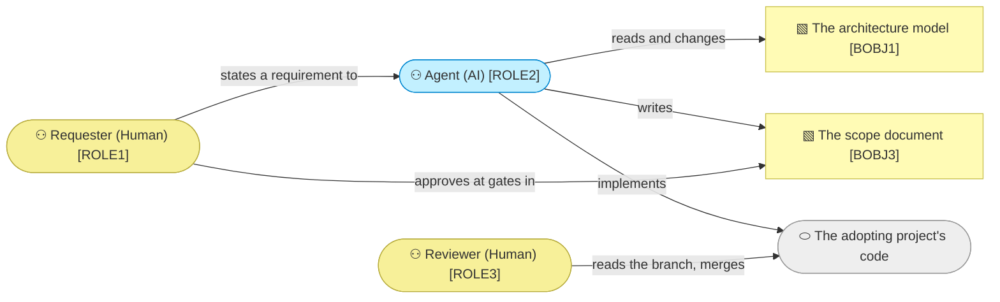

# Domain context and rules

_[← Business layer](./README.md) · [EA home](../README.md)_

**ArchiMate viewpoint:** Business. The vocabulary the method uses, and the
rules that bind every change made with it.

## Problem statement

An AI agent can now build faster than anyone can specify what to build. The
constraint has moved from writing code to deciding what should be written, and
the context needed to decide — who the customers are, what the organization is
trying to do, which rules bind a change — is almost never written anywhere the
agent can read it.

archreator's answer is to make the business context a **first-class artifact
in the same repository as the code**, in the format an agent reads natively,
with a person approving at named points before anything is built.

## System context

The grey node is outside the method's boundary: archreator produces no code
and knows nothing about the adopting project's stack. It governs the path a
requirement takes to reach that code, and stops there.

## Glossary

Terms with a specific meaning here. Reuse them in documents and commit
messages; a synonym invented in passing is how a vocabulary starts to drift.

| Term | Means |
| ---- | ----- |
| **Subject** | The thing being modeled — a company, a department, an application. Not the repository, and not the model |
| **Depth** | How much of the six layers a project fills, and which gates apply: 1 Application, 2 Organization, 3 Enterprise. Declared once, in `CLAUDE.md` |
| **Gate** | A point where the Requester approves before work continues. Four exist; which apply depends on the change |
| **Layer** | One of the six numbered folders. The numbering is the assessment order |
| **Element** | One identified thing in the model, carrying a type prefix and a number |
| **Grounding** | The requirement that every element names what realizes it, or says it is Pending |
| **Initiative** | One change large enough to need a scope document |
| **Restatement** | Removing accumulated history from a model so it reads as a description of today |
| **Tree** | One federated project's complete model. A repository may hold several |
| **Scaffold** | The empty project a new adopter starts from |

**"Model" always means the documents, never a diagram and never a database.**
The method has no store, and nothing has to be exported before the model can
be used; the Markdown is the model. A portal or a PDF built from it is a
rendering, which is what `RULE7` is about.

## Business rules

Every rule here is enforced by procedure or by a validator, and the column
says which. A rule nothing enforces is a preference.

| ID | Rule | Why | Enforced by |
| -- | ---- | --- | ----------- |
| `RULE1` | **A requirement is aligned through the layers before it is implemented.** Each layer is either changed or explicitly declared unchanged — never skipped in silence | A "no change" verdict a reader can see is evidence; an absent one is indistinguishable from an oversight | `align-change-through-layers`, and review |
| `RULE2` | **Which gate applies is defined in exactly one place** — `align-change-through-layers` § The gates. Every other document points there | A second copy of a gate rule is a second thing to drift, and the drift decides whether someone's approval was needed | Review |
| `RULE3` | **A merged scope document is never rewritten.** It records what was approved at a moment, and the model moves on without it | A record that can be edited after the fact is not a record. It will eventually name a retired element, and that is correct | Review, and by the validators deliberately not checking `scope/` |
| `RULE4` | **An identifier is draft until the gate that approves its element, and permanent afterwards.** Before the gate, removing an element renumbers the rest; after it, the identifier is retired and never reused | Once an approved document cites an identifier, a stale reference must fail loudly rather than resolve to something else | `check_model.py` |
| `RULE5` | **A change repairs every document it falsifies**, in the same branch | A model that is true in the layer somebody edited and false two layers up is worse than one nobody updated, because it looks maintained | Review |
| `RULE6` | **An architecture document describes its subject, not its own construction.** No "this used to say", no counts of what was consolidated | A reader wants to know what is true, not how the document got there. The change log is `BOBJ3` | Review |
| `RULE7` | **A rendering is never the model.** A portal or a PDF is rebuilt from the Markdown on every run, is never committed, and carries on every page the path of the file that produced it | A published copy a reader cannot trace back becomes the version they treat as true, and it drifts the moment the documents move | Construction: the staged copy is regenerated on every build, the whole tree is gitignored, and the theme prints and links each page's source |

**Four of seven are carried by review, and that is not an oversight.**
`RULE4` is fully mechanical and `RULE7` is carried by construction — a copy
that is rebuilt from scratch every time and never committed cannot drift,
whoever forgets. The other five need a judgement — whether a layer genuinely
did not change, whether a cell names a path or a team — and a check that fails
wrongly teaches people to ignore the checks that do not.

**`RULE3` is the one that surprises people.** A scope document that names an
element which no longer exists is working as intended. That is why the
validators skip the narrative folders entirely, and why a reader should treat
`scope/` as history rather than as description.

## Access control

**None.** The method has no accounts, no roles enforced by software, and
nothing to authorize. `ROLE1` and `ROLE3` are responsibilities a repository's
own permissions already carry: whoever can approve a pull request is the
Reviewer. Adding an access matrix here would model a mechanism that does not
exist.
