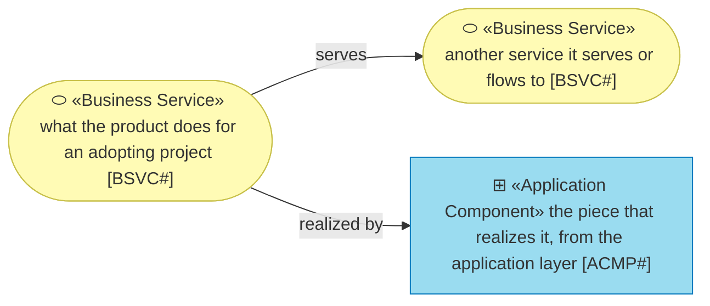
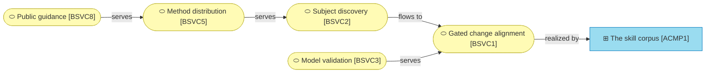

# Business

_[← Front door](../README.md)_

What the product does for an adopting project, as services. The actors are
the adopting project's own three roles, defined as stakeholders in
[motivation](../1_strategy/1_motivation.md).

**ArchiMate viewpoint:** Business: Business Service.

## Documents

| # | Document | Elements | Question it answers |
| - | -------- | -------- | ------------------- |
| 1 | [Business services](./1_business-services.md) | The eight services, what each delivers, and which components realize it | What does the product do for an adopting project? |

## Metamodel

The component is a visitor from the application layer and keeps its cyan.

## Layer view

Guidance leads to distribution, distribution to discovery, and discovery
flows into the gated alignment where the method happens; validation serves
it, and the skill corpus realizes it.
