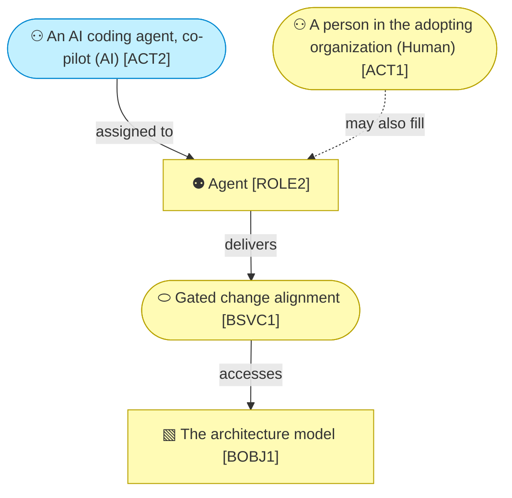

# Business Layer

_[← EA home](../README.md)_

Who interacts with the system, the services it offers them, the processes
those services run through, the business objects they handle, and the
domain vocabulary and rules that constrain all of it.

## Analysis order

Files are numbered in the order they are analyzed: identify _who_ first,
then _what they are offered_, then _how it is delivered_, then _what is
handled_, and finally the domain vocabulary and rules.

| #   | Document                                                          | Elements                                           | Question it answers                              |
| --- | -------------------------------------------------------------------| ---------------------------------------------------- | --------------------------------------------------- |
| 1   | [1_business-actors-and-roles.md](./1_business-actors-and-roles.md) | Business Actors and Roles, organizational units, external partners (Contracts, Collaborations) | Who interacts with the system, and who do we depend on? |
| 2   | [2_business-services.md](./2_business-services.md)                | Products, Business Services, Business Interfaces (channels) | What is offered to them, and through which channels? |
| 3   | — | Business Processes | **Not held here** — see § The process catalogue |
| 4   | [4_business-objects.md](./4_business-objects.md)                  | Business Objects                                   | What things do the processes handle?              |
| 5   | [5_domain-context-and-rules.md](./5_domain-context-and-rules.md)  | Problem statement, system context, glossary, rules | What vocabulary and constraints bind everything?  |

## The process catalogue

**This tree does not hold the method's processes, and that is deliberate.**
They live in `docs/process/` of the
[`archreator`](https://github.com/roanboc/archreator) repository — four macro
processes classified into operational, support and evaluation bands, their
level-2 children, and the one branch decomposed to level 3, each carrying a
trigger, an input, an output, an owner, and the skill that realizes it.

They stay there because the catalogue exists to make a binding checkable:
every process must name a skill that exists, and every skill must name a
process that exists. That check runs where the processes and the skills sit
together, and nowhere else. Moving the documents here would have kept the
catalogue and lost the proof it was written for.

Full reasoning in
[decision 1](../decisions/1_the-process-model-stays-with-the-skills.md).

**What it costs.** A reader looking for the method's processes is sent one
repository over, and no validator here would notice if that catalogue were
renumbered underneath this model. That mismatch is caught by review or not at
all.

[1_business-actors-and-roles.md](./1_business-actors-and-roles.md) states each
actor's **kind** — human, AI or hybrid — and, for the AI one, its autonomy
level, decision rights and escalation path. That is the method's distinguishing
claim made concrete: an agent is a member of the organization with stated
authority, not a tool somebody uses.

[5_domain-context-and-rules.md](./5_domain-context-and-rules.md) carries the
**glossary** — reuse its terms in documents and commits — and the **business
rules**, each with what enforces it. A rule nothing enforces is a preference,
so the table says which are mechanical and which are carried by review.

## Layer view

One chain through the layer: the AI actor, the role it fills, the service that
role delivers, and the object that service changes. The full sets are in the
documents above.

The AI actor is drawn in the Application cyan even though it sits in a
business diagram — one of the two colour overrides in
[README.md § Notation conventions](../README.md#notation-conventions), so a
reader never mistakes it for a person.

**The process box is missing from this view on purpose.** A business service
is normally realized by a process, and this method's processes live one
repository over — see § The process catalogue. Drawing a placeholder would
imply this tree holds something it does not.

Every business service is realized by application services — the mapping is in
[4_application/](../4_application/README.md).

### Relationships

<!-- Transcribed from this document's diagrams. The identifier is
     authoritative; the description beside it is checked against the
     catalogue that defines the element. -->

| From | From element | To | To element | Relationship |
| ---- | ------------ | -- | ---------- | ------------ |
| `ACT1` | «Actor» A person in the adopting organization | `ROLE2` | «Role» Agent | may also fill |
| `ROLE2` | «Role» Agent | `BSVC1` | «Business Service» Gated change alignment | delivers |
