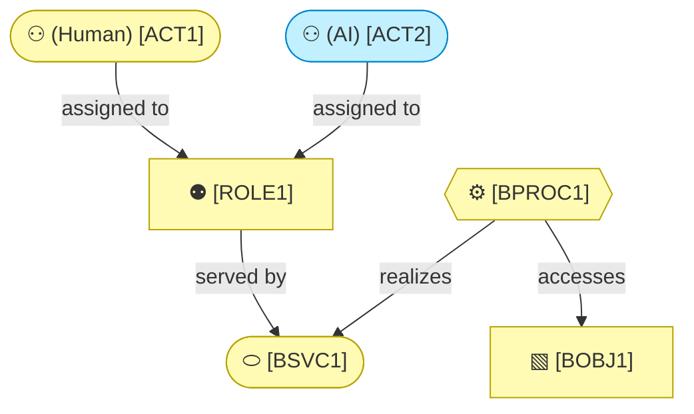

# Business Layer

_[← EA home](../README.md)_

Who interacts with the system, the services it offers them, the processes
those services run through, the business objects they handle, and the
domain vocabulary and rules that constrain all of it.

## Analysis order

Files are numbered in the order they are analyzed: identify _who_ first,
then _what they are offered_, then _how it is delivered_, then _what is
handled_, and finally the domain vocabulary and rules.

| #   | Document                                                          | Elements                                           | Question it answers                              |
| --- | -------------------------------------------------------------------| ---------------------------------------------------- | --------------------------------------------------- |
| 1   | `1_business-actors-and-roles.md` | Business Actors and Roles, organizational units, external partners (Contracts, Collaborations) | Who interacts with the system, and who do we depend on? |
| 2   | `2_business-services.md`                | Products, Business Services, Business Interfaces (channels) | What is offered to them, and through which channels? |
| 3   | — | Business Processes | **Not held here** — see § The process catalogue |
| 4   | `4_business-objects.md`                  | Business Objects                                   | What things do the processes handle?              |
| 5   | `5_domain-context-and-rules.md`  | Problem statement, system context, glossary, rules | What vocabulary and constraints bind everything?  |

## The process catalogue

**This tree does not hold the method's processes, and that is deliberate.**
They live in `docs/process/` of the
[`archreator`](https://github.com/roanboc/archreator) repository — four macro
processes classified into operational, support and evaluation bands, their
level-2 children, and the one branch decomposed to level 3, each carrying a
trigger, an input, an output, an owner, and the skill that realizes it.

They stay there because the catalogue exists to make a binding checkable:
every process must name a skill that exists, and every skill must name a
process that exists. That check runs where the processes and the skills sit
together, and nowhere else. Moving the documents here would have kept the
catalogue and lost the proof it was written for.

Full reasoning in
[decision 1](../decisions/1_the-process-model-stays-with-the-skills.md).

**What it costs.** A reader looking for the method's processes is sent one
repository over, and no validator here would notice if that catalogue were
renumbered underneath this model. That mismatch is caught by review or not at
all.

`5_domain-context-and-rules.md` carries the project's **glossary** (reuse
its terms in code and commits) and its **business rules table** — every new
rule gets a row there, with its rationale, before it gets a line of code.
It is also the natural home for a role × operation access matrix if the
project has segregated roles.

`2_business-services.md` is where a **«Product»** aggregates the services
that make it up. A single-application project usually has one implicit
product and can leave it out; an organization sells several, and the
portfolio is what makes the rest of the model make sense — two products may
share every capability and still need entirely different channels and
processes. On the company track the products, channels, and customer
relationships are derived from the business model canvases (see
[0_business-design/](../0_business-design/README.md#from-canvas-to-archimate)),
and Key Partners land in `1_business-actors-and-roles.md` as external
actors, each with the «Contract» or «Business Collaboration» that binds
them.

`1_business-actors-and-roles.md` states each actor's **kind** — human, AI,
or hybrid — and, for AI/hybrid actors, its autonomy level, decision
rights, and escalation path (see the `architecture-document-style` skill's actor
notation). This is where an AI system's role **in the business being
modeled** gets stated explicitly — not just its role in how this repo is
developed (see `CONTRIBUTING.md`). If an initiative changes one of those
values, consider a `record-decision` alongside the scope document.

## Layer view

<!--
  TEMPLATE — replace with the project's real actors, roles, services, and
  business objects once known. Keep at least one actor's kind explicit
  (Human/AI/Hybrid) even if every actor in this project turns out to be
  human — an explicit "(Human)" beats a silent default. The kind is the one
  type word a content node keeps; the stereotype belongs in the legend.
-->

The AI actor is drawn in the Application cyan even though it sits in a
business diagram — one of the two colour overrides in
[README.md § Notation conventions](../README.md#notation-conventions), so a
reader never mistakes it for a person.

Every business service is realized by application services — the mapping is
in `4_application/1_application-services.md`.
