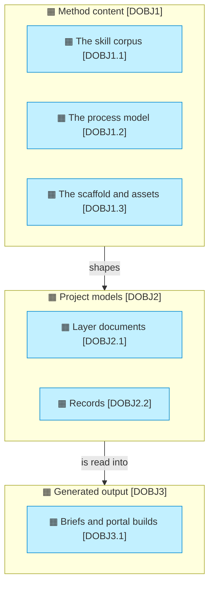

# Data domains and objects

_[← Information layer](./README.md) · [Front door](../README.md)_

What information exists, who owns it, and where it lives.

**ArchiMate viewpoint:** Information: Data Object, with the domain as its
level 1 and the object as its level 2.

**Status:** ◐ Draft catalogue, not yet validated.

## Level 1 — the domains

| ID | Domain | Owner | Mastered in |
| -- | ------ | ----- | ----------- |
| `DOBJ1` | **Method content**: what the method itself is made of | The method maintainer | The archreator repository |
| `DOBJ2` | **Project models**: what each adopting project knows about itself | Each adopting project's Requester | That project's repository, always |
| `DOBJ3` | **Generated output**: what the tools produce on request | Nobody; disposable by design | Nowhere: gitignored under `.archreator/`, regenerated fresh, never committed |

## Level 2 — the objects

| ID | Object | Is | Classification |
| -- | ------ | -- | -------------- |
| `DOBJ1.1` | The skill corpus | Eighteen skills and their references, one Markdown file each | Public |
| `DOBJ1.2` | The process model | The macro processes and their level-2 children, beside the skills that realize them | Public |
| `DOBJ1.3` | The scaffold and assets | The thirteen files a project starts with, and the templates emitted when a skill first has content for them | Public |
| `DOBJ2.1` | Layer documents | The model proper: catalogues, diagrams and the relationship catalogue, each document declaring how far it is validated | The project's call |
| `DOBJ2.2` | Records | Scope documents, decisions, engagement notes: the durable trail of who approved what | The project's call |
| `DOBJ3.1` | Briefs and portal builds | One question answered, or the model rendered for a reader, stamped with the revision they came from and thrown away | Derived; never a source of truth |

Method content shapes project models, project models are read fresh into
generated output, and only the first two are ever a source of truth.
