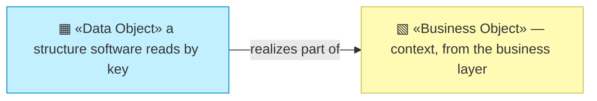
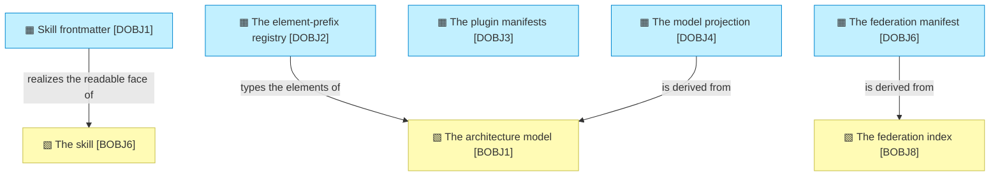

# Data objects

_[← Information layer](./README.md) · [EA home](../README.md)_

**ArchiMate viewpoint:** Passive structure. The machine-readable structures
the method's components read and write.

**Status:** ● Validated. `DOBJ1`–`DOBJ3` and `DOBJ5` at **Gate 2**, 2026-08-22, with
**Gate 3** declined there
([scope document 1](../scope/1_rebuild-the-models-on-the-current-method.md)),
which routed the layers below the business layer to pull-request review. `DOBJ4`
restated at **Gate 2**, 2026-08-27, with
[initiative 6](../scope/6_declare-the-relationships-and-let-the-graph-be-walked.md)
and again with [initiative 7](../scope/7_walk-the-model.md); `DOBJ6` added and
`DOBJ4` restated at **Gate 2**, 2026-08-27, with
[initiative 8](../scope/8_federate-the-graph.md), and `DOBJ4` again with [initiative 9](../scope/9_cross-the-boundary.md).

**This layer is short, and the reason is the method's central choice.** Almost
everything archreator handles is prose in Markdown — a business object read by
people and by agents, not a data structure parsed by software. Only four
things here are genuinely *data*: something a program reads by key rather than
by reading. Everything else is [`2_business/`](../2_business/README.md)'s
business objects, unchanged.

## How to read this document

| Glyph | Shape | Element | ID prefix | Reads as |
| ----- | ----- | ------- | --------- | -------- |
| `▦` | Rectangle | «Data Object» | `DOBJ` | `DOBJ1` = Data Object 1 |
| `▧` | Rectangle (yellow) | «Business Object» — context, from [2_business/4_business-objects.md](../2_business/4_business-objects.md) | `BOBJ` | `BOBJ1` = Business Object 1 |

## The objects

| ID | Data object | Structure | Where it lives | Read by |
| -- | ----------- | --------- | -------------- | ------- |
| `DOBJ1` | **Skill frontmatter** | YAML: `name`, `description`, and `metadata.archreator` carrying `kind`, `realizes_process` and `gates` | The head of every `SKILL.md` | The host platform, to route a request to a skill; `check_skills.py`, to bind skills to processes |
| `DOBJ2` | **The element-prefix registry** | JSON: layer group → prefix → element type name. Forty-three prefixes in nine groups | `scaffold/scripts/element-prefixes.json` | `model_graph.py`, to recognise and type an identifier |
| `DOBJ3` | **The plugin manifests** | JSON: the plugin's name, version and entry points, and the marketplace entry that publishes it | `.claude-plugin/plugin.json`, `.claude-plugin/marketplace.json` | The host platform, at install time |
| `DOBJ4` | **The model projection** | `nodes` and `edges` tables, plus `mentions`. Every node carries the declared status of the document defining it. Every edge carries where the relationship was declared — `catalogue`, `table` or `identifier` — whether it is pending, and the model its far end belongs to. Regenerated, never hand-edited, never committed | `.model/model.json`, `.model/model.db`, and both beside the published portal, where they carry a schema number and the commit they were built from | `query_model.py` and the navigator, both running the same traversal against `model.db`; and whatever else cannot read Markdown |
| `DOBJ6` | **The federation manifest** | JSON: a schema number, and one entry per federated model naming it, what it models, and the directory its projection is published in. Derived from `BOBJ8` on every build, never committed | `navigator/federation.json` in the published site | The navigator, to know what else to fetch |
| `DOBJ5` | **Provided source documents** | Whatever a Requester handed over — transcripts, decks, specifications — under a dated name, with an index row naming the original filename, who provided it and what was derived from it | `architecture/reference/` in an adopting project; this repository keeps none | A reader asking where a claim came from. Not the validators, not the projection, and not the portal |

**`DOBJ1` is the only one an author writes by hand**, and it is why a skill's
description is method content rather than packaging: the description is what
matches a user's sentence to a procedure, so it is the routing table.

**`DOBJ2` is a copy, held in step by a check.** The human-readable source is
the prefix table in `architecture-document-style`; this JSON ships beside the
validators because a downstream project has the scripts and not the skills.
`check_skills.py` compares the two in both directions. That is `P1`'s escape
clause used deliberately — one unavoidable copy, with a check on it.

**An edge knows which model its far end is in, and that is what lets a walk
cross.** Schema 2 added it. Traversal moved onto an identifier qualified by
model, so `neighbourhood.sql` follows a reference across a federation boundary
without knowing it crossed one — a blast radius that stops at a repository is
a wrong answer rather than a smaller one.

**`DOBJ4` published is a contract; `DOBJ4` local is a convenience.** [initiative 8](../scope/8_federate-the-graph.md)
put both formats at a documented path under a project's portal, with a schema
number and the commit they came from. A second project fetching one is reading
a file it does not control, built by a version of the method it may not have —
a number it can compare beats a shape it has to guess at, and a consumer that
meets a schema it does not know can say so instead of misreading the file.

**A published projection is the model's own, never the repository's.** A
repository holding several models publishes several projections. Putting all
of them under one model's address would be a build step doing the restating
the federation rule forbids an author from doing.

**`DOBJ4` has two readers now, and they read it the same way.** The database
was written from the first commit and opened by nothing — `query_model.py` read
the JSON. [initiative 7](../scope/7_walk-the-model.md) moved both readers onto the database and onto one
recursive query, because the alternative was a second traversal in a second
language, and the browser one is the one nobody would have tested.

**`DOBJ4`'s edges stopped depending on whether anyone drew a diagram.**
Initiative 6 moved the relationship into `BOBJ7`, declared in catalogue
columns and relationship tables; this object reads those and no longer parses
Mermaid. The two new fields are what a consumer needs and a Markdown reader
gets for free: `origin` says how firmly the relationship was stated, and
`pending` carries the distinction the notation draws with a dashed edge and
the projection used to discard.

**`DOBJ4` is the only derived object in the model, and it is derived on
purpose.** The Markdown stays the source of truth; the projection is rebuilt
from scratch on every run, which is what makes it incapable of going stale.
Delete it and nothing is lost.

### Relationships

<!-- Transcribed from this document's diagrams. The identifier is
     authoritative; the description beside it is checked against the
     catalogue that defines the element. -->

| From | From element | To | To element | Relationship |
| ---- | ------------ | -- | ---------- | ------------ |
| `DOBJ1` | «Data Object» Skill frontmatter | `BOBJ6` | «Business Object» The skill | realizes the readable face of |
| `DOBJ2` | «Data Object» The element-prefix registry | `BOBJ1` | «Business Object» The architecture model | types the elements of |
| `DOBJ4` | «Data Object» The model projection | `BOBJ1` | «Business Object» The architecture model | is derived from |

## Retention and classification

**Nothing here is personal, and nothing is retained.** `DOBJ1`–`DOBJ3` are
source files versioned with the code. `DOBJ4` is regenerated and gitignored.
The method holds no user data, no credentials and no state — there is no
database, no account and no session, which is what makes this section a
paragraph rather than a policy.

An adopting project's own model may well contain commercially sensitive
material — a capability gap, a partner strategy, a cost structure. That is
that project's classification to make, and it is why a published view of a
model is an access decision before it is a technical one.
