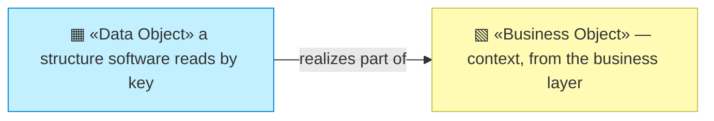
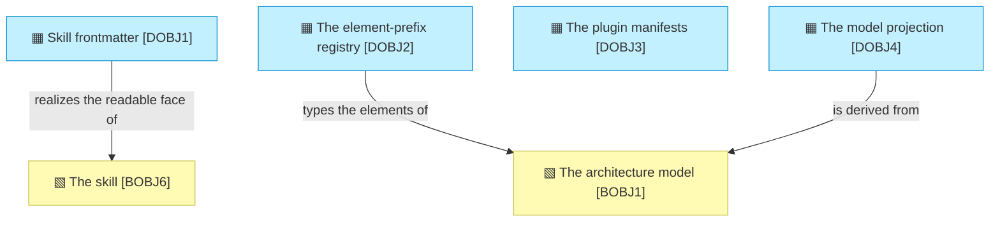

# Data objects

_[← Information layer](./README.md) · [EA home](../README.md)_

**ArchiMate viewpoint:** Passive structure. The machine-readable structures
the method's components read and write.

**This layer is short, and the reason is the method's central choice.** Almost
everything archreator handles is prose in Markdown — a business object read by
people and by agents, not a data structure parsed by software. Only four
things here are genuinely *data*: something a program reads by key rather than
by reading. Everything else is [`2_business/`](../2_business/README.md)'s
business objects, unchanged.

## How to read this document

| Glyph | Shape | Element | ID prefix | Reads as |
| ----- | ----- | ------- | --------- | -------- |
| `▦` | Rectangle | «Data Object» | `DOBJ` | `DOBJ1` = Data Object 1 |
| `▧` | Rectangle (yellow) | «Business Object» — context, from [2_business/4_business-objects.md](../2_business/4_business-objects.md) | `BOBJ` | `BOBJ1` = Business Object 1 |

## The objects

| ID | Data object | Structure | Where it lives | Read by |
| -- | ----------- | --------- | -------------- | ------- |
| `DOBJ1` | **Skill frontmatter** | YAML: `name`, `description`, and `metadata.archreator` carrying `kind`, `realizes_process` and `gates` | The head of every `SKILL.md` | The host platform, to route a request to a skill; `check_skills.py`, to bind skills to processes |
| `DOBJ2` | **The element-prefix registry** | JSON: layer group → prefix → element type name. Forty-three prefixes in nine groups | `scaffold/scripts/element-prefixes.json` | `model_graph.py`, to recognise and type an identifier |
| `DOBJ3` | **The plugin manifests** | JSON: the plugin's name, version and entry points, and the marketplace entry that publishes it | `.claude-plugin/plugin.json`, `.claude-plugin/marketplace.json` | The host platform, at install time |
| `DOBJ4` | **The model projection** | `nodes` and `edges` tables, plus `mentions`. Regenerated, never hand-edited, never committed | `.model/model.json`, `.model/model.db` | `query_model.py`, to traverse the graph and to report grounding; and whatever else cannot read Markdown |

**`DOBJ1` is the only one an author writes by hand**, and it is why a skill's
description is method content rather than packaging: the description is what
matches a user's sentence to a procedure, so it is the routing table.

**`DOBJ2` is a copy, held in step by a check.** The human-readable source is
the prefix table in `architecture-document-style`; this JSON ships beside the
validators because a downstream project has the scripts and not the skills.
`check_skills.py` compares the two in both directions. That is `P1`'s escape
clause used deliberately — one unavoidable copy, with a check on it.

**`DOBJ4` is the only derived object in the model, and it is derived on
purpose.** The Markdown stays the source of truth; the projection is rebuilt
from scratch on every run, which is what makes it incapable of going stale.
Delete it and nothing is lost.

## Retention and classification

**Nothing here is personal, and nothing is retained.** `DOBJ1`–`DOBJ3` are
source files versioned with the code. `DOBJ4` is regenerated and gitignored.
The method holds no user data, no credentials and no state — there is no
database, no account and no session, which is what makes this section a
paragraph rather than a policy.

An adopting project's own model may well contain commercially sensitive
material — a capability gap, a partner strategy, a cost structure. That is
that project's classification to make, and it is why a published view of a
model is an access decision before it is a technical one.
