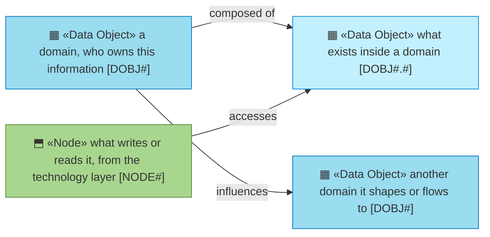
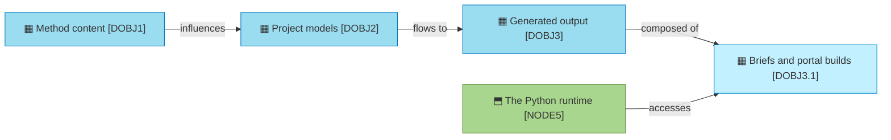

# Information

_[← Front door](../README.md)_

What information exists, who owns it, and where it lives.

**ArchiMate viewpoint:** Information: Data Object, with the domain as its
level 1 and the object as its level 2.

## Documents

| # | Document | Elements | Question it answers |
| - | -------- | -------- | ------------------- |
| 1 | [Data domains and objects](./1_data-domains-and-objects.md) | The three domains and their owners, and the objects inside each | What information exists, who owns it, and where does it live? |

## Metamodel

The darker cyan marks a domain; the node is a visitor from the technology
layer and keeps its green.

## Layer view

Method content shapes project models, project models are read fresh into
generated output, and only the first two are ever a source of truth.
