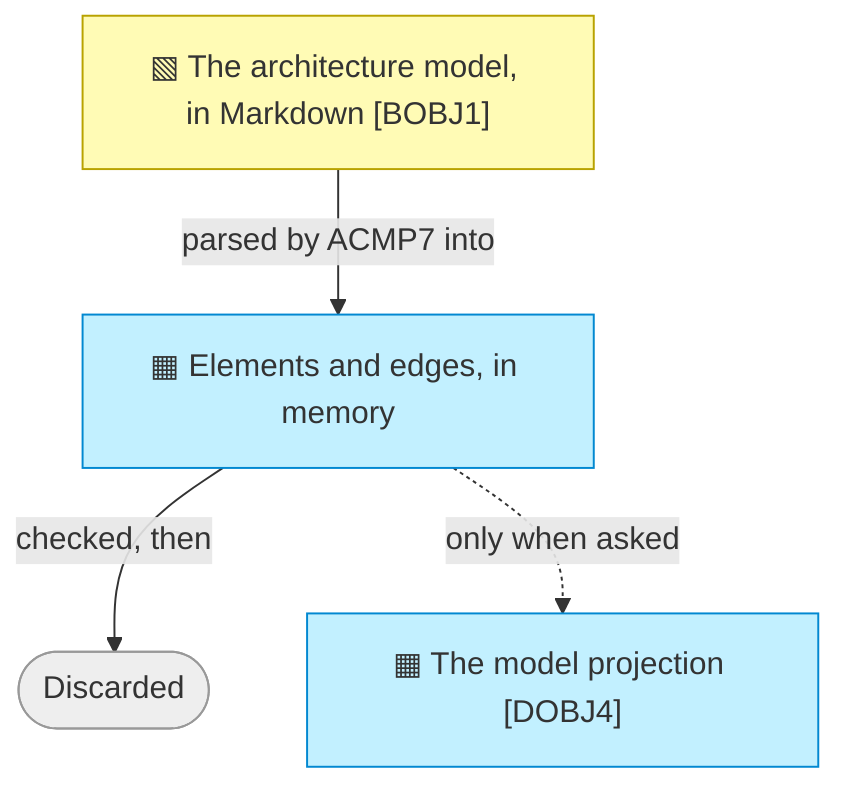

# Information Layer

_[← EA home](../README.md)_

The passive structure of the architecture: the data objects that represent
the `business objects`, and how
information flows, is represented, and persists.

## Analysis order

Files are numbered in the order they are analyzed: first _what information
exists_, then _how it moves and is represented_, and finally _where it is
physically stored, classified, and retained_.

| #   | Document                                           | Elements                                              | Question it answers                                 |
| --- | ---------------------------------------------------| -------------------------------------------------------| ------------------------------------------------------ |
| 1   | [1_data-objects.md](./1_data-objects.md)           | Data Objects (domain types) and their code locations  | What information exists?                             |
| 2   | `2_data-flows.md`               | Representations, persistence and flow relationships   | How does it move between representations?            |
| 3   | `3_data-architecture.md` | Schema, classification, retention                     | Where does it live, how sensitive is it, how long?   |

`3_data-architecture.md` is where **data classification** (public,
internal, sensitive, regulated, …) and **retention** live — reference it
whenever a business rule or technology decision depends on how sensitive a
piece of data is.

## Layer view

The one flow in this layer, and it runs in a single direction: Markdown is
read, held in memory long enough to be checked, and thrown away. Only when a
projection is asked for does anything persist, and that copy is rebuilt from
scratch every time.

**Validation needs a parse, not a store**, which is why the solid path ends in
nothing being kept. A derived copy that survives the run is a second version
of the truth that can fall behind the first — so the dashed path exists only
for a reader who cannot open the Markdown at all.
