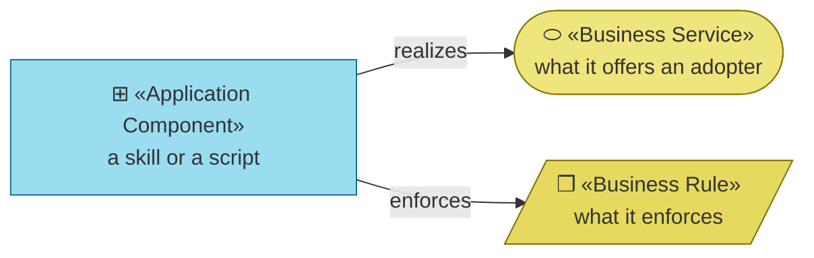
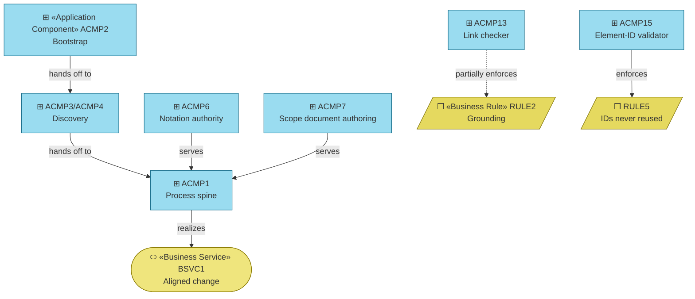

# Application Components — archreator

_[← Application layer](./README.md) · [EA home](../README.md)_

**ArchiMate elements:** Application Component, Application Service.

## How to read this document

| Glyph | Shape | Element | ID prefix | Reads as |
| ----- | ----- | ------- | --------- | -------- |
| `⊞` | Rectangle | «Application Component» | `ACMP` | `ACMP1` = Application Component 1 |
| `⬭` | Stadium (yellow) | «Business Service» — context, from [layer 2](../2_business/2_business-services.md) | `BSVC` | `BSVC1` = Business Service 1 |
| `❒` | Parallelogram (yellow) | «Business Rule» — same document | `RULE` | `RULE1` = Business Rule 1 |

**The glyph rides on every node; the «stereotype» word appears once.**

## Components

**One dashed edge, and it is the important one.** `ACMP13` only *partially*
enforces `RULE2` — it checks that links resolve, not that a named realizing
artifact exists. Everything else here is solid; the grounding rule is the
one this repository asks you to take on trust.

The table below is that rule applied to archreator itself: if a skill listed
here does not exist at the path given, the model is wrong and CI should have
caught it.

| ID | Component | Realizes | File |
| -- | --------- | -------- | ---- |
| `ACMP1` | Process spine | `BSVC1` | [`.claude/skills/ea-first-change/SKILL.md`](../../../.claude/skills/ea-first-change/SKILL.md) |
| `ACMP2` | Bootstrap | `BSVC3` | [`.claude/skills/project-bootstrap/SKILL.md`](../../../.claude/skills/project-bootstrap/SKILL.md) and [`templates/`](../../../.claude/skills/project-bootstrap/templates/CLAUDE.md) — the scaffold it emits |
| `ACMP3` | Operating-model discovery | `BSVC2` | [`.claude/skills/operating-model-discovery/SKILL.md`](../../../.claude/skills/operating-model-discovery/SKILL.md) |
| `ACMP4` | Strategy discovery | `BSVC2` | [`.claude/skills/strategy-discovery/SKILL.md`](../../../.claude/skills/strategy-discovery/SKILL.md) |
| `ACMP5` | Domain modeling | `BSVC5` | [`.claude/skills/domain-modeling/SKILL.md`](../../../.claude/skills/domain-modeling/SKILL.md) |
| `ACMP6` | Notation authority | `RULE2`, `RULE5`, `RULE9` | [`.claude/skills/ea-doc-style/SKILL.md`](../../../.claude/skills/ea-doc-style/SKILL.md) |
| `ACMP7` | Scope document authoring | `BSVC4`, `RULE3`, `RULE4` | [`.claude/skills/scope-doc/SKILL.md`](../../../.claude/skills/scope-doc/SKILL.md) |
| `ACMP8` | Restatement | `BSVC6` | [`.claude/skills/restate-current-state/SKILL.md`](../../../.claude/skills/restate-current-state/SKILL.md) |
| `ACMP9` | Decision records | — (supports `BSVC1`) | [`.claude/skills/decision-record/SKILL.md`](../../../.claude/skills/decision-record/SKILL.md) |
| `ACMP10` | Story sharding | — (supports `BSVC1`) | [`.claude/skills/story-sharding/SKILL.md`](../../../.claude/skills/story-sharding/SKILL.md) |
| `ACMP11` | Stack selection | — (supports `BSVC1`) | [`.claude/skills/stack-selection/SKILL.md`](../../../.claude/skills/stack-selection/SKILL.md) |
| `ACMP12` | PR authoring | — (supports `BSVC1`) | [`.claude/skills/pr-description/SKILL.md`](../../../.claude/skills/pr-description/SKILL.md) |
| `ACMP13` | Link checker | `RULE2` (partially — it checks links, not realizations) | [`.claude/skills/project-bootstrap/templates/scripts/check_links.py`](../../../.claude/skills/project-bootstrap/templates/scripts/check_links.py) |
| `ACMP14` | Plugin package | `BSVC7` | [`.claude/.claude-plugin/plugin.json`](../../../.claude/.claude-plugin/plugin.json), [`.claude-plugin/marketplace.json`](../../../.claude-plugin/marketplace.json) |
| `ACMP15` | Element-ID validator | `RULE5` | [`.claude/skills/project-bootstrap/templates/scripts/check_model.py`](../../../.claude/skills/project-bootstrap/templates/scripts/check_model.py) |
| `ACMP16` | Engagement retrospective | `BSVC6` (from the other end — it keeps the *method* current) | [`.claude/skills/engagement-retrospective/SKILL.md`](../../../.claude/skills/engagement-retrospective/SKILL.md) |

## What is enforced, and what still isn't

`ACMP15` closes `RULE5`: every element reference under an `architecture/` tree
resolves, no ID is defined twice, and no retired ID reappears as live. It
builds the graph in memory and exits — there is no exported model, and
deliberately so ([decision 4](../decisions/4_defer-the-model-database.md)
records why, and what would change the answer).

**`RULE2` is still only partly enforced.** `ACMP13` verifies that a *link*
resolves to a file; nothing verifies that a "Realized by" cell naming a
module path points at something that exists. That check was considered and
left out: distinguishing a repository path from a team name is fuzzy, and a
wrong failure in CI teaches people to ignore CI. The grounding rule is
therefore still carried by review, not by tooling — which is worth knowing
when reading any row in this repository that claims a realization.

**`ACMP16` is the newest and the least like the others.** Every other
component here acts *during* a change; this one acts after one, and its
output is a proposal rather than an edit. It exists because
[the organization behind archreator](../../../org-archreator/architecture/decisions/1_take-coa1-staged.md)
needed a mechanism for turning what a person improvised into method anyone
can use.

## Interface

Every skill component exposes the same interface: a `description:` line in
its `SKILL.md` frontmatter, which Claude Code matches against the situation
rather than against a command name. That is `P4` made concrete — the caller
does not name the component, it describes the problem.

The consequence is that a skill's description **is** its contract, and a
badly-scoped description is a defect even when the body is perfect: the
component never gets invoked. This is how `ACMP10` came to be effectively
dead code for ten pull requests — its description was accurate and no other
component pointed at it, so nothing ever reached it.
