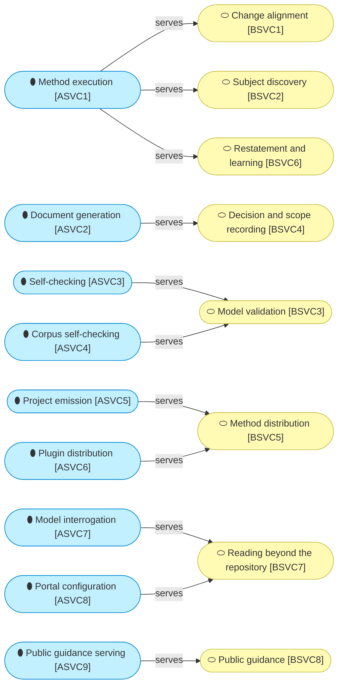

# Application services

_[← Application layer](./README.md) · [Front door](../README.md)_

What the software does, service by service, and which business service
each one serves.

**ArchiMate viewpoint:** Application: Application Service.

**Status:** ◐ Draft catalogue, not yet validated.

## The services

The two layers meet here, and not one-to-one in either direction. One
application service carries three business services on its own, `ASVC1`,
the skills doing what skills do, while three business services each need
two application services behind them. Every business service is served;
nothing is built for nobody. The pieces that realize each service are in
[the components](./2_application-components.md).

| ID | Service | Does | Realized by |
| -- | ------- | ---- | ----------- |
| `ASVC1` | **Method execution** | Walks a requirement through the layers, runs the discovery conversations, and builds directly from the request — stopping only for a contradiction, an ambiguity, or something needing authorization: the skills, doing what skills do | [`ACMP1`] The skill corpus |
| `ASVC2` | **Document generation** | Produces the scope document, the decision record and the pull-request body from templates with fixed sections | [`ACMP1`] The skill corpus |
| `ASVC3` | **Self-checking** | Resolves every identifier, link and anchor in a project's model and requires a declared status on every defining document, offline and with no plugin installed | [`ACMP2`] The link checker, [`ACMP3`] The element-ID validator, [`ACMP4`] The model parser, [`ACMP13`] The prose validator |
| `ASVC4` | **Corpus self-checking** | Checks the skill corpus against the process model, the citation forms, the asset bindings, which skills are listed and what they spend, and its own format rules | [`ACMP7`] The corpus validator |
| `ASVC5` | **Project emission** | Copies the thirteen-file scaffold into a new project and turns it into that project; emits an asset the first time a skill has content for it | [`ACMP8`] The scaffold, [`ACMP9`] The asset library |
| `ASVC6` | **Plugin distribution** | Publishes the corpus so a host platform can install it, and copies the skills for a host that installs no plugin | [`ACMP10`] The plugin package, [`ACMP11`] The skills installer |
| `ASVC7` | **Model interrogation** | Reads a project fresh, caching nothing, and answers what a change would touch, what names no realizing artifact, how much is validated, which elements name a code path, and one focused question as a disposable brief | [`ACMP5`] The model reader, [`ACMP6`] The brief generator |
| `ASVC8` | **Portal configuration** | Writes a stock MkDocs Material configuration for one project into its gitignored work area, on request; the method owns the boundary, not a site builder | [`ACMP5`] The model reader |
| `ASVC9` | **Public guidance serving** | The landing page and the get-started page, telling the two customers what the method is and how to install it | [`ACMP12`] The guidance site |
