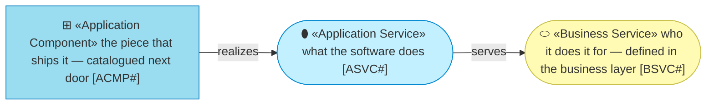
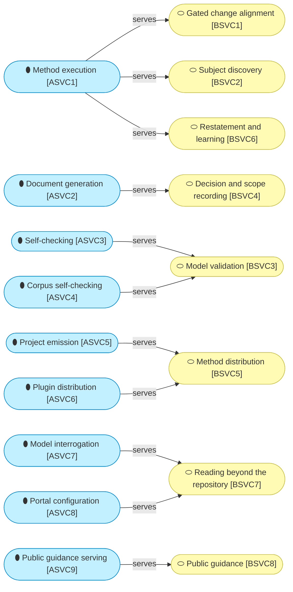

# Application services

_[← Application layer](./README.md) · [Front door](../README.md)_

**ArchiMate viewpoint:** Application — Application Service.

**Status:** ◐ Draft catalogue — not yet approved at a gate. **Understanding**
covers this document.

## How to read this document

## The services

**This is where the two layers meet, and it is not one-to-one in either
direction.** One application service carries three business services on its
own — `ASVC1` is the skills doing what skills do — while three business
services each need two application services behind them. Every business
service is served; nothing here is built for nobody.

The `Realized by` column below points on to
[the components](./2_application-components.md), which is the next link in
the same chain and is drawn there rather than repeated here.

| ID | Service | Does | Serves | Realized by |
| -- | ------- | ---- | ------ | ----------- |
| `ASVC1` | **Method execution** | Walks a requirement through the layers, runs the discovery conversations, decides which gates apply and stops at each — the skills, doing what skills do | `BSVC1`, `BSVC2`, `BSVC6` | `ACMP1` |
| `ASVC2` | **Document generation** | Produces the scope document, the decision record and the pull-request body from templates with fixed sections | `BSVC4` | `ACMP1` |
| `ASVC3` | **Self-checking** | Resolves every identifier, link and anchor in a project's model and requires a declared status on every defining document — offline, with no plugin installed | `BSVC3` | `ACMP2`, `ACMP3`, `ACMP4` |
| `ASVC4` | **Corpus self-checking** | Checks the skill corpus against the process model, the citation forms, the asset bindings and its own format rules | `BSVC3` | `ACMP7` |
| `ASVC5` | **Project emission** | Copies the eleven-file scaffold into a new project and turns it into that project; emits an asset the first time a skill has content for it | `BSVC5` | `ACMP8`, `ACMP9` |
| `ASVC6` | **Plugin distribution** | Publishes the corpus so a host platform can install it, and copies the skills for a host that installs no plugin | `BSVC5` | `ACMP10`, `ACMP11` |
| `ASVC7` | **Model interrogation** | Reads a project fresh — nothing cached — and answers what a change would touch, what names no realizing artifact, and one focused question as a disposable brief | `BSVC7` | `ACMP5`, `ACMP6` |
| `ASVC8` | **Portal configuration** | Writes a stock MkDocs Material configuration for one project into its gitignored work area, on request — the method owns the boundary, not a site builder | `BSVC7` | `ACMP5` |
| `ASVC9` | **Public guidance serving** | The landing page and the get-started page, telling the two customers what the method is and how to install it | `BSVC8` | `ACMP12` |
