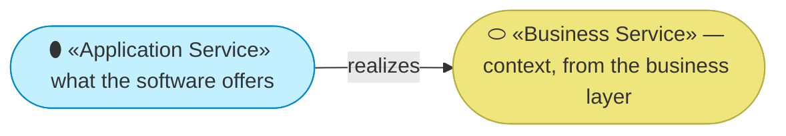
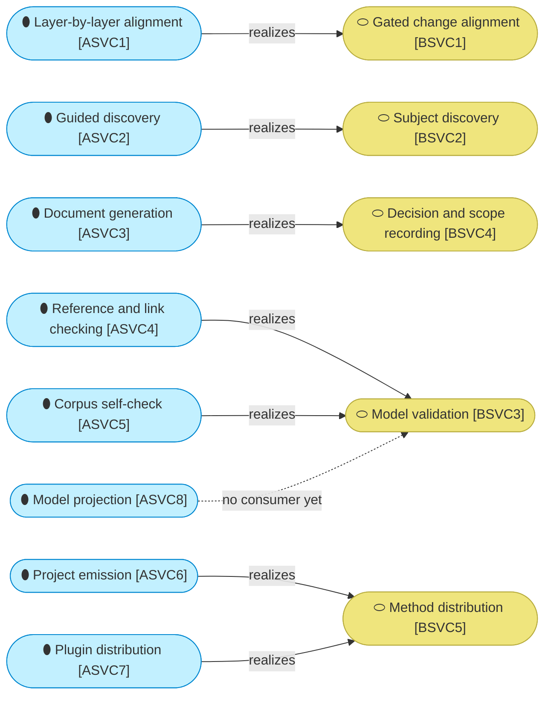

# Application services

_[← Application layer](./README.md) · [EA home](../README.md)_

**ArchiMate viewpoint:** Application. What the software offers the business
layer, and which business service each one realizes.

## How to read this document

| Glyph | Shape | Element | ID prefix | Reads as |
| ----- | ----- | ------- | --------- | -------- |
| `⬮` | Stadium | «Application Service» | `ASVC` | `ASVC1` = Application Service 1 |
| `⬭` | Stadium (yellow) | «Business Service» — context, from [2_business/2_business-services.md](../2_business/2_business-services.md) | `BSVC` | `BSVC1` = Business Service 1 |

## The services

| ID | Application service | What it does | Realizes | Provided by |
| -- | ------------------- | ------------ | -------- | ----------- |
| `ASVC1` | **Layer-by-layer alignment** | Walks a requirement down the six layers, decides which gates apply, and stops at each one | `BSVC1` | `ACMP1` |
| `ASVC2` | **Guided discovery** | Runs the canvas and strategy conversations, and the domain split, each ending at a gate | `BSVC2` | `ACMP2` |
| `ASVC3` | **Document generation** | Produces the scope document, the decision record and the pull-request body from templates with fixed sections | `BSVC4` | `ACMP1`, `ACMP3` |
| `ASVC4` | **Reference and link checking** | Resolves every element identifier and every relative link and anchor in a model, per project | `BSVC3` | `ACMP5`, `ACMP6`, `ACMP7` |
| `ASVC5` | **Corpus self-check** | Checks the skill corpus against the process model and its own format rules | `BSVC3` | `ACMP9` |
| `ASVC6` | **Project emission** | Copies the scaffold into a new project and turns it into that project | `BSVC5` | `ACMP2`, `ACMP10` |
| `ASVC7` | **Plugin distribution** | Publishes the corpus so a host platform can install it | `BSVC5` | `ACMP11` |
| `ASVC8` | **Model projection** | Reads a model and writes it as nodes and edges for a consumer that cannot read Markdown | **Pending — no consumer yet** | `ACMP7`, `ACMP8` |

**`ASVC8` has a dashed edge, and the dash is the honest part.** The projection
is built and works; nothing in the business layer consumes it. Its intended
consumer is a published view of the model, which is a course of action the
organization has not taken. Drawing it solid would claim a delivery that has
not happened.

**`ASVC4` and `ASVC5` both realize `BSVC3`, and neither is redundant.** One
checks a model an adopter wrote; the other checks the method itself. They
share no code and run in different repositories — the first ships in the
scaffold, the second deliberately does not, because a downstream project has
no skills to check.

**No service realizes `BSVC6`.** Model restatement and the engagement
retrospective are procedures a person or an agent follows, with no component
behind them beyond the skill text itself. That is a real gap in the sense that
nothing can be automated about them today, and not a gap in the sense that
something is missing — some work is judgement, and the method says so rather
than inventing a component to fill the row.
